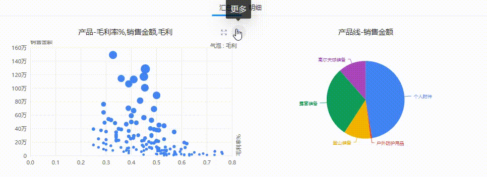
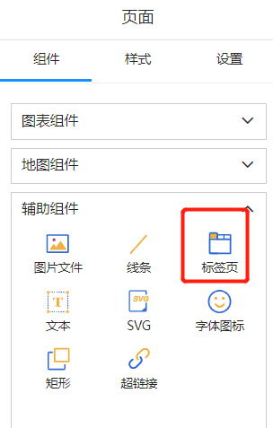
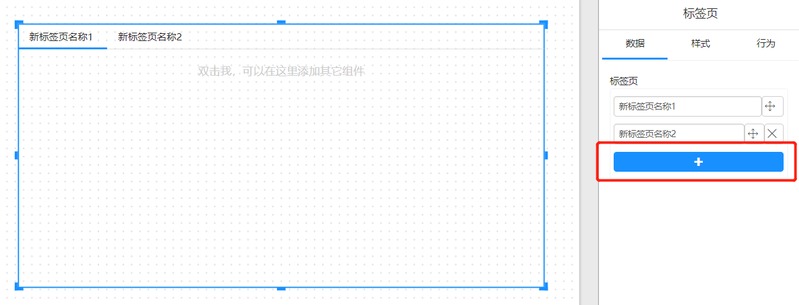
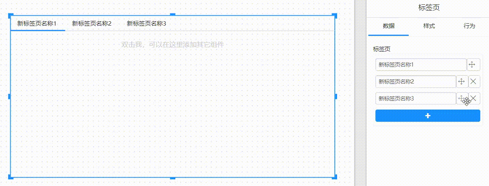
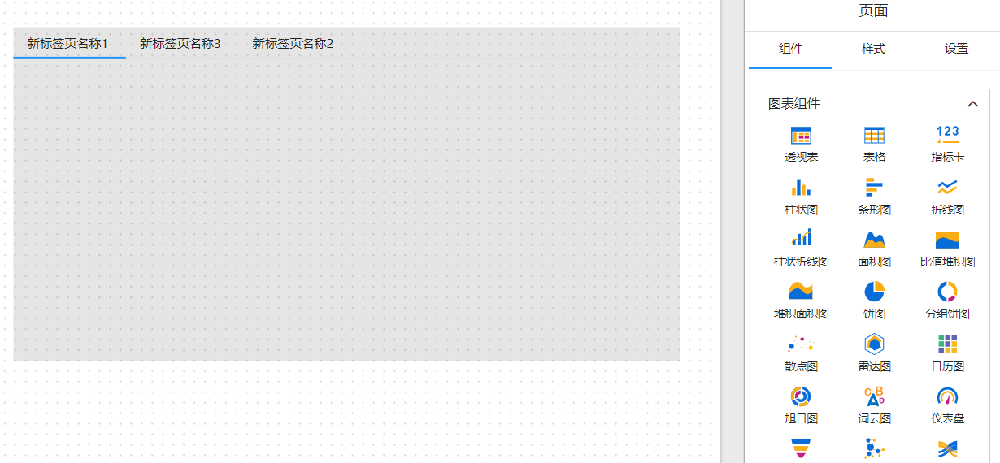
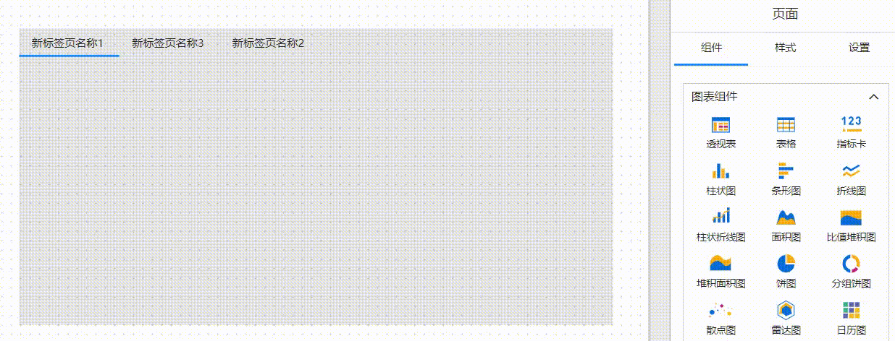

# 标签页（Tab）

使用标签页可以在同一个界面中同时浏览和比较多个相关的数据视图或图表。标签页组件通常由一个标签条和多个标签页组成，每个标签页都包含一个不同的可视化元素或图表。

标签页组件的主要优点是它可以节省屏幕空间，并提高用户对数据的比较和分析效率。通过标签页组件，用户可以轻松地切换不同的数据视图或图表，而无需切换不同的界面或打开多个窗口。

## 制作标签页

1. 辅助组件中选择“标签页”组件

2. 增加新的标签页

   在标签页的数据面板上增加、删除标签页。

   

   

3. 调整标签页顺序

   

4. 在标签页上添加组件

   双击标签页内容区域，进入组件编辑模式。

   

   此时您可以像在页面上添加组件一样在标签页上添加和编辑其它组件。
   
   

4. 退出组件编辑模式
   鼠标点击标签页以外的任意位置，退出标签页编辑模式。