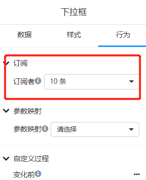
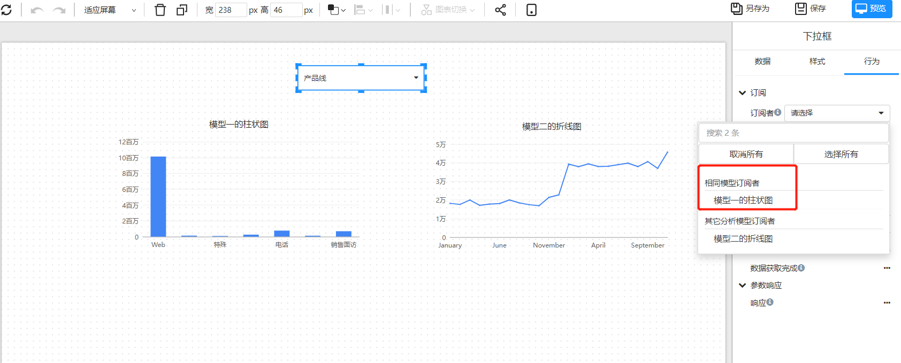
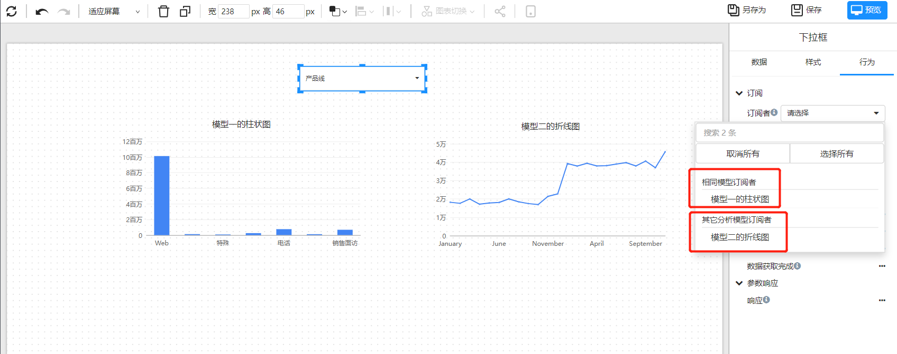
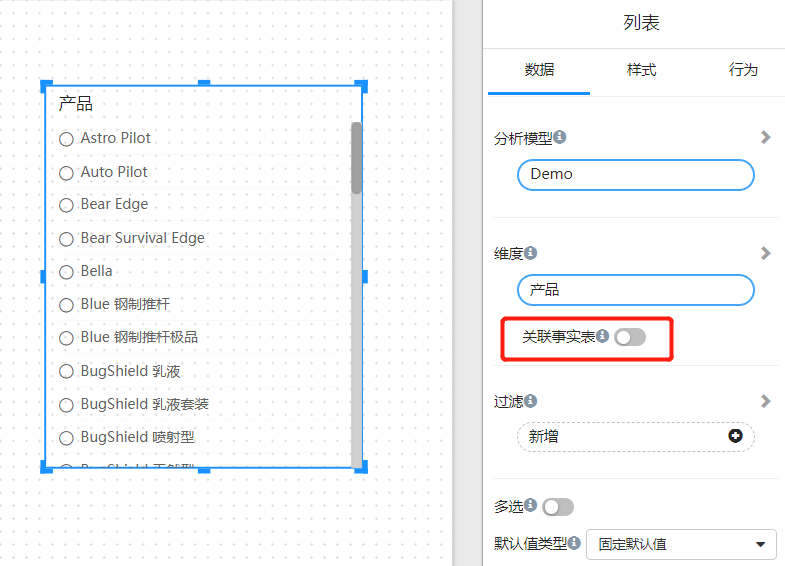
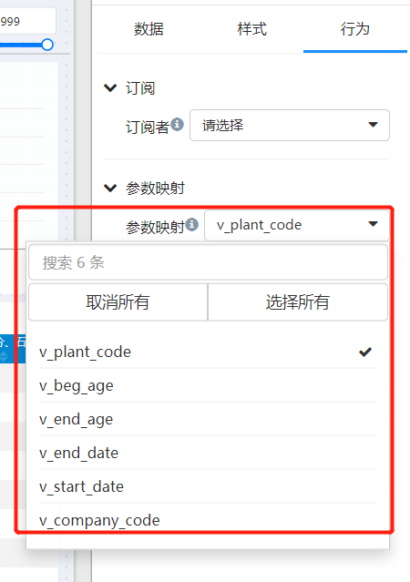

# 筛选组件和图表组件的订阅

每个Datafor的筛选组件的行为面板里有个“订阅”配置项。“订阅”是在筛选组件和其它组件之间建立数据筛选关系。筛选组件将筛选值传递给订阅者组件。

## 为什么要有“订阅”

在某些场景中，筛选组件的值不是要传递给所有数据组件。比如，页面中需要一直显示一个“汇总”值，这个值不需要随着筛选组件的值而变化，这种场景就不需要将这个“汇总”值组件和筛选组件建立“订阅”关系。

## 使用同一个分析模型的组件订阅

筛选组件和图表组件使用了同一个分析模型，那么组件会出现在订阅列表中。

## 跨模型的组件订阅

当页面中存在多个组件的数据来自不同的分析模型，如果分析模型有相同的维度和维度字段，筛选组件可以将筛选值传递到不同的模型。

## 筛选组件之间的订阅

- 当两个筛选组件引用了同一个维度或者层次的字段，那么这两个筛选组件之间可以建立订阅关系。

- 当两个筛选组件引用了不同维度的字段，订阅者需要打开“关联事实表”开关。

## 通过参数建立订阅

筛选组件可以将筛选值传递给参数。如果页面中其它组件的分析模型中使用了该参数，那么这个组件能够订阅此筛选组件。

