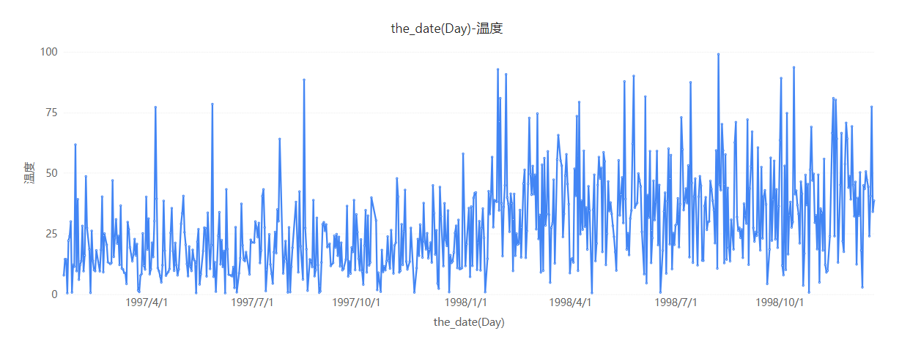
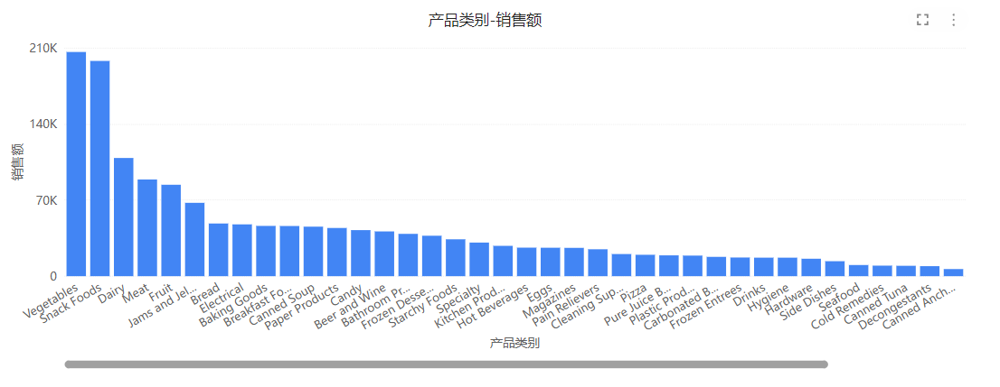
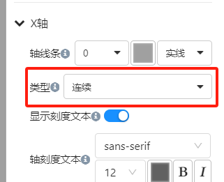

# X 轴类型设置：连续和类别

在 Datafor 中，当我们使用折线图、柱状图、面积图等图表时，X 轴可以设置为“连续”或“类别”两种类型。这两种类型的设置对数据的展示方式有很大的影响。以下是对这两种类型的详细说明：

## 1. 连续（Continuous）

### 定义
“连续”类型适用于数值或时间序列数据。选择“连续”类型时，X 轴将以连续的方式显示数据点。

### 特点
- **数据点均匀分布**：数据点按顺序均匀分布在X轴上，即使中间有缺失值。
- **适合时间序列数据**：尤其适合用于时间序列数据的展示，如每日销售额、温度变化等。
- **支持平滑曲线**：在折线图中，可以显示平滑的曲线，反映数据的变化趋势。

### 优点
- 能够更好地展示数据的趋势和变化。
- 可以处理大量数据点并显示在一个连续的时间轴上。

### 示例
如果我们有一组每日温度的数据，使用“连续”类型可以使得温度变化的趋势更为明显。

## 2. 类别（Categorical）

### 定义
“类别”类型适用于离散的分类数据。选择“类别”类型时，X 轴将按类别逐一显示数据点。

### 特点
- **数据点离散分布**：数据点按照类别显示，各个类别之间没有连续性。
- **适合分类数据**：尤其适合用于展示分类数据，如产品种类、地区分布等。
- **类别间间隔固定**：类别之间的间隔是固定的，不受类别值大小的影响。

### 优点
- 清晰展示各个类别的数据对比。
- 更适合用于展示离散的、非连续的数据点。

### 示例
如果我们有一组不同产品的销售额数据，使用“类别”类型可以更清晰地比较各个产品的销售情况。

## 如何在 Datafor 中设置 X 轴类型

1. **选择图表**：在 Datafor 中选择需要修改的图表，如折线图、柱状图、面积图等。

2. **打开“格式”窗格**：点击图表后，在右侧的“样式”面板中找到“X 轴”选项。

3. **选择轴类型**：在“类型”下拉菜单中，选择“连续”或“类别”。
   

4. **应用更改**：选择后，图表将自动更新，显示相应的 X 轴类型。

## 默认 X 轴类型

在 Datafor 中，当你创建图表时，系统会自动根据字段的类型（时间型或文本型）为 X 轴选择默认的类型（“连续”或“类别”）。这种自动切换可以帮助用户快速生成合适的图表，但在某些情况下，手动调整 X 轴类型可能更符合你的数据分析需求。

### 时间型字段

当你使用时间型字段（如日期、月份等）作为 X 轴时，Datafor 通常会默认将 X 轴设置为“连续”类型。这是因为数值型字段更适合以连续的方式展示数据点，能够更好地体现数据的趋势和变化。

### 文本型字段

当你使用文本型字段（如类别、产品名称等）作为 X 轴时，Datafor  通常会默认将 X 轴设置为“类别”类型。这是因为文本型字段代表离散的分类数据，更适合逐一显示各个类别的数据点。

## 总结

在 Datafor 中，选择合适的 X 轴类型（“连续”或“类别”）能够显著影响数据的展示效果。了解这两种类型的区别和适用场景，可以帮助我们更准确地呈现和分析数据。

通过以上步骤，我们可以轻松地在 Datafor 中设置和切换 X 轴类型，从而优化数据的可视化效果。