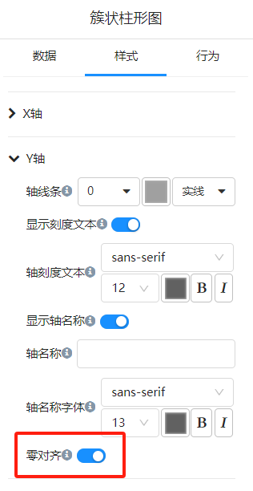
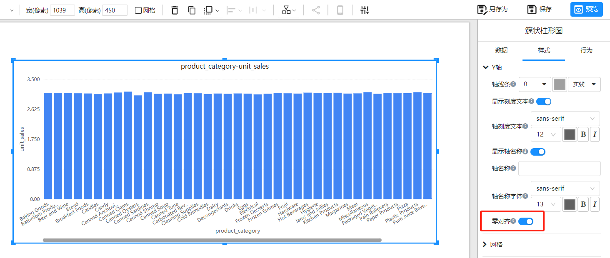
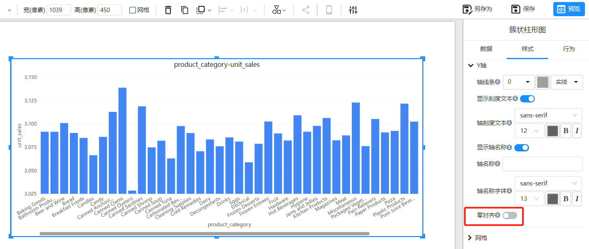

# Y轴的“零对齐”

Y轴“零对齐”特性是指将Y轴的起始点强制设置为零。这一功能在柱状图、折线图和面积图等轴类型图表中尤为重要，因为它可以确保数据的可视化展示更具一致性和准确性。

## 为什么要使用“零对齐”？

1. **数据一致性**：零对齐可以确保数据从零开始展示，避免因起始点不同而导致的误导性数据可视化。
2. **视觉效果**：统一的起始点有助于观众更直观地比较不同数据点之间的差异。
3. **数据准确性**：避免因非零起始点导致的误解，确保数据的展示真实反映其实际情况。

## 启用Y轴“零对齐”

1. 在“样式”面板中，展开“Y轴”选项。
2. 找到“零对齐”设置开关。

## 示例

**零对齐开启**

Y轴的最小值为：0

**零对齐关闭**

Y轴的最小值根据度量值范围自动计算。

## 常见问题

**Q1: 为什么我的图表看起来没有变化？**

**A1:** 开启了”零对齐“ 后，如果图表数据本身没有大幅度的变化，视觉效果可能不明显。

**Q2: 是否可以同时设置X轴和Y轴的零对齐？**

A2: 通常零对齐主要应用于Y轴。但有些图表的X轴也可以设置X轴的开始值为零，比如：散点图