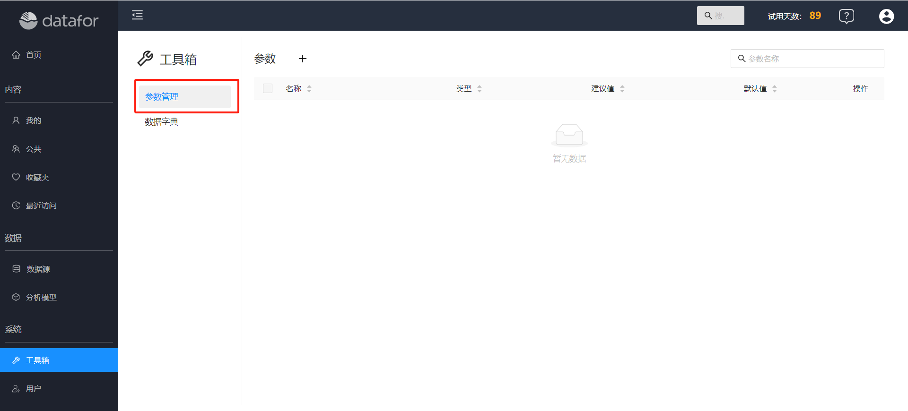
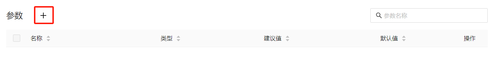
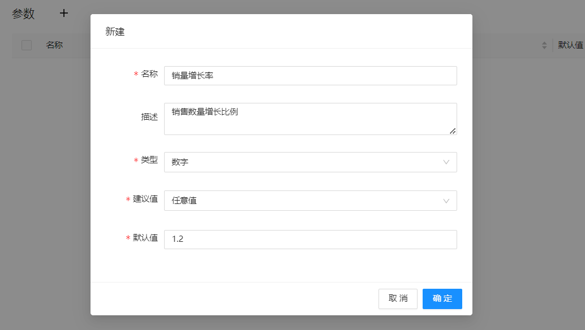
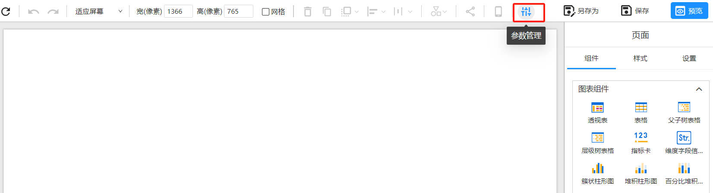
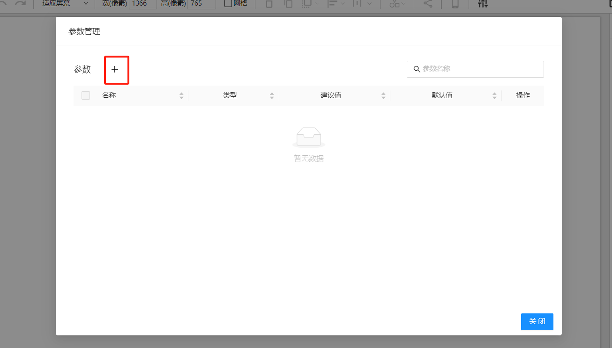
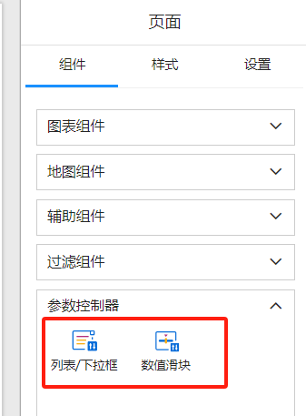
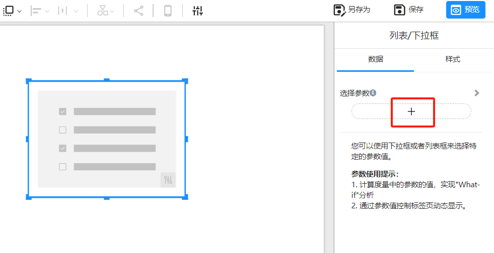
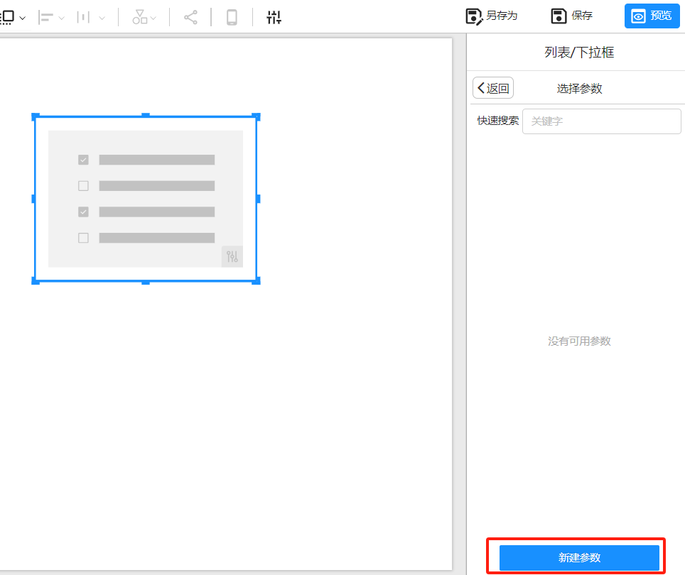
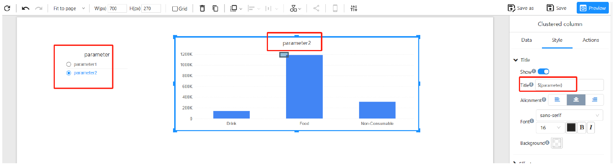

# 参数

## 概述

Datafor 提供了强大的动态参数功能，允许用户在报表和数据模型中实现灵活和互动的数据分析。用户可以定义参数的名称、数据类型和值来源（如手动输入、列表值或查询值），并在分析模型中使用这些参数来筛选数据或创建计算字段。在报表中，参数可以与参数控制器结合使用，使用户能够通过实时调整参数值来动态改变数据的显示，从而增强报表的互动性和个性化体验。

Datafor的参数包括：**全局参数**和**报表参数**。

**全局参数**：全局参数是定义在分析模型或分析项目中的参数，这些参数可以在多个报表和分析中复用。其特点：

- 统一管理：全局参数可以集中管理，修改一个全局参数的值会在所有引用它的地方同步更新。
- 一致性：确保在不同报表和分析模型中使用相同的参数设置，保持一致性。

**报表参数**：报表参数是仅在特定报表中使用的参数，这些参数的作用范围仅限于创建它们的报表。其特点：

- 局部控制：报表参数只在特定报表中有效，修改报表参数只会影响当前报表。

## 创建全局参数

1. 打开全局参数管理

   <div align="left"></div>

2. 点击 `新建`按钮

   <div align="left"></div>
   
3. 在弹出的 **"管理参数"** 窗口中，填写以下信息：

   - **名称**：为参数命名。

   - **描述**：参数描述

   - **类型**：选择参数的数据类型（如文本、数字）。

   - 建议值

     ：选择参数的值来源：

     - **任意值**：手动输入参数值。
     - **列表值**：定义一组预定义值供用户选择。
     - **查询值**：使用查询结果的**第一列值**作为参数值。

   <div align="left"></div>

4. 保存参数

   完成上述设置后，点击 **"确定"** 保存参数。

## 创建报表参数

**方法一**：

1. 进入报表设计器，在工具条上选择 “参数管理” 按钮

   <div align="left"></div>
   
2. 在弹出的 ”参数管理“ 窗口，选择 ”新建“ 按钮

   <div align="left"></div>

3. 同创建 ”全局参数“ 3和5步骤，创建参数并保存参数。

**方法二**：

1. 选择 ”参数控制器“ 组件

   <div align="left"></div>
   
   2. 在画布上添加参数控制器，并点击数据面板上的 “选择参数” 按钮。

   <div align="left"></div>
   
   3. 选择 ”新建参数“ 按钮

   <div align="left"></div>
   
4. 同创建 ”全局参数“ 3和5步骤，创建参数并保存参数。

## 使用参数

### 在计算度量使用参数

在计算度量中通过ParamRef函数引用参数值：`ParamRef("参数名")`

例如：

计算度量：预测销量

**公式**：

```
[Measures].[去年销量] * ParamRef("销量增长率")
```

### 在组件的标题栏使用参数

在组件标题中引用参数： ${"参数名"}

   <div align="left"></div>

### 通过参数控制标签页切换

参考：[参数驱动标签页切换](https://datafor123.github.io/docs/60%20visualizer/visualization-parameter-driven)


