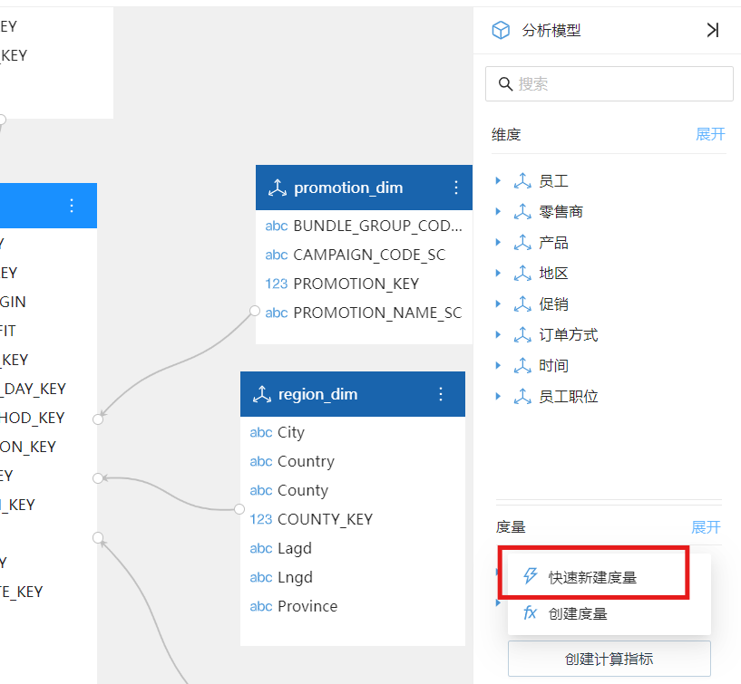
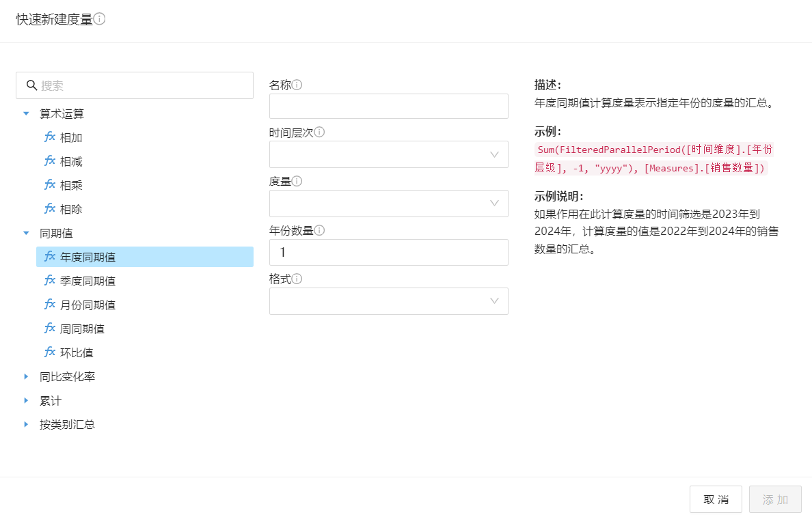
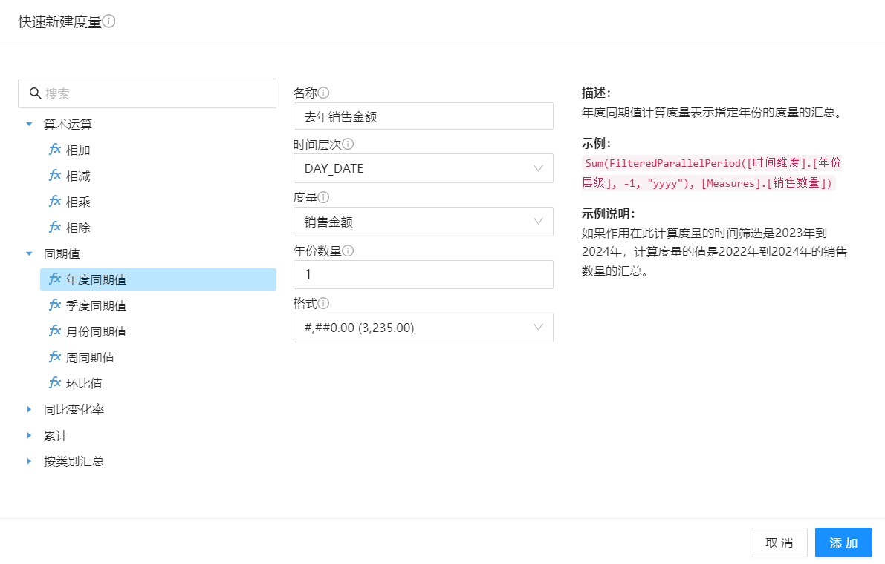
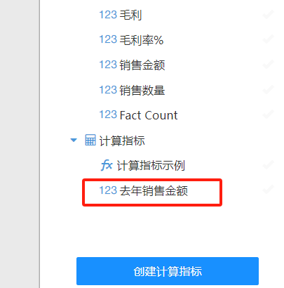
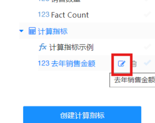
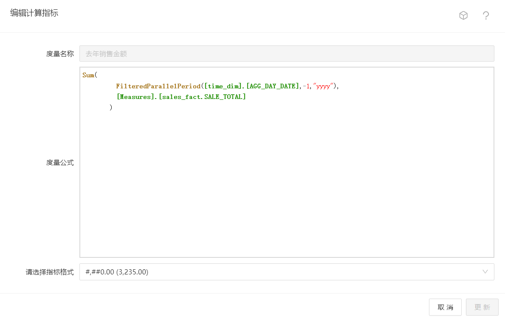

# 快速计算度量

### 功能概述

Datafor 的快速计算度量功能允许用户通过简化的界面和预定义的计算逻辑，快速创建各种常见的度量。这对于不熟悉 MDX（多维查询语言）语法的用户尤其有用。快速计算度量包括总和、年累计、同比、环比等多种常见的业务需求。

### 快速计算度量的优点

- **简化计算过程**：无需编写复杂的 MDX 公式，通过图形化界面即可快速创建常见的度量。
- **提高效率**：快速计算度量功能加速了度量的创建过程，特别是对于常见的业务需求。
- **易于理解**：预览和自动生成的公式帮助用户理解计算逻辑，提升数据分析技能。

### 何时创建快速计算度量

1. **在创建或编辑分析模型时**

   在新建或编辑分析模型时，点击“创建计算指标”按钮，选择“快速新建度量”
   

2. **在创建分析报表时**

   图表添加“度量”字段过程中，点击“创建计算指标”按钮，选择“创建快速指标”。

   **注意：在分析报表上创建的计算度量只在本分析报表可见。**

   

### 创建快速计算度量的步骤

1. **选择计算类型**：在弹出的快速计算度量窗口中，你可以看到各种预定义的计算类型，如相加、相减、年度同期值、环比值等。选择你需要的计算类型。

   

2. **配置参数**：根据所选计算类型，填写所需的参数。例如，对于“年度同期值”计算，选择你要时间字段，度量，和对比的年份和当前年份的差值。

   

3. **添加计算度量**：在窗口的底部，选择 “添加” 按钮。所创建的计算度量被添加到模型上。

   

4. **查看公式**：点击计算度量的编辑按钮。这可以帮助你了解背后的计算逻辑。

   

5. **修改计算度量**：如果需要，可以修改计算度量的公式并更新所创建的快速计算度量。

   

通过本文档，你应该能够轻松上手 Datafor 的快速计算度量功能，提升数据分析效率和准确性。