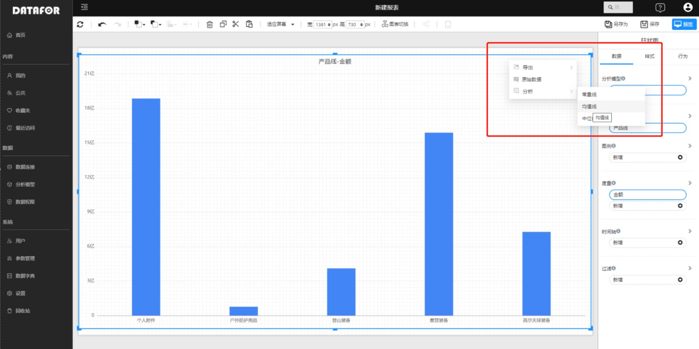
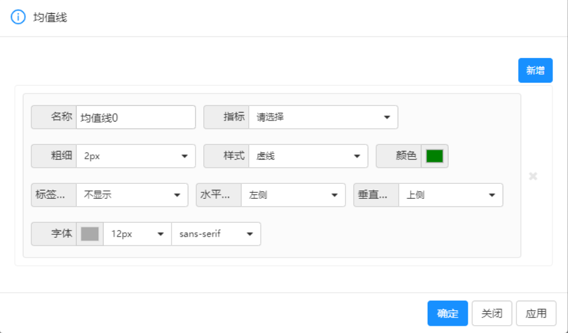
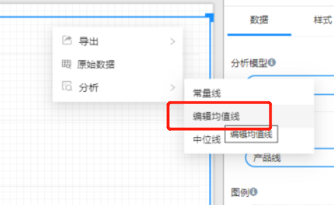

# 图表参考线

图表参考线是指在图表中添加的一组标记线，用于辅助用户分析和比较数据。用户可以自由地添加、编辑、删除参考线，以满足自己的需求。通过参考线，用户可以更清晰地了解数据的变化趋势和异常值。

## 参考线类型

- **常量线**：也称为阈值线或目标线，用于标记某个固定的数值或范围。例如，如果我们想将销售额的目标设置为100万，可以在柱状图或折线图中添加一条常量线，以帮助我们比较实际销售额与目标值之间的差距。
- **均值线**：也称为平均线或平均值参考线，用于标记数据的平均值。均值是所有数据之和除以数据点数的结果，它可以帮助我们了解数据集的总体趋势。通过添加均值线，我们可以比较每个数据点与总体趋势之间的差异。
- **中位线**：也称为中位数参考线，用于标记数据的中位数。中位数是将数据集按大小排序后，位于中间位置的数值。与均值相比，中位数更能反映数据分布的中心位置，因此在分析数据集的时候，中位线也是一个重要的参考线。

## 支持图表参考线的图表

- 柱状图
- 条形图
- 折线图

## 如何设置参考线

1. 在组件菜单中选择“分析”菜单，在下级菜单中选择需要创建的参考线。

   

2. 点击”新增“按钮

   

3. 设置参考线

   常数参考线，请指定要标记的数值或范围。 
   
   均值或中位数参考线，请选择线条类型并配置任何其他设置，例如线条颜色或样式。
   
   

| 项目 | 描述                                                     |
| ---- | -------------------------------------------------------- |
| 名称 | 参考线的名称                                             |
| 指标 | 选择需要用哪个指标作为参考线                             |
| 粗细 | 设置参考线的粗细程度                                     |
| 样式 | 设置参考线的线条样式，如虚线、实线、点线等               |
| 标签 | 是否显示参考线的标签，标签通常显示参考线对应的数值或名称 |
| 水平 | 设置参考线标签的水平位置，如左对齐、居中、右对齐等       |
| 垂直 | 设置参考线标签的垂直位置，如顶部对齐、居中、底部对齐等   |
| 字体 | 设置参考线标签的字体和大小                               |

## 删除参考线

1. 在组件菜单选择”编辑“需要删除的参考线

   

2. 点击参考先右侧的删除按钮

   

