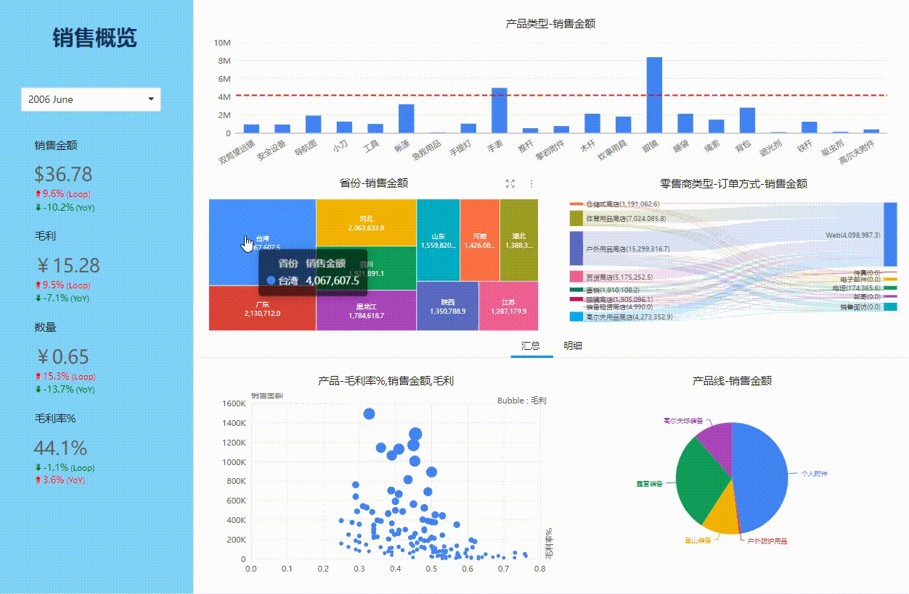
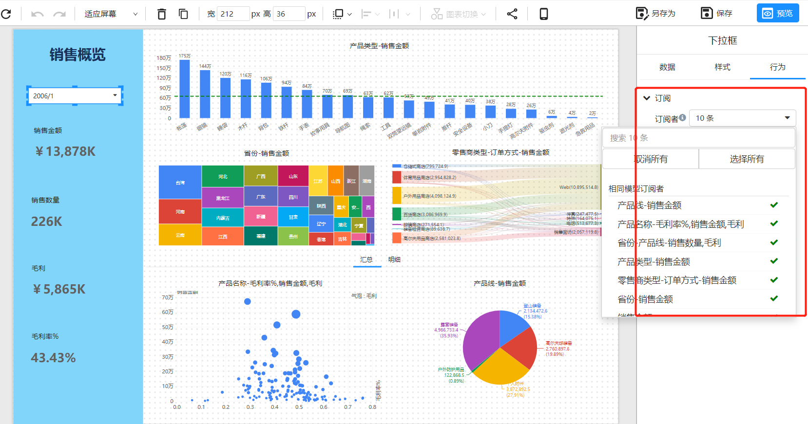

# 组件数据联动

组件数据联动是指当一个组件中的数据发生变化时，其他组件中的相应数据也随之发生变化。这种联动可以让用户在一个分析报表中更加方便、高效地查看和分析数据。

   

## 如何设置联动
### 数据图表之间的联动

Datafor 的图表之间的联动是基于分析模型的自动关联实现的。在 Datafor 中，如果不同的分析模型中存在相同的维度，这些维度也会自动关联，从而实现图表之间的联动。
### 筛选组件和数据图表之间的联动
在数据分析中，通常需要通过筛选组件（例如下拉框、滑块等）来对数据进行过滤，这些过滤条件需要同时应用到数据图表中。默认情况下，筛选组件和数据图表之间是没有联动的。为了实现它们之间的联动，需要建立一个“订阅关系”，让筛选组件与数据图表互相关联。

## 常见问题

1. 不同分析模型的组件是否能联动？

   如果组件选中维度在不同的分析模型中都存在，那么选中维度值会被传递到不同的分析模型。所有不同分析模型的组件可以联动，但是需满足模型有相同的维度这个前提条件。

2. 图表组件是否会和筛选组件联动？

   图表组件和筛选组件没有联动功能。图表组件只能订阅筛选组件。

3. 筛选组件之间是否有联动功能

   筛选组件和筛选组件的联动通过”[筛选组件和图表组件的订阅](https://datafor123.github.io/docs/visualizer/visualization-sxzjhtbzjddy)“实现联动功能。