# What-if 分析

What-if 分析是一种预测性分析方法，用于评估在不同假设或情景下，特定变量变化对结果的影响。

   <div align="left">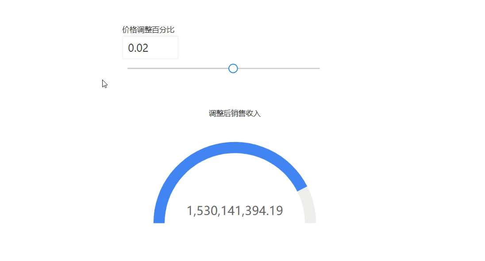</div>

以下是一个具体的示例，展示如何在 Datafor 中使用 What-If 参数进行销售预测分析：

### 场景：销售预测分析

#### 背景

一家零售公司希望预测不同价格策略对未来销售收入的影响。他们希望通过调整产品价格来了解对销售数量和总收入的潜在影响。

#### 目标

使用 Datafor 的 What-If 参数功能，模拟不同价格调整情景对销售收入的影响。

### 步骤

1. **创建参数控制器**

   <div align="left">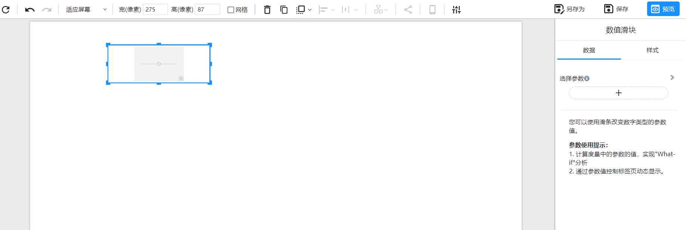</div>
   
2. **创建 What-If 参数**

   - 选中参数控制器，在数据面板点击 ”添加数据“ 按钮，选择“新参数”。

   <div align="left">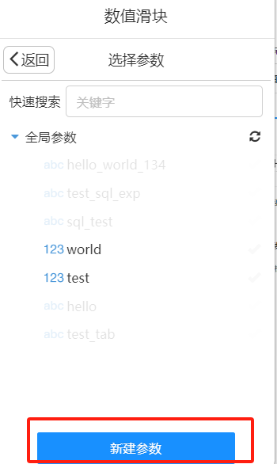</div>
   
   - 命名参数为“价格调整百分比”，默认值为 ”0“。

   <div align="left">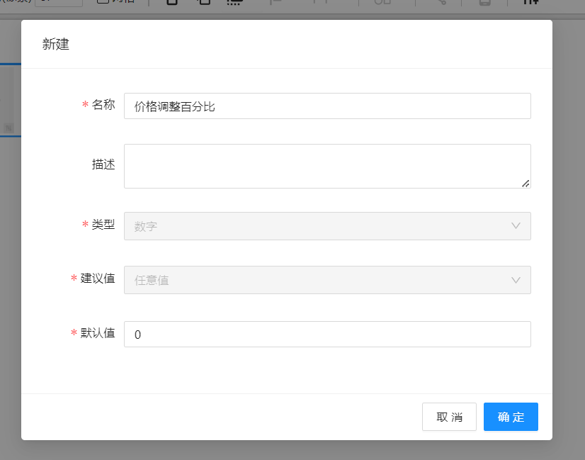</div>
   
   - 选中创建的 价格调整百分比” 参数。


   <div align="left">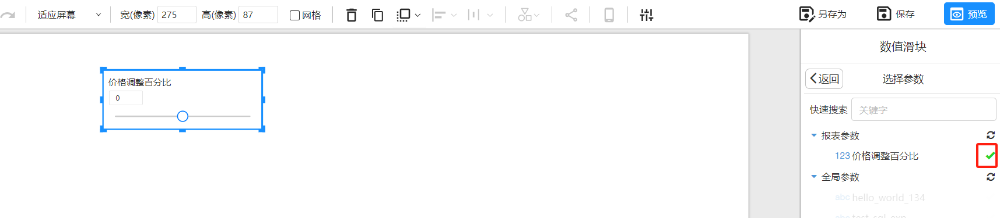</div>

   - 在样式面板定义滑条的数值范围，最小值为 -0.2, 最大值为 0.2， 步长为 0.1


   <div align="left">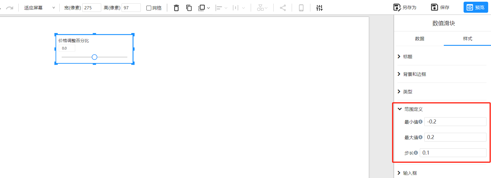</div>


3. **创建一个仪表盘组件**

   选择分析模型 “Demo”

   <div align="left">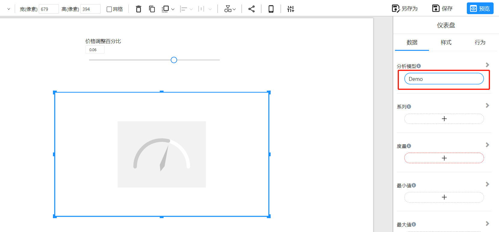</div>

4. **添加度量**

   在数据面板选择 ”添加数据“ 按钮

   <div align="left">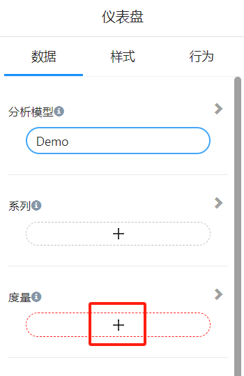</div>

5. **创建计算度量**

   <div align="left">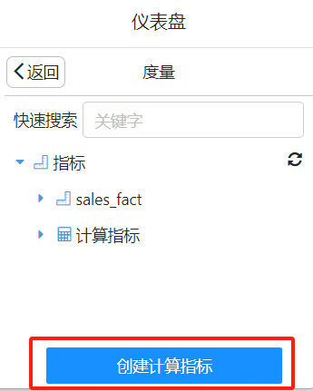</div>

   - 计算度量名称：调整后的价格。公式如下：

     ```
     [Measures].[sales_fact.UNIT_PRICE] * (1 + ParamRef("价格调整百分比"))
     ```
     
   - 计算度量名称：调整后销售收入。公式如下：

     ```
     [Measures].[sales_fact.QUANTITY]*[Measures].[调整后的价格]
     ```

6. **选择 “调整后的销售收入” 作为仪表盘组件的度量**

   <div align="left">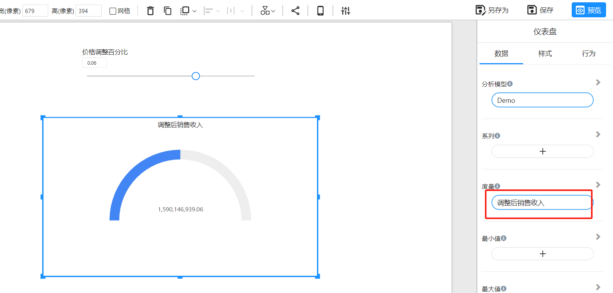</div>

   - 调整仪表盘组件的样式

     设置**最小值(0)**和**最大值(1800000000)**

   <div align="left">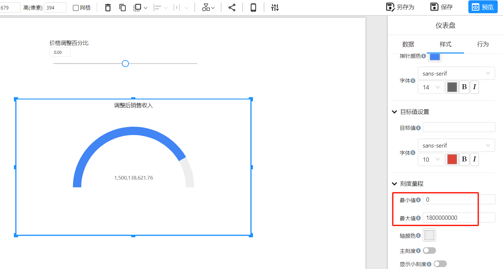</div>

7. **交互式分析**

   调整 “**价格调整百分比**” 参数，实时查看不同价格调整情景下的总销售收入变化。

   <div align="left"></div>