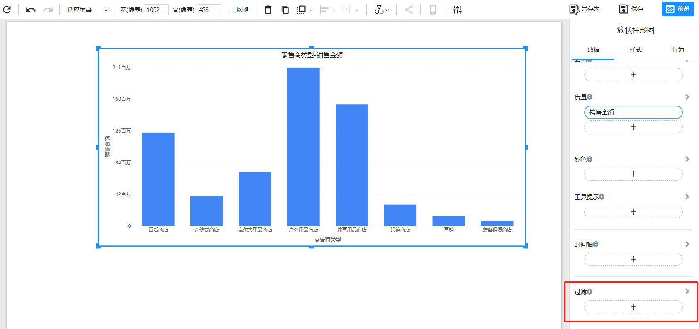

# 组件级筛选

Datafor 提供了组件级筛选功能，允许用户为每个可视化组件设置特定的筛选条件。

## 什么是组件级筛选？

组件级筛选是应用于 Datafor 中单个可视化组件的筛选器。它允许用户对每个组件设置独特的筛选条件，仅影响所选的可视化组件，而不会对页面上的其他组件产生影响。

## 为什么使用组件级筛选？

使用组件级筛选有以下几个主要优点：

1. **精细控制**：为每个可视化组件设置不同的筛选条件，以满足特定的分析需求。
2. **提高数据展示的准确性**：确保每个组件显示的数据都符合其独特的筛选条件。
3. **避免数据混淆**：在同一页面上展示不同维度或不同数据集的数据时，组件级筛选有助于避免数据混淆。

## 如何使用组件级筛选？

**1：选择可视化组件，并在数据面板中找到 “过滤” 区域**

**2：添加筛选字段**

点击“添加”按钮，从分析模型中选择您想要作为筛选条件的字段。

**3：配置筛选条件**

选择数据字段后，您可以根据需要配置筛选条件。例如，如果您选择了一个日期字段，您可以设置日期范围筛选；

**不同类型字段的过滤方法：**

| 字段类型               | 过滤类型   | 过滤方法                                                     |
| ---------------------- | ---------- | ------------------------------------------------------------ |
| 文本&emsp;&emsp;&emsp; | 基本&emsp; | 包括或排除                                                   |
|                        | 高级       | 包含、不包含、前置、后缀                                     |
| 时间                   | 基本       | 包括或排除                                                   |
|                        | 相对       | 相对时间，包括：过去、当前、未来                             |
|                        | 高级       | 之前(<=), 等于(=)，之后(>=)                                  |
| 数字                   | 基本       | 小于、小于等于、等于、大于等于、大于、大于且小于、大于等于且小于、大于且小于等于、大于等于且小于等于、非空数据、空数据 |

**4：应用筛选器并查看效果**

配置好筛选条件后，点击`应用`按钮，数据筛选会立即应用于所选的可视化组件。

## 结论

Datafor 的组件级筛选功能为用户提供了对单个可视化组件的精细数据控制。它不仅提高了数据的可访问性和互动性，还支持复杂的分析需求和个性化的分析体验。