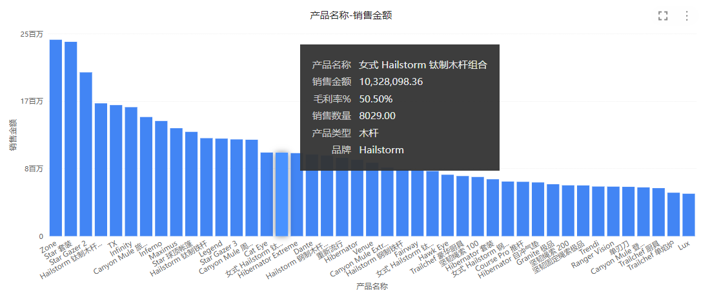
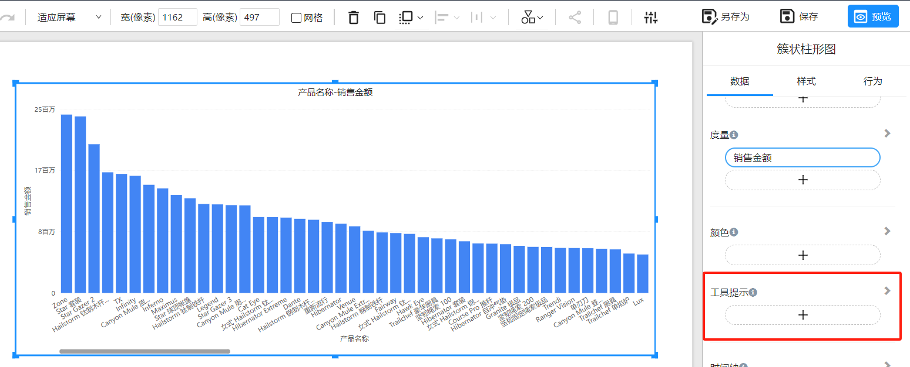
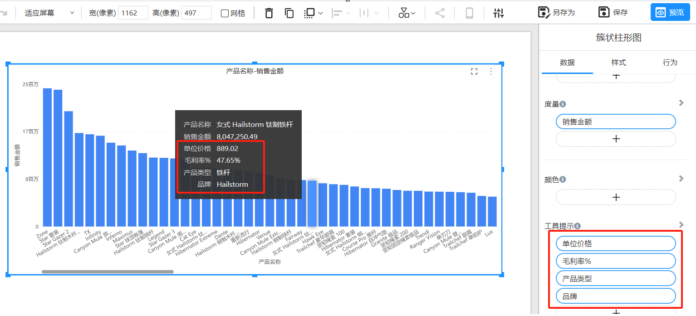

# 图表组件的 "工具提示"

## 概述

工具提示功能可以在用户将鼠标悬停在图表或可视化数据点上时提供额外的信息。此功能通过在不占用可视空间的情况下提供更多细节信息，增强了数据理解。工具提示可以自定义显示各种信息，如汇总统计数据、文本描述，甚至额外的可视化内容。

## 理解 “工具提示”

### 什么是 “工具提示”？

工具提示是在用户将鼠标悬停在 Datafor 图表组件中的数据点上时出现的小型交互框。它们提供特定数据点的上下文信息，如数据值、类别等，帮助用户更好地理解和分析数据。

### “工具提示”的好处

- **增强数据理解**：通过提供额外的信息，帮助用户更全面地理解数据。
- **保持可视化简洁**：不需要在图表上显示所有细节，保持界面清晰整洁。
- **动态交互**：用户可以通过悬停获得实时信息，提高数据探索的互动性。

## 如何使用 “工具提示”

### 默认 “工具提示”

Datafor 中的每个图表组件都默认启用 工具提示功能。默认情况下，工具提示显示基本的数据信息，如数据值和类别。

1. **打开你的 Datafor 报表**：确保报表页面上有多个图表组件。
2. **将鼠标悬停在数据点上**：在图表组件中悬停鼠标即可看到默认的 ”工具提示“。
3. **查看信息**：观察 工具提示显示的相关数据点信息。

### 自定义 “工具提示”

用户可以自定义 “工具提示”，以显示更多详细信息或自定义内容。

1. 选择图表组件：点击你想要自定义 工具提示的图表。

2. 在数据面板找到 ”工具提示“

   

3.  在 “工具提示” 区域添加维度字段和度量字段。

   

## 结论

Datafor 的 ”工具提示“ 功能是一个强大的工具，通过提供额外的数据点信息来增强数据理解和互动。默认 工具提示提供基本的信息，而自定义 工具提示则允许用户根据特定需求展示更多的详细内容。