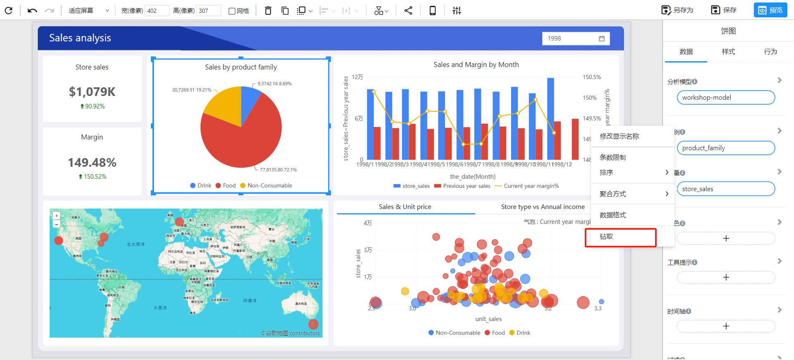
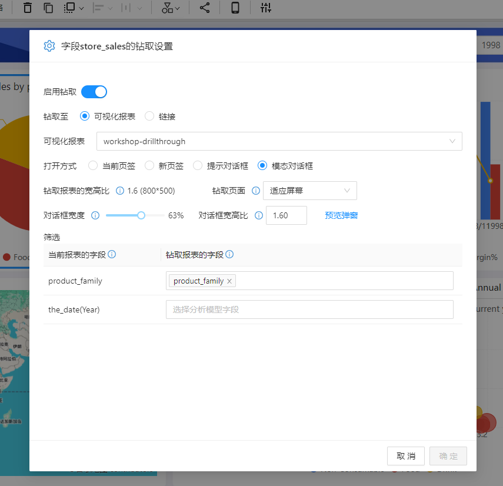
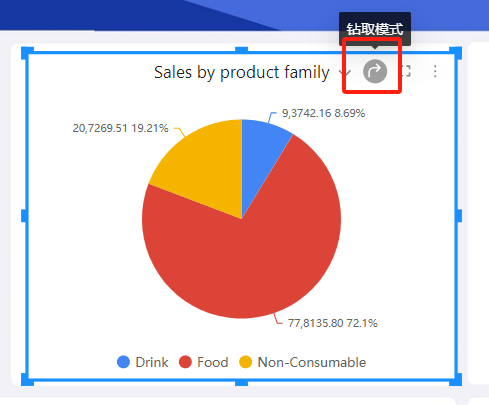
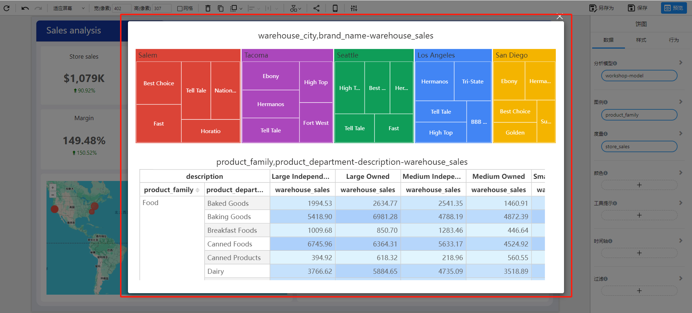

## 什么是”钻取“？

**“钻取”** 是从一个汇总视图跳转到一个新的详细视图，用于查看与选定数据相关的更多信息。

------

## 如何设置”钻取“

1. 图表组件的**字段菜单**中选择”**钻取**“
   

2. 设置钻取功能

   

   **钻取至:** 选择钻取目标，可以是一个可视化报表，也可以是URL链接。

   **可视化报表:** 在Datafor资源库中选择可视化报表。

   **打开方式:** 选择钻取目标页面的打开方式。

   **钻取报表的宽高比:** 查看目标页的长宽比和页面像素大小。

   **钻取页面:** 设置钻取页面在容器中的大小。

   **对话框宽度:**  钻取页面的容器占本页面的宽度比例。

   **对话框宽高比:**  钻取页面的容器的长宽比。

   **筛选:**  设置传递到钻取页面的筛选值。可以传递的筛选值包括图表组件数据面板上选择的字段值和筛选此图表组件的筛选组件的值。

## 如何使用“钻取”

1. 开启图表组件的钻取功能。在图表组件的工具条上选择“允许钻取”
   

2. 点击图表组件相关图区，打开钻取页面。
   

## 总结

Datafor的”钻取“功能为用户提供了深入挖掘数据的有力工具。通过合理使用”钻取“，用户可以更全面地理解数据，支持更深入的业务决策。希望本文档能够帮助您充分利用Datafor的”钻取“功能。如有任何疑问或需要进一步支持，请随时联系我们的支持团队。