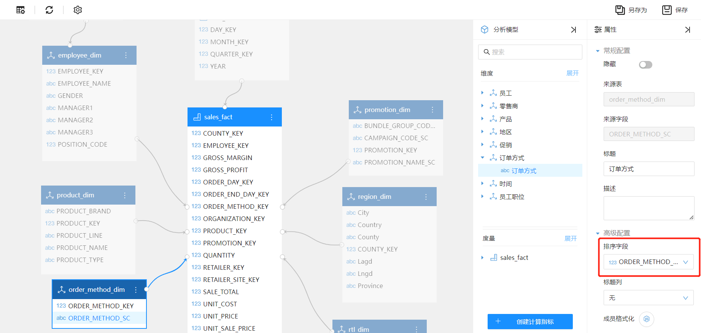
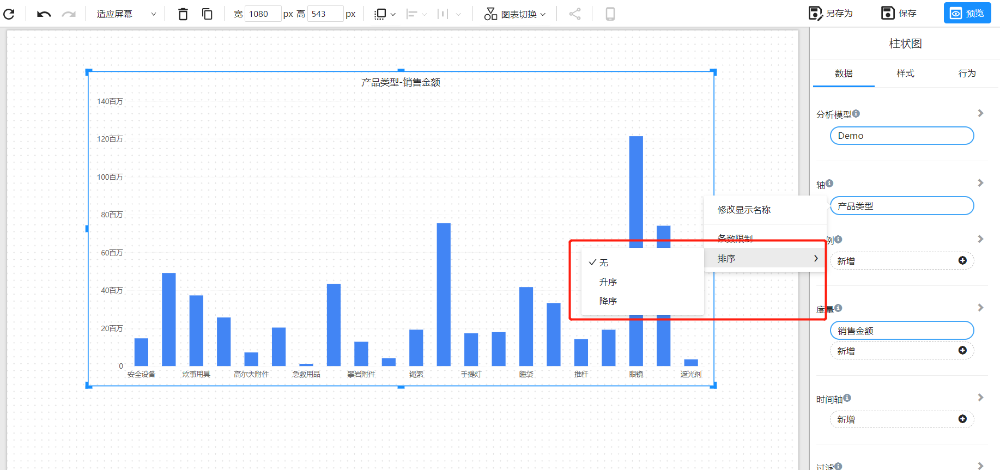
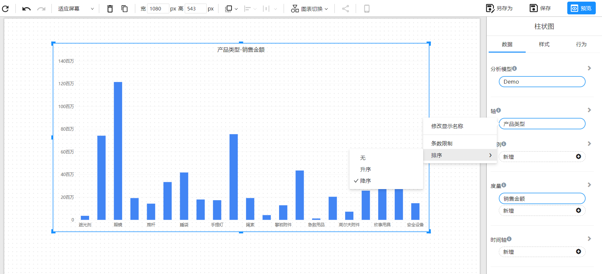
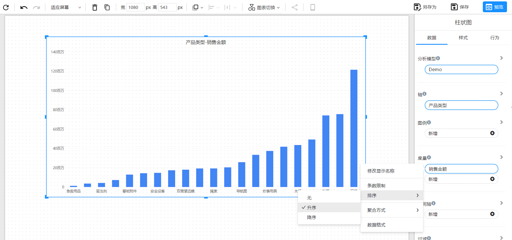

# 排序

Datafor提供在分析模型上设置排序字段和报表设计时在组件上设置字段的升降排序。

## 分析模型上设置排序

当一个维度字段，它的排序顺序需要参考另外一个字段的顺序，那么你需要在设计模型时，在维度字段的”高级属性”中设置排序字段。

例如：你有一个“订单方式”列，当将其添加到某个组件后，“订单方式”会按字母顺序排序。 这不是你需要的， 你希望它按”订单方式键值“顺序进行排序。

## 设计分析报表时排序

### 维度字段排序

组件的“轴”通常可以排序。无论是文本、数字还是日期，都可以按所需的方式进行排序。

对于某些类型的组件，排序不可用：树状图、仪表、地图等。

在维度字段的菜单中，选择“排序”菜单，在二级菜单中选择”升序“或”降序“。

### 度量排序

度量值通常是数字类型，在度量菜单中选择“排序”，，在二级菜单中选择”升序“或”降序“。

