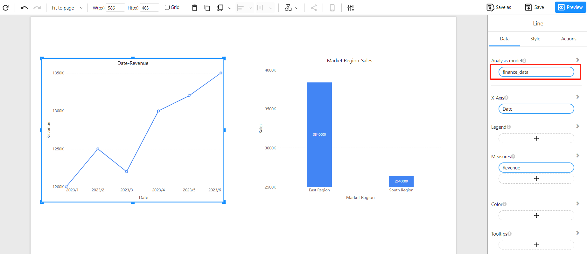
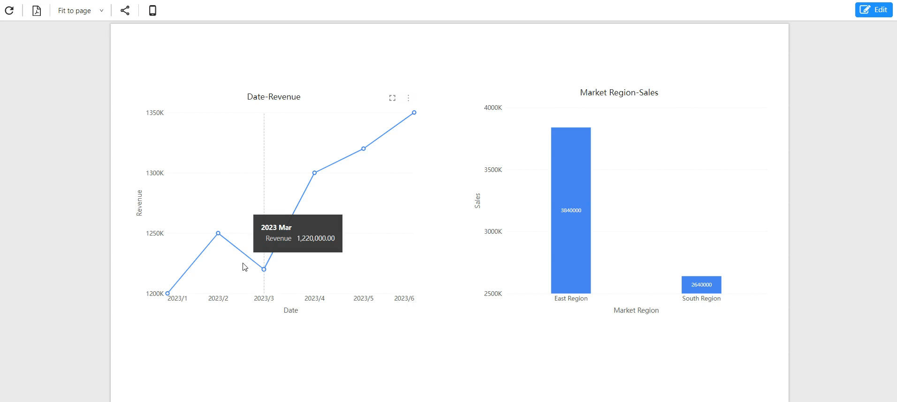

# 跨模型和跨数据源分析

Datafor 的跨模型和跨数据源分析功能使用户能够在单一报表中集成来自不同数据源的数据，从而实现全面的数据分析和可视化。该功能帮助用户跨数据源关联和对比数据，提供更深入的分析视角。

## 功能特性

- **多数据源整合**：用户可以在同一报表中，将不同组件的数据源设置为不同的模型或数据源，打破数据孤岛，实现全局视图。
- **交叉筛选**：不同数据来源的可视化组件支持交叉筛选，用户可通过多维度分析更好地探索数据之间的关系。

## 使用场景

假设某公司希望整合财务数据与销售数据，以全面分析市场表现并追踪关键财务指标。财务数据存储在 ERP 系统中，而销售数据存储在 CRM 系统中。借助 Datafor 的跨模型和跨数据源分析功能，公司能够在同一报表中直观展示销售趋势、成本分析、盈利状况等信息。通过交叉分析，用户能够深入发现财务与销售数据之间的潜在联系。

## 示例数据

### ERP 系统：财务数据表（FinanceData）

| Date     | Cost   | Revenue | Profit |
| -------- | ------ | ------- | ------ |
| 2023 Jan | 500,000 | 1,200,000 | 700,000 |
| 2023 Feb | 520,000 | 1,250,000 | 730,000 |
| 2023 Mar | 510,000 | 1,220,000 | 710,000 |
| 2023 Apr | 550,000 | 1,300,000 | 750,000 |
| 2023 May | 560,000 | 1,320,000 | 760,000 |
| 2023 Jun | 590,000 | 1,350,000 | 760,000 |

### CRM 系统：销售数据表（SalesData）

| Date     | Market Region | Product Category | Sales  | Units Sold |
| -------- | ------------- | ---------------- | ------ | ---------- |
| 2023 Jan | East Region   | Electronics      | 600,000 | 1,200       |
| 2023 Jan | South Region  | Home Goods       | 400,000 | 900         |
| 2023 Feb | East Region   | Electronics      | 620,000 | 1,240       |
| 2023 Feb | South Region  | Home Goods       | 420,000 | 920         |
| 2023 Mar | East Region   | Electronics      | 610,000 | 1,230       |
| 2023 Mar | South Region  | Home Goods       | 410,000 | 910         |
| 2023 Apr | East Region   | Electronics      | 650,000 | 1,300       |
| 2023 Apr | South Region  | Home Goods       | 450,000 | 950         |
| 2023 May | East Region   | Electronics      | 670,000 | 1,340       |
| 2023 May | South Region  | Home Goods       | 470,000 | 970         |
| 2023 Jun | East Region   | Electronics      | 690,000 | 1,380       |
| 2023 Jun | South Region  | Home Goods       | 490,000 | 990         |

## 创建分析模型

接下来，我们将创建两个不同数据源的分析模型。

### 财务分析模型：finance_data

### 销售分析模型：sales_data

## 创建分析报表

使用 `finance_data` 模型创建折线图：

使用 `sales_data` 模型创建柱状图：

## 交叉分析

在数据报表中，用户可以通过交叉筛选功能进行多维度分析：

## 常见问题

1. **跨模型交叉分析和筛选时，如果两个模型的字段名称不同，能进行交叉分析吗？**

   **回答**：可以，只要两个模型的字段标题一致，便可进行交叉分析。

   

2. **筛选组件使用模型 A 的字段，基于模型 B 创建的图表组件能订阅该筛选吗？**

   **回答**：可以。如果模型 B 中有与筛选组件使用的字段标题相同的字段，则可以进行筛选和交叉分析。
