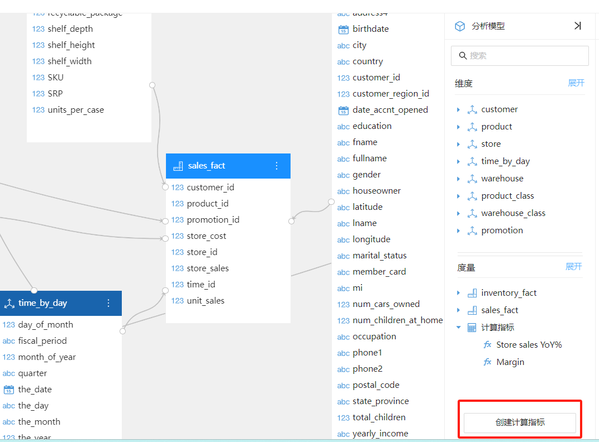
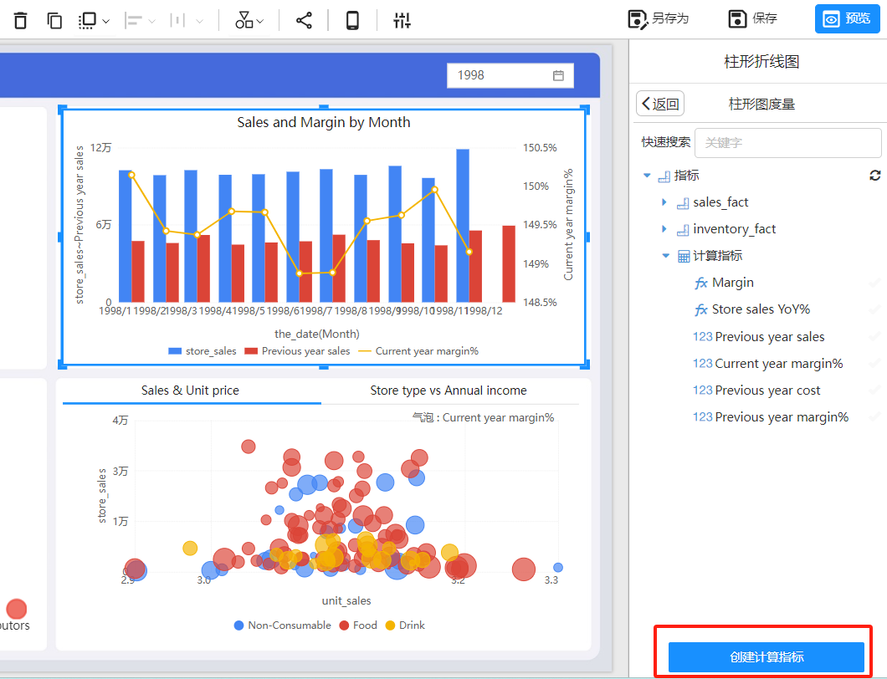
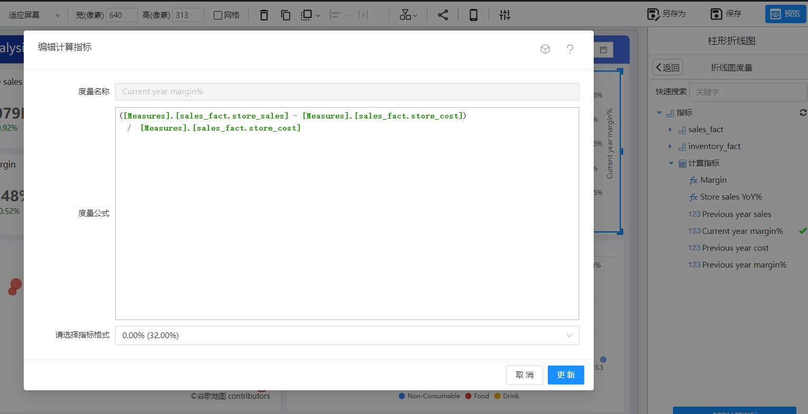
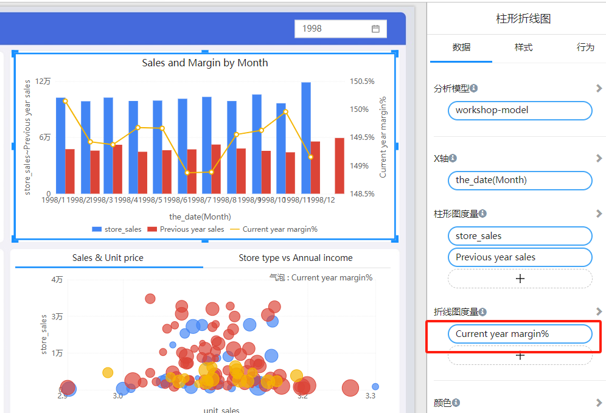

# 计算度量

Datafor 提供了强大的计算度量功能，允许用户定义复杂的计算逻辑，以便在报表和仪表板中使用。

## 什么是计算度量？

计算度量是由用户定义的度量，通过对现有数据进行计算来创建新的值。这些计算可以简单如求和或平均，也可以复杂如时间智能计算和自定义业务逻辑。计算度量允许用户根据特定的业务需求创建动态且灵活的分析。

## 使用 MDX 定义计算度量

MDX 是一种专门用于查询和操作多维数据的表达式语言。Datafor 使用 MDX 来定义计算度量，为用户提供强大的计算和分析能力。MDX 提供了一系列函数和操作符，可以处理复杂的多维数据计算需求。

[MDX函数](https://datafor123.github.io/docs/120%20advanced/advanced-mdx)

### 示例：简单计算度量

例如，您可以创建一个简单的计算度量来计算总销售额：

```
SUM([Sales].[Amount])
```

### 示例：时间智能计算度量

MDX 还支持复杂的时间智能计算。例如，您可以创建一个计算度量来计算同比增长：

```
([Measures].[Sales Amount], [Date].[Calendar].CurrentMember) - 
([Measures].[Sales Amount], [Date].[Calendar].CurrentMember.PrevYear)
```

## 在 Datafor 中创建计算度量

### 在分析模型中创建

<div align="left"></div>

### 在报表编辑视图中创建

<div align="left"></div>

## 在报表中使用计算度量

一旦创建了计算度量，您可以在 Datafor 的报表和仪表板中使用这些度量。

### 示例：在仪表板中使用计算度量

您可以将之前创建的 `Current year margin%`计算度量添加到仪表板中。

```
SUM([Sales].[Amount])
```

<div align="left"></div>

通过这种方式，您可以在仪表板中实时查看和分析毛利率的变化情况。

<div align="left"></div>

## 总结

Datafor 的计算度量功能通过使用 MDX 语言，为用户提供了强大的数据计算和分析能力。