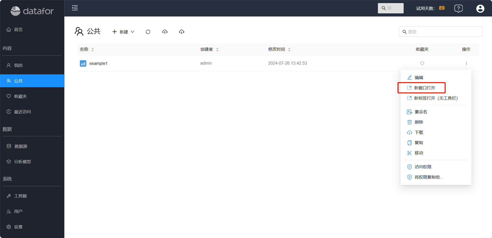
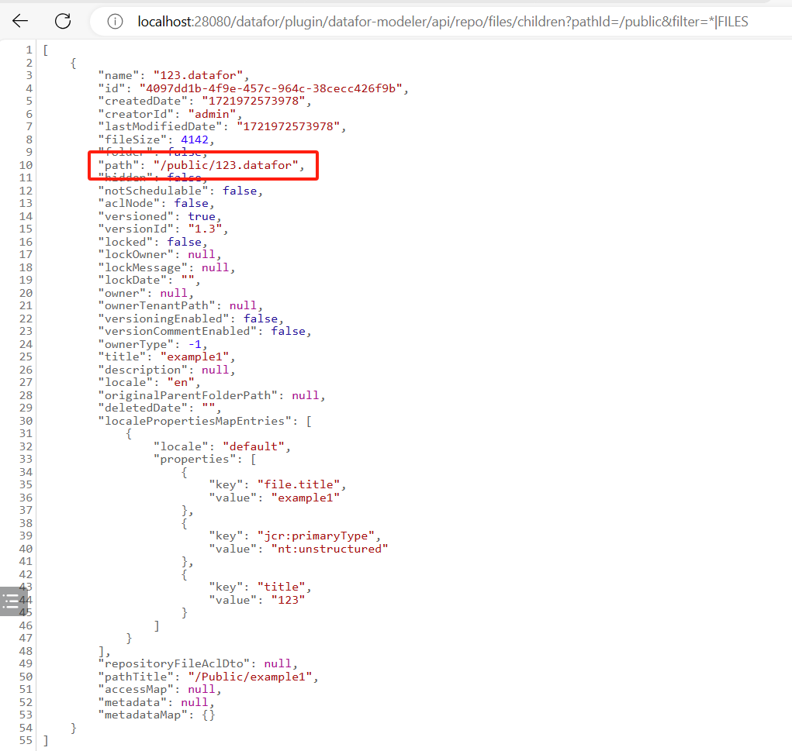

# 报表的REST API

Datafor提供了一系列REST API，允许用户通过HTTP请求调用报表。

## 打开空白的报表设计器

`http://localhost:28080/datafor/plugin/datafor/api/createDo`

## 打开报表

**URL格式**：http://`<datafor-server>`/datafor/plugin/datafor/api/`<mode>`/`<report id>`?`<parameter>&<parameter>`

说明：

- `<datafor-server>`：datafor服务器地址

- `<model>`： 报表打开模式，有三种

  **edit**：编辑模式打开报表

  **open**：查看模式打开报表

  **integrate**：嵌入模式打开报表。使用场景：通过iframe将报表嵌入到其它页面。

- `<report id>`：报表ID

- `<parameter>`: 参数，仅在嵌入模式有效

  **__compact=true**： 去掉报表页面的外边距

  **__clean=true**：去掉报表页面的默认阴影效果

  **__forceAdjust=true**：报表宽度适应容器

## 示例

- 编辑模式打开报表: `http://localhost:28080/datafor/plugin/datafor/api/edit/L2hvbWUvYWRtaW4vZXhhbXBsZTEuZGF0YWZvcg==`


- 查看模式打开报表: `http://localhost:28080/datafor/plugin/datafor/api/open/L2hvbWUvYWRtaW4vZXhhbXBsZTEuZGF0YWZvcg==`


- 嵌入模式打开报表: `http://localhost:28080/datafor/plugin/datafor/api/integrate/L2hvbWUvYWRtaW4vZXhhbXBsZTEuZGF0YWZvcg==`


- 嵌入模式打开报表并且去掉报表外边距: `http://localhost:28080/datafor/plugin/datafor/api/integrate/L2hvbWUvYWRtaW4vZXhhbXBsZTEuZGF0YWZvcg==?__compact=true`


- 嵌入模式打开报表并且去掉报表外边距和报表宽度适应所嵌入的iframe容器: `http://localhost:28080/datafor/plugin/datafor/api/integrate/L2hvbWUvYWRtaW4vZXhhbXBsZTEuZGF0YWZvcg==?__clean=true&__forceAdjust=true`

## 如何获取报表ID

### 方法一:  报表从URL上复制

1. 在新窗口中打开报表

   <div align="left"></div>


2. 在浏览器的地址栏获取文件ID

   <div align="left"></div>

### 方法2: 用代码生成报表ID

1. 用接口获取文件路径

   例如：

   ```
   http://localhost:28080/datafor/plugin/datafor-modeler/api/repo/files/children?pathId=/public&filter=*|FILES
   ```

   <div align="left"></div>

2. 使用Base64方式编码文件路径

   ```
   window.btoa(unescape(encodeURIComponent("/public/123.datafor"))).replace(/\+/g, "-").replace(/\//g, "_");
   ```
