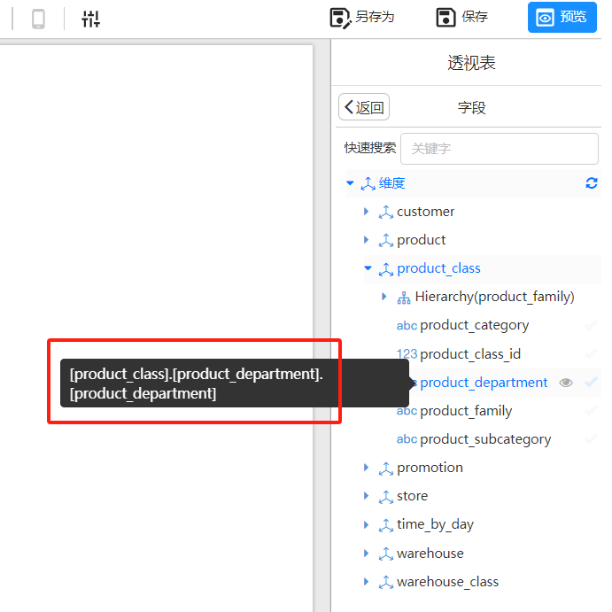
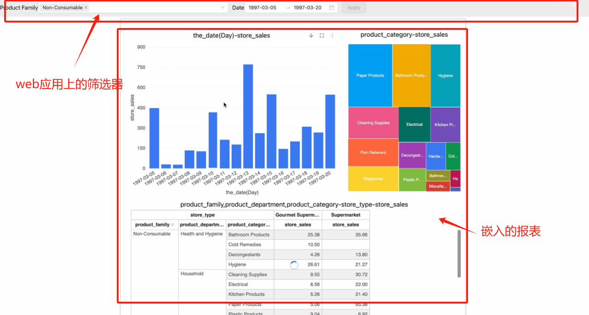

# XDM方式嵌入报表

> [!NOTE]
>
> 本文档中的”**报表**“是指通过Datafor或Visualizer插件创建的可视化报表。

报表支持XDM（跨文档消息传输）方式，过滤报表数据（无需刷新报表页）。XDM方式可控制报表的数据过滤、样式、行为，本篇只讨论数据过滤的场景。


## 什么是 XDM（跨文档消息传递）？

XDM（Cross-Document Messaging）是一种技术，允许不同网页或应用之间在不同来源（例如不同域名、子域名）下安全地交换信息。通常，浏览器会限制不同来源的网页互相访问彼此的内容，以保护用户的隐私和安全。但是在某些情况下，不同来源的网页需要进行通信，比如在嵌入了外部内容的页面中，这时就可以使用 XDM。

Web应用通过`postMessage` API与报表进行通信，向报表发送参数值。报表将参数值作为过滤器分发给各个图表组件，各个图表重新发起查询以实现数据过滤功能。

通过 XDM，您可以在不破坏浏览器安全性的情况下，实现跨域的网页通信。

## 应用场景：

在Web应用中通过iframe嵌入报表时，可能有以下场景：

1. 初始加载报表时传递参数给报表，过滤报表数据。
2. 报表加载完成后，在Web应用中改变参数值，将参数值传递给报表，过滤报表数据(无需重新加载报表)

## 步骤：

1. **在主程序中引入`XDMWorker`类：**

   调用报表的的主程序中添加如下类`XDMWorker`，用于转发`XDM`消息。主程序可以基于这个类的`send`方法，将过滤参数传递给报表。

   ```js
   class XDMWorker {
       constructor({ onPageInitEvent = () => { } }) {
           this.reportId = null;
           window.addEventListener('message', (msg) => {
               const { data } = msg;
               let reportMessage;
               try { reportMessage = JSON.parse(data); } catch (d) { }
               if (reportMessage) {
                   if (reportMessage.event == 'visualizerReportFileLoaded') {
                       this.reportId = reportMessage.id;
                       onPageInitEvent();
                   }
               }
           });
       }
   
       send(data, target, init = false) {
           if (!this.reportId) {
               console.error('No reportId found, please wait for the report to be loaded');
               return;
           }
           const message = {
               trustMark: this.reportId,
               event: 'query',
               init,
               filters: data,
           };
           target?.postMessage(JSON.stringify(message), '*');
       }
   }
   ```


### 场景一：初始加载报表时传递参数给报表，过滤报表数据。

1. **在调用报表前初始化XDMWorker对象：**

   在调用报表前，初始化一个`XDMWorker`对象。如需在报表初次加载时过滤报表数据，请在`onPageInitEvent`事件中调用`send`方法，并将第三个参数指定为`true`。

   **示例:**

   ```js 
   const xdm = new XDMWorker({
       onPageInitEvent: () => {
          iframeRef?.current && xdm.send(
                  [
                     {
                       value: [
                         'product_family_1',  //
                         'product_family_2' 
                       ],  
                       name: '[product_class].[hierarchy_product_family].[product_family]',  
                       type: 'name',  // 过滤作用类型，可选值：name, caption
                       datatype:'string'  // 过滤值的数据类型
                     }
                  ], 
                  iframeRef.current?.contentWindow, 
                  true   // 是否为报表初次加载，true表示初次加载。
              );
       }
   });
   ```
   **参数说明：**

   ```js
   [{
       value: [
           [
               {i: 0|1, v: string},  // 范围过滤。 i属性（0表示不包含边界值或1表示包含边界值），v属性（Web应用里的参数值）
               {i: 0|1, v: string}
           ], 
           string,  // Web应用里的参数值
           ...
       ],  
       name: string,  // 报表中分析模型里level的uniqueName
       type: 'name'|'caption',  // 过滤作用类型，可选值：name, caption
       datatype: 'string'|'numeric'|'timestamp'  // 过滤值的数据类型
   }]
   ```

   **value**：Web应用里的参数值

   | 值类型                                                     | 示例                                                         |
   | ---------------------------------------------------------- | ------------------------------------------------------------ |
   | x in ('a','b','c')                                         | {'value':['a','b','c'],'datatype':'string'}                  |
   | x >=1 and x<3                                              | {'value':[{'i':'1','v':'1'},{'i':'0','v':'3'}],'datatype':'numeric'} |
   | x between (2,5) or x between (4,6)                         | {'value':[['2','5'],['4','6']],'datatype':'numeric'}         |
   | x between (2,5) or x between (4,6) or x in (7,8)           | {'value':[['2','5'],['4','6'],'7','8'],'datatype':'numeric'} |
   | x >= '2024-01-01 00:00:00+8'and x <'2025-01-01 00:00:00+8' | {'value':[{'i':'1','v':'1704038400'},{'i':'0','v':'1735660800'}],'datatype':'timestamp'} |

   **name：**报表所用分析模型的字段的uniqueName

   **type：**将参数值传递到分析模型字段的name或caption上

   **datatype：**过滤值的数据类型

2. **调用报表**

   - 获取报表的嵌入模式url

     [参考文档](https://help.datafor.com.cn/docs/80%20share/jcyfx-report-api)

   - 在报表URL中添加“延迟时间参数”：

     在调用报表的链接中添加**延迟时间参数** `__xdmTimeout=150`，

     例如：`http://localhost:28080/datafor/plugin/datafor/api/integrate/L2hvbWUvYWRtaW4vZXhhbXBsZTEuZGF0YWZvcg==?__xdmTimeout=150`
     
     > [!NOTE]
     >
     > **什么是“延迟时间参数”？**
     >
     > 打开报表后，报表启动到特定阶段，会发出报表初始化广播信息，并等待150ms，如果等待时间内收到有效回应，便将回应里的参数值作为报表初次加载的数据筛选值。可以根据主程序响应的速度调整这个延迟时间。如果不需要在报表初次加载时过滤数据，则可以不添加这个参数。


### 场景二：报表加载完成后，在Web应用中改变参数值，将参数值传递给报表，过滤报表数据(无需重新加载报表)


1. **调用send方法**

   报表页面打开后，如需将Web应用中的参数值传递给报表，可以在主程序中调用send方法。报表会即时响应，重新查询数据。

2. **send方法调用格式：**

   ```js   
   send(message, target)
   ```

   参数说明：
   - `message`: 过滤参数，格式如下：
     
     ```js
     [{
         value: [
             [
                 {i: 0|1, v: string},  // 范围过滤。 i属性（0表示不包含边界值或1表示包含边界值），v属性（Web应用里的参数值）
                 {i: 0|1, v: string}
             ], 
             string,  // Web应用里的参数值
             ...
         ],  
         name: string,  // 报表中分析模型里level的uniqueName
         type: 'name'|'caption',  // 过滤作用类型，可选值：name, caption
         datatype: 'string'|'numeric'|'timestamp'  // 过滤值的数据类型
     }]
     ```
     
   - `target`: 打开报表的iframe所属窗口对象。

## 如何获取分析模型字段的 `uniqueName`？

在报表设计器中，选择分析模型字段时通过工具提示可以查看到 `uniqueName`。

下图中的 `product_department` 字段的 `uniqueName` 是：`[product_class].[product_department].[product_department]`

<div align="left"></div>


## 示例项目

   请参考示例项目：https://github.com/datafor123/visualizer-xdm-demo

   <div align="left"></div>
