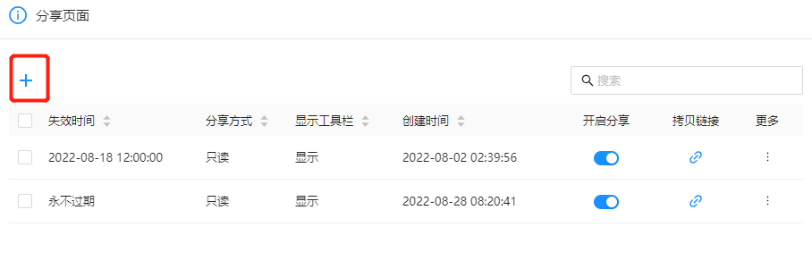
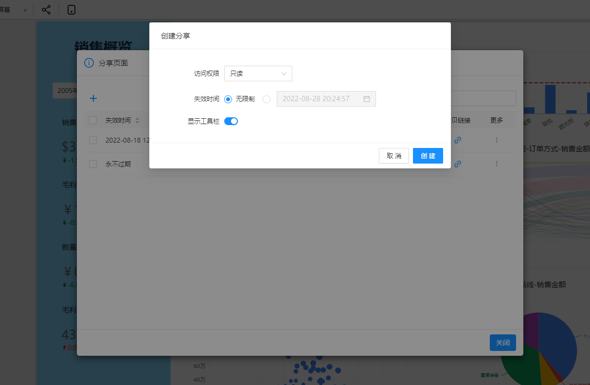
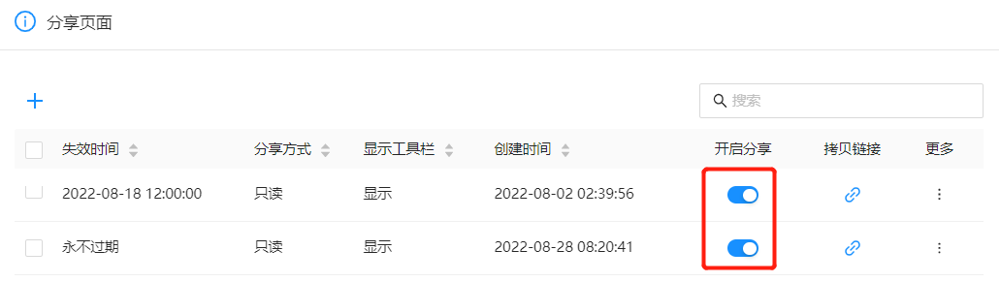
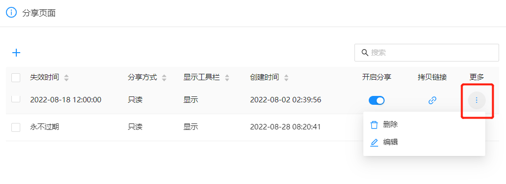

# 分享链接

通过生成“分享链接”，可以将分析报表分享给他人。被分享者有DATAFOR账号或者没有DATAFOR账号，都可以查看数据，或者修改报表。通过分享链接查看的数据权限和分享者所拥有的数据权限一致。

## 配置应用域名地址

分享连接使用

## 创建分享链接

1. 通过工具栏的”分享“按钮管理已创建的分享链接

   

2. 在分享链接管理界面，点击创建分享链接按钮创建分享链接

  

  点击“拷贝链接”按钮，复制分享链接url。 

3. 设置分享链接

     

DATAFOR提供两种分享链接：

- 只读

  任何人，都可以访问此链接来查看此报表，无需DATAFOR账号。数据权限和分享者的权限一致。

- 编辑

  任何人，都可以访问此链接来编辑和查看此报表，无需DATAFOR账号。数据权限和分享者的权限一致。

***注意：对文件没有编辑权限的用户，也无权生成”编辑“分享链接。**

## 分享链接暂停分享

在分享链接列表，关闭“开启分享”按钮。当“开启分享”开关被关闭，分享链接失效。

## 编辑和删除分享链接

点击分享链接列表中的更多按钮，进行编辑和删除操作。

