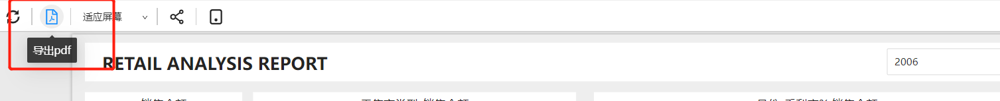
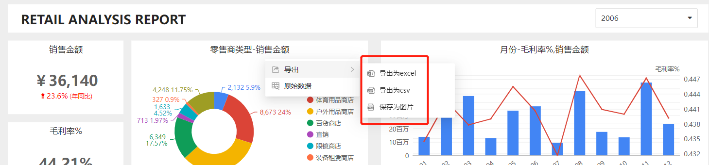

# 导出

Datafor提供多种导出格式，使用户能够以不同的方式导出数据和报表。

- PDF：以PDF格式文件保存报表，提供高质量的打印和共享功能。
- Excel：以电子表格的形式导出数据，使用户可以对数据进行更详细的分析和处理。
- CSV：以逗号分隔的值的形式导出数据。这种格式适用于将数据导入到其他软件中，比如数据库或电子表格。
- PNG：将报表以图片格式导出，可以方便地插入到文档、演示文稿或网页中。

## 报表导出

通过工具条上的导出按钮将报表导出成pdf文件。

## 组件导出

通过“组件菜单”将组件导出：

1. 图片文件
2. Excel文件
3. CSV文件

