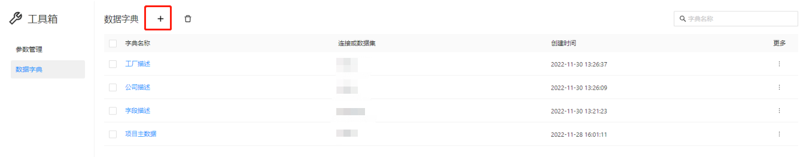
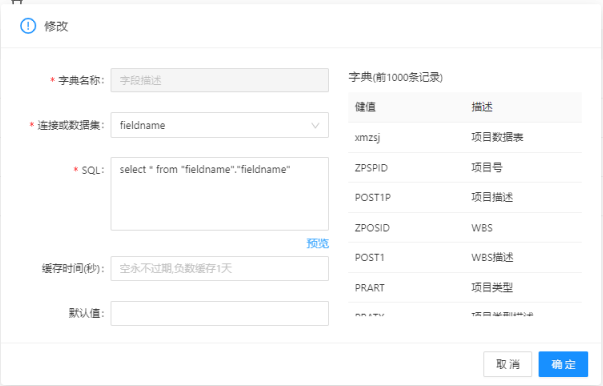
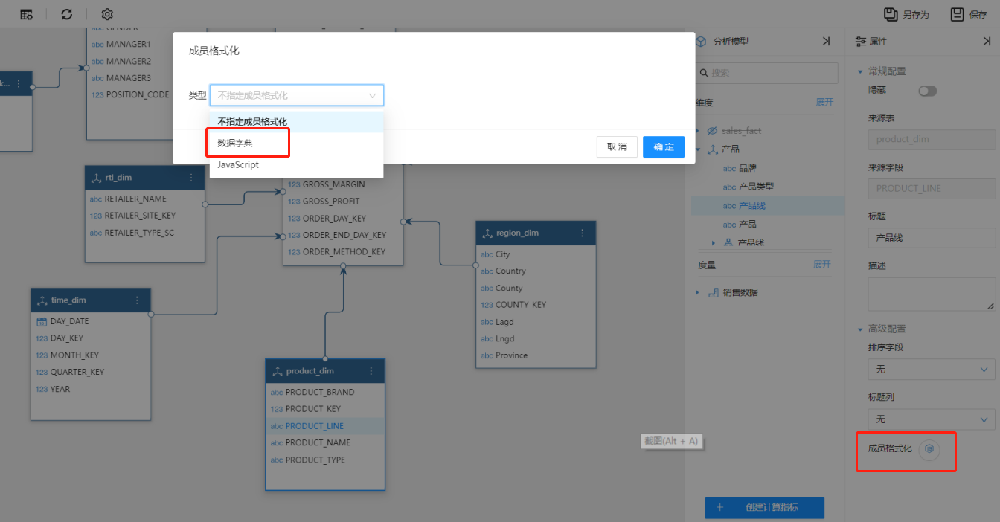
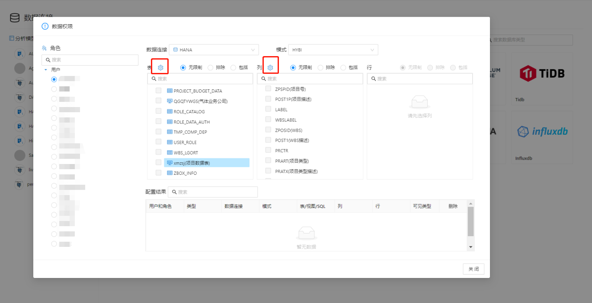

# 数据字典

## 什么是数据字典

数据字典包含两个字段：key和value。数据字典的key用来和其它字段做关联，value值将替换引用数据字典的key值。

## 创建数据字典

在数据字典管理界面新建数据字典

 

点击新增按钮。

数据字典通过sql语句定义，sql返回的第一个字段作为数据字典的”键值“，第二个字典作为数据字典的“值”。

## 使用数据字典

目前Datafor在两个地方可以用到数据字典：

### 1. 分析模型的维度字段

分析的维度字段可以通过数据字典替换字段成员的值。

 

   

### 2. 数据权限配置界面

数据权限配置界面可以引用数据字典，将表名、字段名、字段值用数据字典来描述。

 
