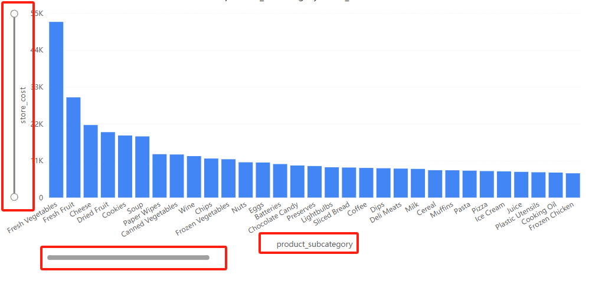
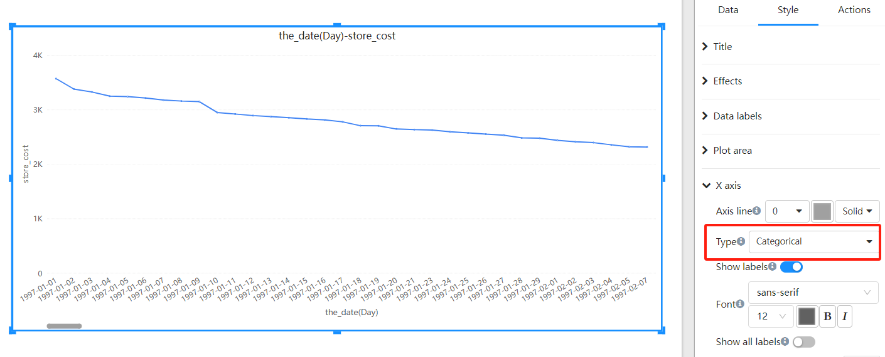

# v6.06 Updates:

1. Coordinate charts optimization: support for scroll bars, zooming, and automatic layout (Legend, Axis text, Axis names, Grid, etc.)

   

2. Added "Continuous" and "Categorical" types to the X-axis. "Continuous" is suitable for numerical or time series data, while "Categorical" is suitable for categorical data.

   

   
   

3. Negative Value Display Optimization: For waterfall chart, Ratio stack chart, etc.

   

   
4. Chart tooltip optimization

5. Table pagination query performance optimization

6. Added system parameters: #{system.username}, #{system.role}, #{system.roles_array}, #{system.locale}, etc.

7. SQL optimization for filtering with null values

8. Indicator filtering performance optimization

9. Error and performance optimization for sorting multiple fact tables

10. License update

11. Other optimizations and bug fixes