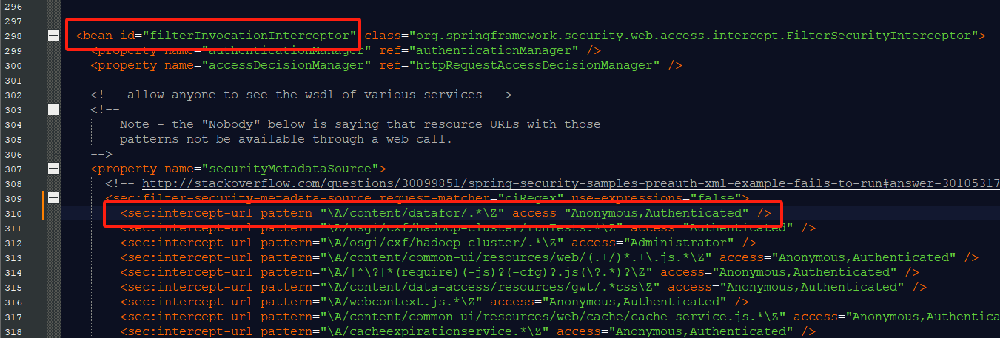

---

id: visualizer-setup
title: Visualizer(Plugin for PBA) Setup
sidebar_position: 40
---
# Visualizer(Plugin for PBA) Setup Manual

1. Unzip **Visualizer.zip** to the **pentaho-solutions\system** directory

   <div align="left"></div>

   **Note: If there is an old version of the Visualizer plugin in the system directory, it needs to be deleted; changing the folder name is also not allowed.**

2. Modify the **ImportHandlerMimeTypeDefinitions.xml** file in the **pentaho-solutions\system** directory and add the following content.

   ```
   <extension>datafor</extension>
   ```

   <div align="left"></div>

3. Modify the **applicationContext-spring-security.xml** file in the **pentaho-solutions\system** directory.

   Add the following code under the **bean id="filterInvocationInterceptor"** node:

   ```
   <sec:intercept-url pattern="\A/content/datafor/.*\Z" access="Anonymous,Authenticated" />
   ```

   <div align="left"></div>

    Add the following code under the **bean id="filterInvocationInterceptorForWS"** node:

   ```
   <sec:intercept-url pattern="\A/plugin/datafor/api/.*\Z" access="Anonymous,Authenticated" />
   <sec:intercept-url pattern="\A/plugin/datafor-modeler/api/.*\Z" access="Anonymous,Authenticated" />
   ```
   <div align="left"></div>

4. In the **pentaho-solutions\system** directory, locate the **server.properties** file, and modify the value of **fully-qualified-server-url** according to the documentation instructions.

   <div align="left"></div>

5. Installing Fonts (Only for Linux)

   If you are unable to export Excel files, it may be because OpenJDK is in use, and the required fonts are not installed. Please execute the following command on the server as the root user to install the fonts.

   ```
   yum install fontconfig
   fc-cache --force
   ```

6. Restart PBA

   <div align="left"></div>

