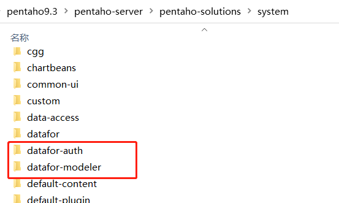

# Modeler(Plugin for PBA) Setup

1. Extract "**Modeler.zip**" to the "**pentaho-solutions\system**" directory.

   <div align="left"></div>

2. Create a database named "**datafor**" in the repository database of PBA (PostgreSQL).

   ```
   CREATE DATABASE datafor WITH OWNER = postgres ENCODING = 'UTF8' TABLESPACE = pg_default;
   GRANT ALL PRIVILEGES ON DATABASE datafor to postgres;
   ```

3. Create 6 tables in the "**datafor**" database.

   **Table: auth_config**

   ```
   CREATE TABLE "public"."auth_config" (
         "id" varchar(250) COLLATE "pg_catalog"."default" NOT NULL,
         "dbconn" varchar(255) COLLATE "pg_catalog"."default" NOT NULL,
         "schema" varchar(255) COLLATE "pg_catalog"."default",
         "tbname" varchar(255) COLLATE "pg_catalog"."default" NOT NULL,
         "cols" text COLLATE "pg_catalog"."default",
         "rows" text COLLATE "pg_catalog"."default",
         "sql" text COLLATE "pg_catalog"."default",
         "enable" char(1) COLLATE "pg_catalog"."default" NOT NULL,
         "visible" char(1) COLLATE "pg_catalog"."default" NOT NULL,
         "add_time" timestamp(6),
         "add_by" varchar(200) COLLATE "pg_catalog"."default",
         "update_time" timestamp(6),
         "update_by" varchar(200) COLLATE "pg_catalog"."default",
         "name" varchar(255) COLLATE "pg_catalog"."default",
         "type" varchar(1) COLLATE "pg_catalog"."default",
         "editable" char(1) COLLATE "pg_catalog"."default" NOT NULL DEFAULT 1
   );
   ALTER TABLE "public"."auth_config" ADD CONSTRAINT "auth_config_pkey" PRIMARY KEY ("id");
   
   ```
   

   **Table: gis_config**

   ```
   CREATE TABLE "public"."gis_config" (
    "engine" varchar(255) COLLATE "pg_catalog"."default" NOT NULL,
    "name" varchar(255) COLLATE "pg_catalog"."zh-Hans-CN-x-icu" NOT NULL,
    "longitude" varchar(255) COLLATE "pg_catalog"."default",
    "latitude" varchar(255) COLLATE "pg_catalog"."default"
    
   );
   ALTER TABLE "public"."gis_config" ADD CONSTRAINT "gis_config_pkey" PRIMARY KEY ("engine", "name");
   ```

   

   **Table: dict_config**

   ```
   CREATE TABLE "public"."dict_config" (
         "id" varchar(32) COLLATE "pg_catalog"."default" NOT NULL,
         "name" varchar(255) COLLATE "pg_catalog"."default",
         "dbconn" varchar(255) COLLATE "pg_catalog"."default",
         "schema" varchar(255) COLLATE "pg_catalog"."default",
         "detail" text COLLATE "pg_catalog"."default",
         "type" char(1) COLLATE "pg_catalog"."default",
         "default" varchar(255) COLLATE "pg_catalog"."default",
         "desc" varchar(255) COLLATE "pg_catalog"."default",
         "add_time" timestamp(6),
         "update_time" timestamp(6),
         "add_by" varchar(255) COLLATE "pg_catalog"."default",
         "update_by" varchar(255) COLLATE "pg_catalog"."default",
         "expire" varchar(255) COLLATE "pg_catalog"."default"
   );
   ALTER TABLE "public"."dict_config" ADD CONSTRAINT "dict_config_pkey" PRIMARY KEY ("id");
   ```
   **Table: dict_map**

   ```
   CREATE TABLE "public"."dict_map" (
    "id" varchar(64) COLLATE "pg_catalog"."default" NOT NULL,
    "dict" varchar(255) COLLATE "pg_catalog"."default" NOT NULL,
    "type" varchar(1) COLLATE "pg_catalog"."default" NOT NULL,
    "dbconn" varchar(255) COLLATE "pg_catalog"."default",
    "schema" varchar(255) COLLATE "pg_catalog"."default",
    "table" varchar(255) COLLATE "pg_catalog"."default",
    "field" varchar(255) COLLATE "pg_catalog"."default"
   );
   ALTER TABLE "public"."dict_map" ADD CONSTRAINT "dict_map_pkey" PRIMARY KEY ("id");
   ```
   **Table: query_config**

   ```
   CREATE TABLE "public"."query_config" (
          "id" varchar(32) COLLATE "pg_catalog"."default" NOT NULL,
          "dbconn" varchar(255) COLLATE "pg_catalog"."default" NOT NULL,
          "schema" varchar(255) COLLATE "pg_catalog"."default",
          "tbname" varchar(255) COLLATE "pg_catalog"."default" NOT NULL,
          "sql" text COLLATE "pg_catalog"."default",
          "enable" char(1) COLLATE "pg_catalog"."default" NOT NULL,
          "add_time" timestamp(6),
          "add_by" varchar(200) COLLATE "pg_catalog"."default",
          "update_time" timestamp(6),
          "update_by" varchar(200) COLLATE "pg_catalog"."default"
   );
   ALTER TABLE "public"."query_config" ADD CONSTRAINT "query_config_pkey" PRIMARY KEY ("id");
   ```

   

   **Table: parameter_config**

   ```
   CREATE TABLE "public"."parameter_config" (
              "id" varchar(32) COLLATE "pg_catalog"."default" NOT NULL,
              "name" varchar(200) COLLATE "pg_catalog"."default" NOT NULL,
              "effectconn" varchar(200) COLLATE "pg_catalog"."default",
              "dbconn" varchar(200) COLLATE "pg_catalog"."default",
              "schema" varchar(200) COLLATE "pg_catalog"."default",
              "detail" text COLLATE "pg_catalog"."default",
              "type" char(1) COLLATE "pg_catalog"."default",
              "default" varchar(2000) COLLATE "pg_catalog"."default",
              "datatype" varchar(2) COLLATE "pg_catalog"."default",
              "desc" varchar(2000) COLLATE "pg_catalog"."default",
              "add_time" timestamp(6),
              "update_time" timestamp(6),
              "add_by" varchar(200) COLLATE "pg_catalog"."default",
              "update_by" varchar(200) COLLATE "pg_catalog"."default"
   );
   ALTER TABLE "public"."parameter_config" ADD CONSTRAINT "parameter_config_pkey" PRIMARY KEY ("id");
   ```

   

4. Create a database connection named "**datafor_modeler_auth**". Set the value of the "**stringtype**" option to "**unspecified**," and enable connection pooling.

   
   <div align="left"></div>


   <div align="left"></div>


   <div align="left"></div>

5. Restart PBA

   <div align="left"></div>