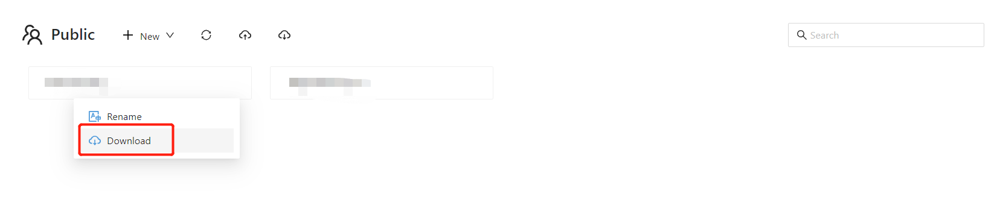
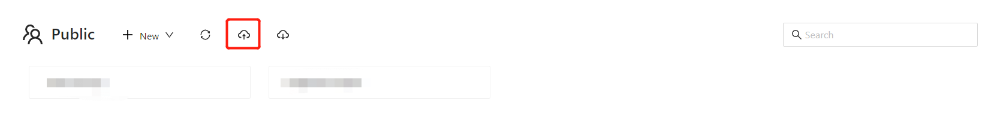
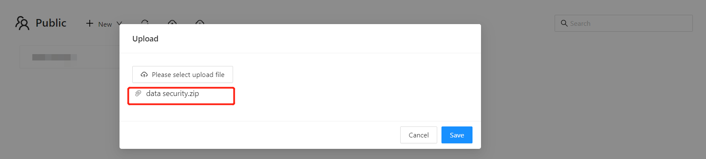
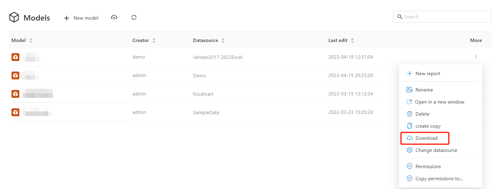
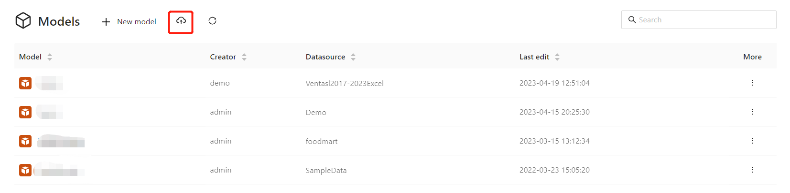
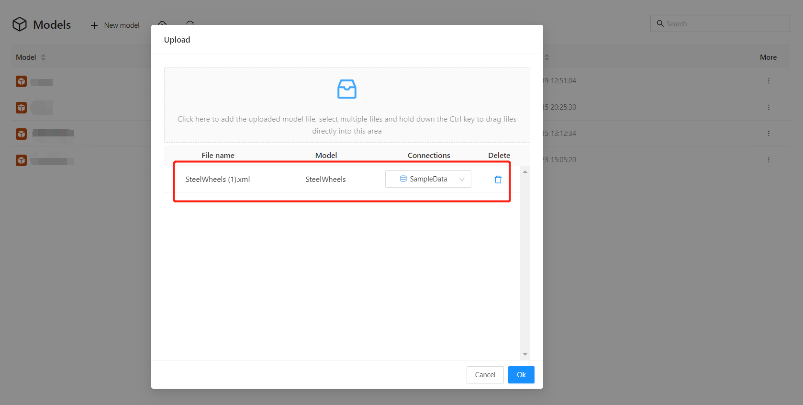

# Migration of analysis reports and models

In many scenarios, it is necessary to migrate analysis report files and models to another machine.

1. Hardware upgrade: When the old equipment cannot meet business requirements, it is necessary to upgrade the hardware equipment, and at this time, it is necessary to migrate the analysis reports and analysis models of the BI system to the new equipment.
2. Data center migration: When an enterprise needs to migrate the data center to a new location or to the cloud, it is necessary to migrate the analysis reports and analysis models of the BI system to the new environment.
3. Business expansion: When an enterprise expands in scale or business scope, it needs to add new analysis models and reports, and at this time, it is necessary to migrate these models and reports to new equipment.
4. Maintenance and upgrade: When it is necessary to maintain or upgrade the BI system, it is necessary to backup the existing analysis reports and analysis models and migrate them to new equipment. After completing the maintenance or upgrade, they need to be migrated back to the original equipment.
5. Business merger: When an enterprise undergoes a merger or acquisition, it needs to integrate the analysis reports and analysis models from different BI systems together, and at this time, it is necessary to migrate them to new equipment.

Datafor provides a "download" and "upload" method for resources such as reports, folders, and models, making it very convenient and flexible to migrate resources between systems.

## Migration of report files and folders

1. In the operation menu of the report file or folder, select the "Download" menu.

   

   > The compressed package downloaded from the folder contains all files and folders in the current folder and all subfolders.

2. Open the folder of the target system and click the "Upload" button.

   

3. Select the report file downloaded from the source system.

   

4. Click the "Save" button, and the file is uploaded to the folder of the target system.

## Migration of analysis models

1. In the operation menu of the analysis model list, select the "Download" menu.

   

2. On the toolbar of the target system's analysis model list, select the "Upload" button.

   

3. Select the model file and set the "Data Connection".

   

4. Click the "OK" button, and the upload is successful.

