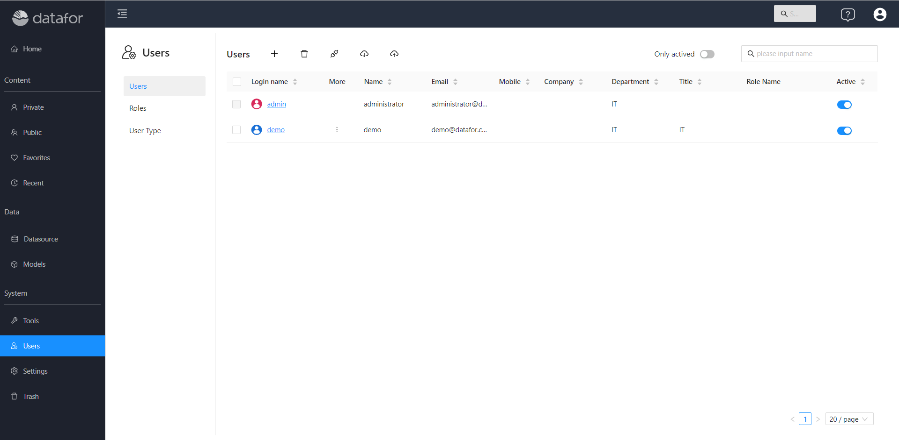
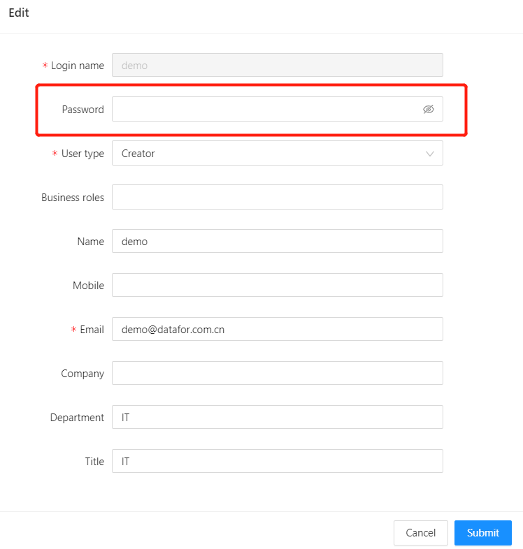
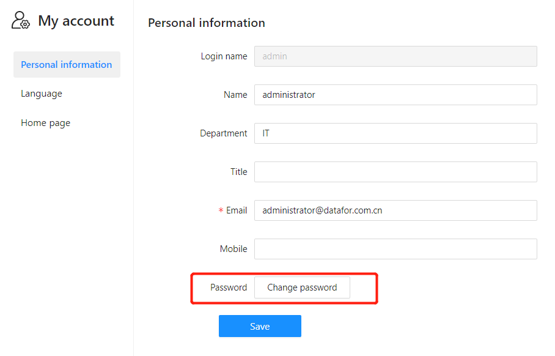
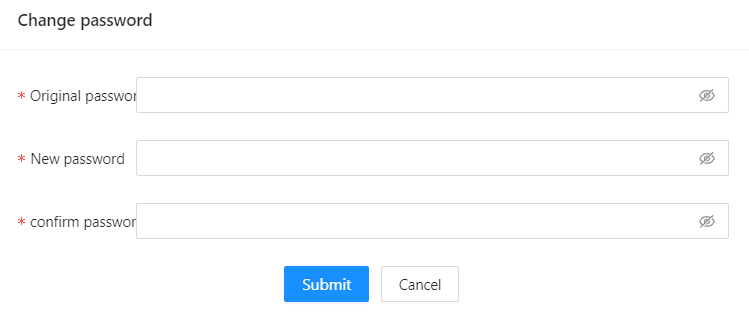

# Modify password

In order to maintain the security of the password or to modify the password due to password leakage, this is a scenario that users often encounter. Here we introduce how to change the password.

## Change Password

 - **Change password via administrator**

   Both the "administrator" and "manager" user in Datafor have the authority to modify the user's password.

   1. System-> Users
   
      

  2. Click the user "login name" to enter the user editor, and enter a new password in the "password" input box.

     

- **Change password by yourself**

  Go to "My Account"

  

   Enter the original password and new password
  
  

