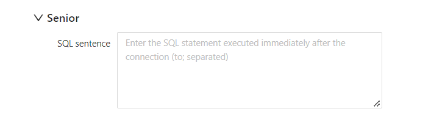

# Create database connection

Datafor supports data from a variety of data sources. If your data source is a database, connect to the database before accessing the data. Define the database connection through the "Datasource" of Datafor.

## Select the database type

Click the "Data Connection" menu to enter the data connection management interface.

Click the icon of the database type to be connected.

## Create connection

Different databases have different configuration items. Here we use MySql as an example to illustrate how to establish a connection.

1. Enter the connection information under the "Basic Configuration" tab of the connection configuration page

   

| Configuration item | Description |
| ---------- | -------------------------------------- ---------------------- |
| Connection Name | A name that uniquely describes this connection. The name can contain spaces, but no special characters (such as #, $, and %) |
| Hostname | The name of the server for the database. Alternatively, specify the host by IP address. |
| Database Name | The name of the database. If you are using an ODBC connection, enter a data source name (DSN) in this field. |
| Port number | TCP/IP port number (if it differs from default) |
| Username | Username to connect to the database |
| Password | Password to connect to the database |

2. Click Test Connectivity. If a connection is established, a success message will be displayed.

3. Click Save to close the Connection Test dialog.

   

## "Advanced" configuration items

1. Select the "Advanced" tab of the connection configuration page

   

2. Enter the SQL statement

| Configuration item | Description |
| -------- | --------------------------------- |
| SQL Statement | Enter the SQL statement used to initialize this connection. |

## 设置数据库的特定选项

1. Select the "Options" tab of the connection configuration page

2. Click the "Add" button to add parameter input items

3. Enter the parameter name in the "Parameter" input box, and enter the parameter value in the "Value" input box

## 定义连接池

1. Select the "Connection Pool" tab of the connection configuration page
2. Turn on the "Use connection pool" switch
3. Enter the connection pool configuration parameters

| Option &emsp;&nbsp;&nbsp;&nbsp;&nbsp;&nbsp; | Description |
| -------------------------------------------------- | - -------------------------------------------------- --------- |
| Enable connection pooling&nbsp; &nbsp;&nbsp; &nbsp; | Enable connection pooling. |
| Pool Size | Initial Sets the initial size of the connection pool. Maximum sets the maximum number of connections in the connection pool. |
| Parameters | You can define additional custom pool parameters. Click on any parameter to view a short description of that parameter. The most commonly used parameter is validationQuery. This parameter varies slightly depending on your RDBMS connection. The base database uses the following values for validation queries: **Select 1 from dual** for Oracle and PostgreSQL. For MS SQL Server and MySQL, use **Select 1**. |
