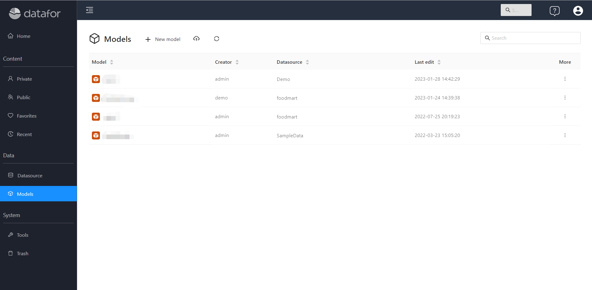

# Create analysis model

The prerequisite for creating an analysis model is that a "data connection" or a "file dataset" has been created.

## list of models

Navigate on the left side of the console and select the "Analysis Model" menu to enter the list of analysis models. Analysis models can be managed through the model list.

 

## Create model

Creating an analysis model involves the following steps:

### 1. Select tables or views in a connection or dataset

Select the tables or views to be analyzed, and set the "dimension table" and "fact table".

<!--There must be at least 1 dimension table and 1 fact table in the model-->

 

After the setting is complete, click the "OK" button to enter the model editing window.

 

### 2. Set tables relationship

Datafor will automatically establish a relationship between the fact table (foreign key) and the dimension table (primary key) (the names of the foreign key and the primary key are the same).

If the names of the foreign key and the primary key are inconsistent, you can manually establish a connection by dragging and dropping fields. The mouse dragging direction is from "primary key" to "foreign key".

 

Connections can be deleted and modified by right-clicking on connection lines between tables.

 

### 3. Modify the automatically generated model

When the relationship between the tables is established, the analysis model will be automatically generated. You can modify the model according to actual needs to meet the data analysis requirements.

The model design tool provides the following modification functions:

| Model element &emsp;&emsp; | Function point &emsp;&emsp;&emsp;&emsp;&emsp;&emsp;&emsp;&emsp; |
| -------- | ----------------------------------------- -------------------- |
| Dimension | - modify dimension name  - add description  - set hidden  - modify dimension type |
| Dimension Field | - Modify Name  - Add Description  - Set Hidden  - Set Sort Field  - Modify Column  - Member Formatting |
| Hierarchy | - New Hierarchy  - Deleting Hierarchy  - Hide Hierarchy |
| Metric Group | - Modify Metric Group Name - Add Metric Group Description - Set Hidden |
| Measure | - Modify Dimension Name - Add Description - Set Hidden - Modify Data Format - Modify Aggregation Method |
| Calculated Measure | - Create Calculated Measure - Modify Name - Add Description - Hide Calculated Measure - Modify Calculated Measure Format - Modify Aggregation Method|
