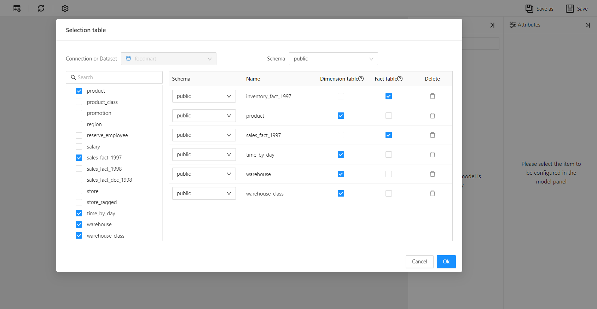
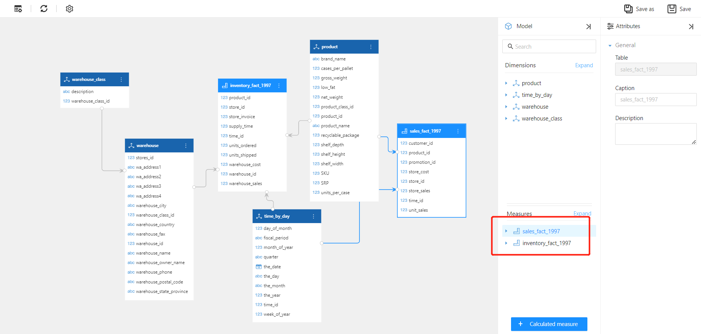

# Multi-Fact Table Model

Datafor supports complex Online Analytical Processing (OLAP) queries, enabling rapid access and processing of multidimensional data. One of its advanced features is the support for multi-fact table models.

## What is a Multi-Fact Table Model?

A multi-fact table model includes multiple fact tables within a single schema. These fact tables can share common dimension tables, allowing for more complex analytical queries across multiple business processes or domains.

### Key Components

1. **Fact Tables**: Central tables in the schema containing quantitative data for analysis (e.g., sales, inventory, orders). Each fact table typically includes measures (e.g., sales amount, quantity) and keys linking to dimension tables.
2. **Dimension Tables**: Tables that store descriptive attributes related to facts (e.g., time, product, customer). These tables help users slice and dice the data in various ways.
3. **Shared Dimensions**: Dimensions used by multiple fact tables. For example, the time dimension might link to both sales and inventory fact tables.

## When to Use a Multi-Fact Table Model

- **Complex Business Processes**: When business processes involve multiple related but independent facts requiring simultaneous analysis.
- **Shared Dimensions**: When multiple fact tables need to share dimensions to provide a unified view of different business metrics.
- **Detailed Analysis**: When detailed granularity and complex relationships are necessary for data analysis.

## How to Create a Multi-Fact Table Model

### Scenario

A retail company wants to analyze both sales and inventory data. The company has two fact tables: `sales_fact` and `inventory_fact`, which share dimensions such as time and product.

### Steps

1. Set `sales_fact_1997` and `inventory_fact_1997` as **fact tables**, and other tables as **dimension tables**.

   

2. Datafor automatically creates a **snowflake multi-fact table model**. The model shows two **measure groups** in the measures area, `time_by_day` and `product` as two **shared dimensions**, and `warehouse` and `warehouse_class` forming a **snowflake dimension**.

   

## Advantages

- **Unified View**: Provides a comprehensive view of different business metrics within a single model.
- **Scalability**: Easily extensible to include additional fact tables and shared dimensions.
- **Enhanced Analysis**: Supports detailed and complex analysis across multiple business processes.
