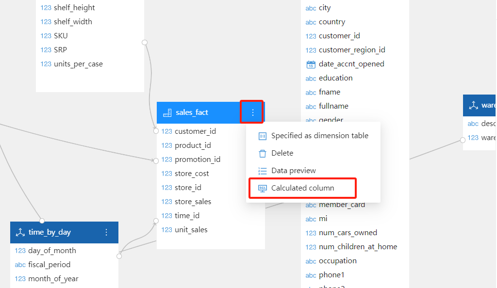
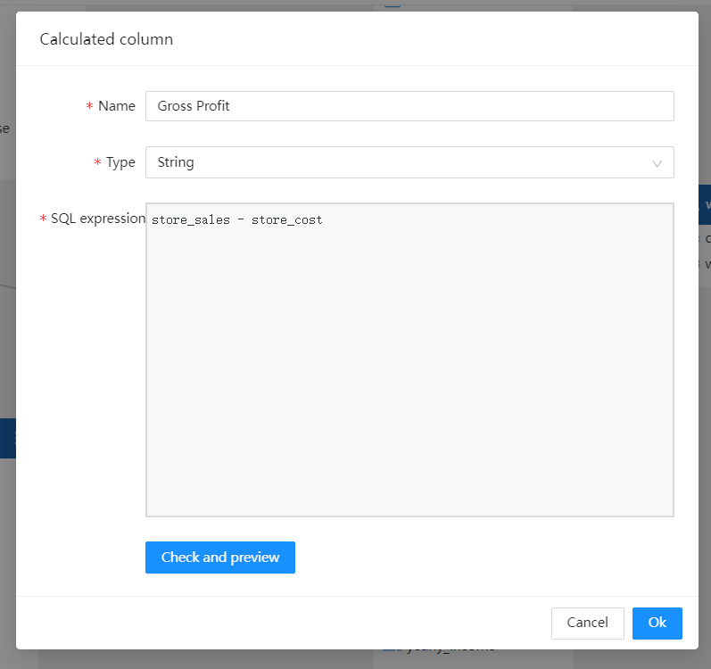
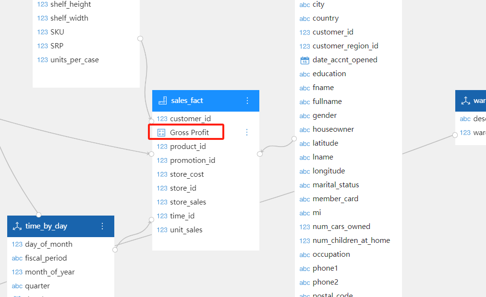
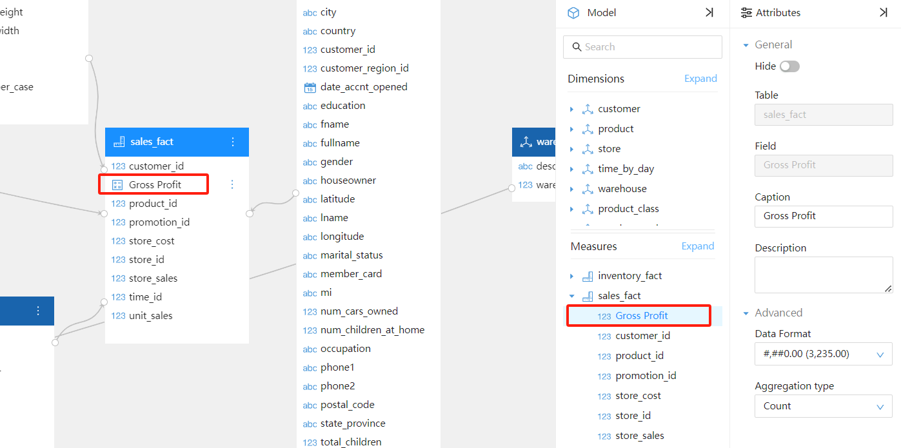

# Calculated Columns

A calculated column is a new data field created in the analytical model using SQL formulas.

## When to Use Calculated Columns

You should use calculated columns in the following scenarios:

- When row-by-row calculations are required.
- When you need to create a new data field based on existing columns.
- When you want to enhance the data model with additional information.

## How to Create a Calculated Column

1. **Enter Modeling View**

   Click the menu button at the top right corner of the data table, and select "Calculated Column" from the pop-up menu.

   

2. **Enter Column Name, Type, and SQL Expression**

   Enter the column name, type, and SQL expression. Once the validation is successful, click the `OK` button.

   

3. **View the New Field in the Table**

   You will see a new field "Gross Profit" added to the `sales_fact` table.

   

4. **Drag the Created Calculated Column into the Model**

   Drag the created calculated column "Gross Profit" into the model.

   

5. **Use the Calculated Column in Reports**

   You can now use this calculated column in your reports.