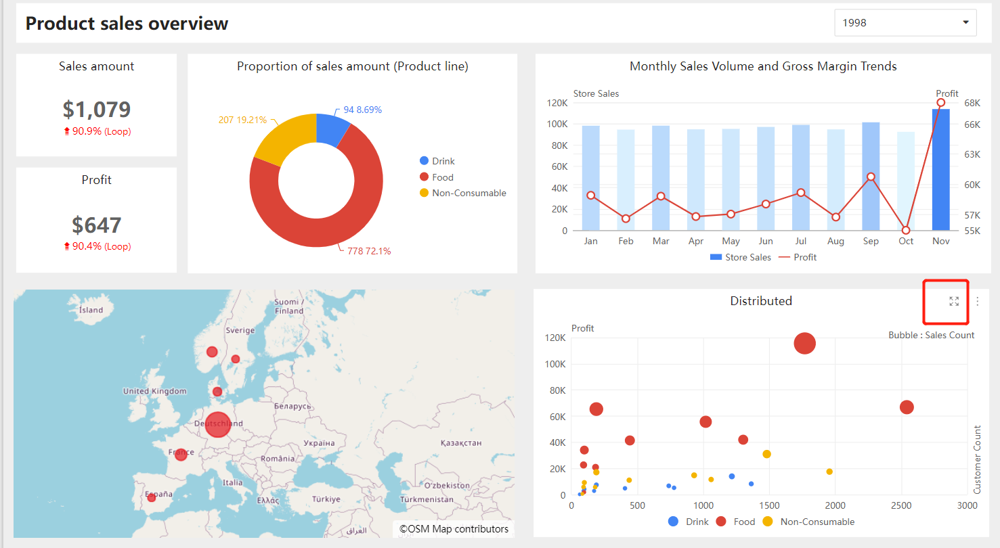
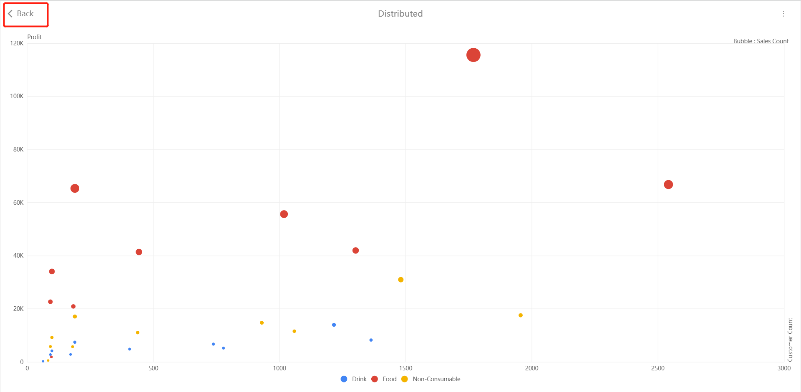
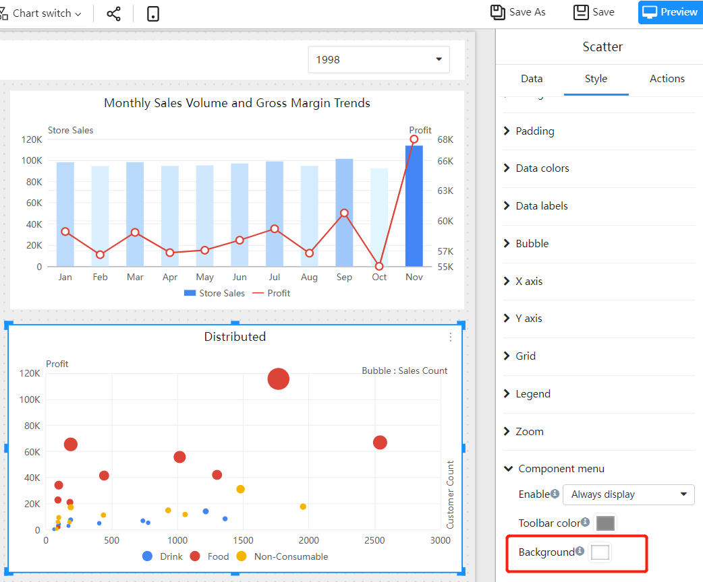
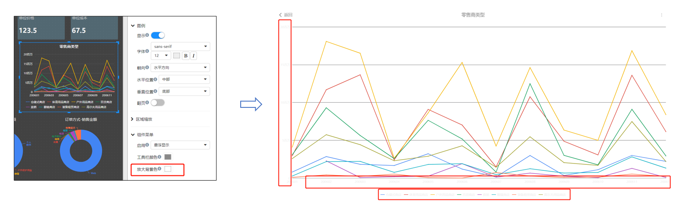
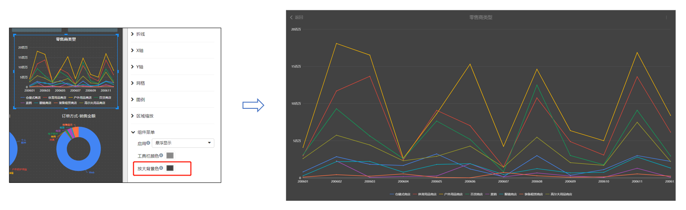

# Component display in full screen

The purpose of full screen display of components:

- View on small screen
- It is necessary to highlight a certain component data at the meeting

## How to full screen display

Each data component has a "component menu", and there is a "zoom in" button on the tool bar of the component menu, click this button to zoom in on the component in full screen.

The component displayed in full screen retains functions such as "drill down", "filter" and so on. Click the "Back" button in the upper left corner to return to the original page.

## Full screen background color setting

The background color or background image may be set when the report page is designed, resulting in a mismatch between the default color and the style setting of the component after the component is enlarged in full screen. At this time, we can change the "Background color" so that the background color after full screen matches the component style configuration.

For example page:

The default magnified background color of the component is white. We found that the text color of the component was not clear.

At this time, you need to modify the "Background color". We modify the component "Background color" to the same dark color as the background color of the main page.

