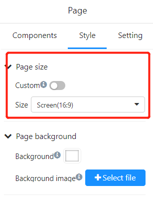
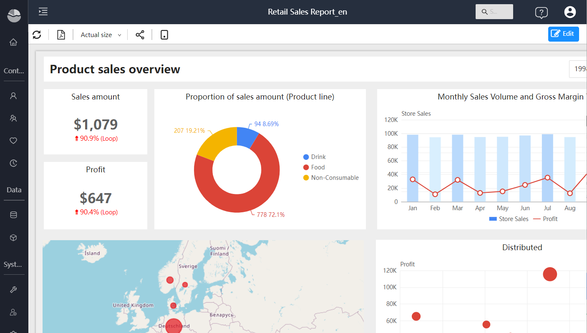
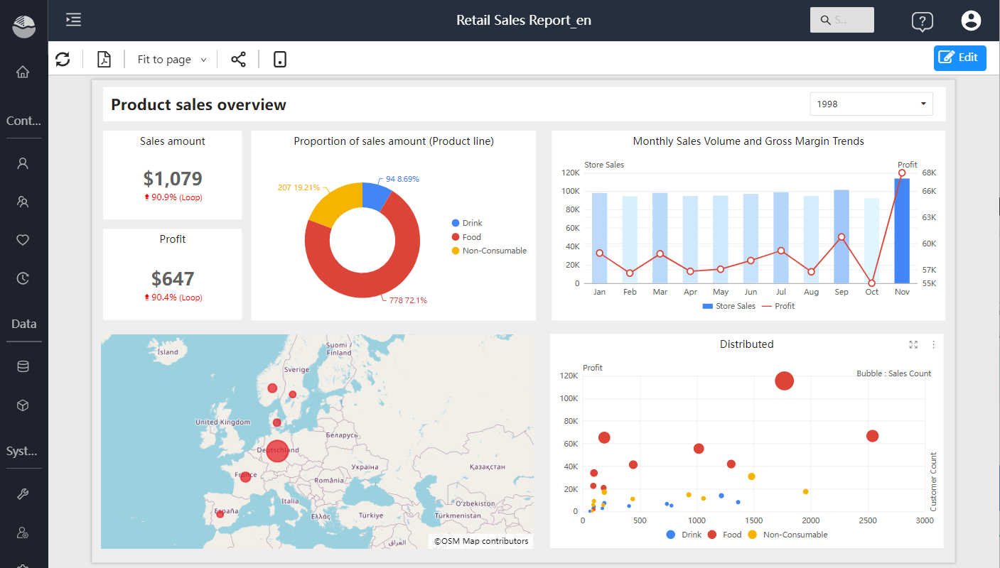

# Size and view of the page

You can adjust the report page size and display to accommodate the way you view the report on screens of different sizes and aspect ratios.

## Report page size setting

The Page Size setting is for report developers only. With a report open in Editing view, the Page Size setting is located in the Visualizations pane and controls the scaling and actual size of the report canvas in pixels:

- 4:3  (1366pxX1024px)
- 16:9  (default) (1366pxX765px)
- Mobile (320pxX568px)
- Tablet (1024pxX768px)
- Custom (height and width in pixels)

## Page view settings

Options in the View menu on the toolbar give you the flexibility to display report pages at the size and width you choose.

- Assuming you are viewing the report on a small device, it is difficult to see the title and legend. Optionally select Actual Size to increase the size of the report page. Use the scroll bars to move around the report.

  

- There is also an option to fit the report to the width of the screen by selecting "Fit to Width". Since it's only about the width and not the height, you may still need to use the vertical scrollbar.

  

- Select "Fit to page" if you don't want any scrollbars, but want to take full advantage of the screen size.

  

- There is an option to "Stretch" when projecting report pages onto a large screen for people to view.

  

