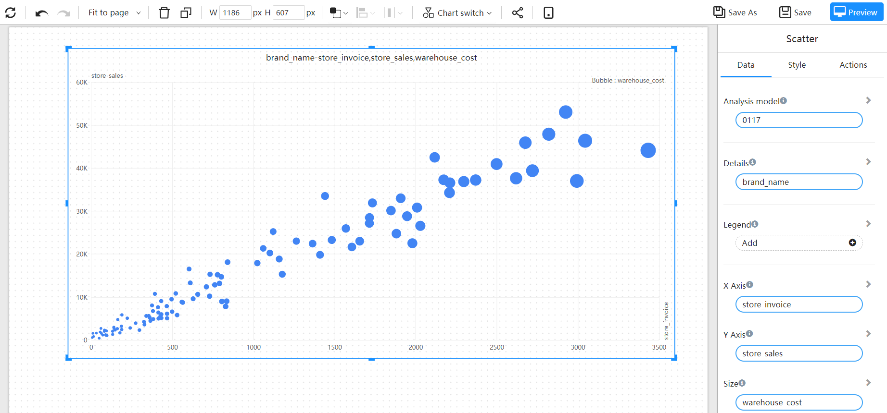

# Scatter

Scatter plots are used to display the relationship between two-dimensional data. They typically represent two variables with the x-axis and y-axis, and show the position of data points in the form of scattered points. Scatter plots can be used to observe trends, associations, distributions, and other information in the data. They are a simple and straightforward type of chart that are commonly used in fields such as research, data analysis, and data mining.

## Application scenario

- Observing the relationship between two variables: Scatter plots can be used to show the correlation between two variables, such as linear or non-linear relationships.
- Examining data distribution: Scatter plots can be used to show the distribution of data, such as the presence of outliers or dense distributions.
- Studying causal relationships: Scatter plots can be used to study the causal relationship between two variables, such as whether changes in two variables occur simultaneously.
- Visualizing data trends: Scatter plots can be used to show data trends, such as whether data is trending upward or downward.
- Visualizing multi-dimensional data: Scatter plots can be used to visualize multi-dimensional data, such as different dimensions being represented by factors such as color and size.

## Composition

1. X-axis: The horizontal axis represents one of the variables being plotted.
2. Y-axis: The vertical axis represents the other variable being plotted.
3. Data points: The data points represent the combination of the two variables being plotted, and they are typically shown as individual dots on the scatter plot.
4. Trend line: A trend line, such as a regression line, can be added to the scatter plot to show the general trend in the data.
5. Labels: The x-axis and y-axis can be labeled with descriptive variable names to indicate what the data represents.
6. Legends: Legends can be added to the scatter plot to indicate the different groups being represented by factors such as color or shape.

## Example

The points on the graph represent the products, the x-axis represents the gross profit, the y-axis represents the sales revenue, and the size of the point represents the gross profit margin.

By observing the distribution of the points on the various indicators, it is possible to identify some "outlier points."

The distribution of indicators of products in different retailer dimensions is distinguished by color.

