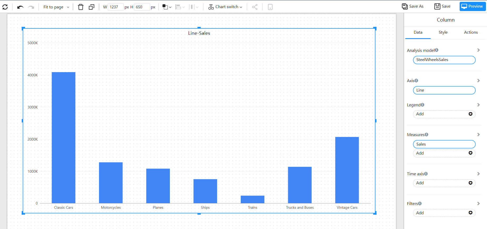
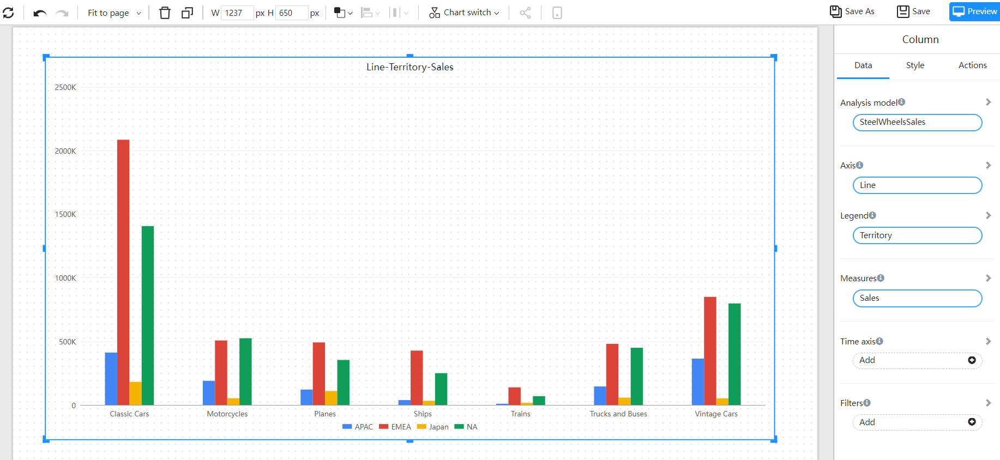
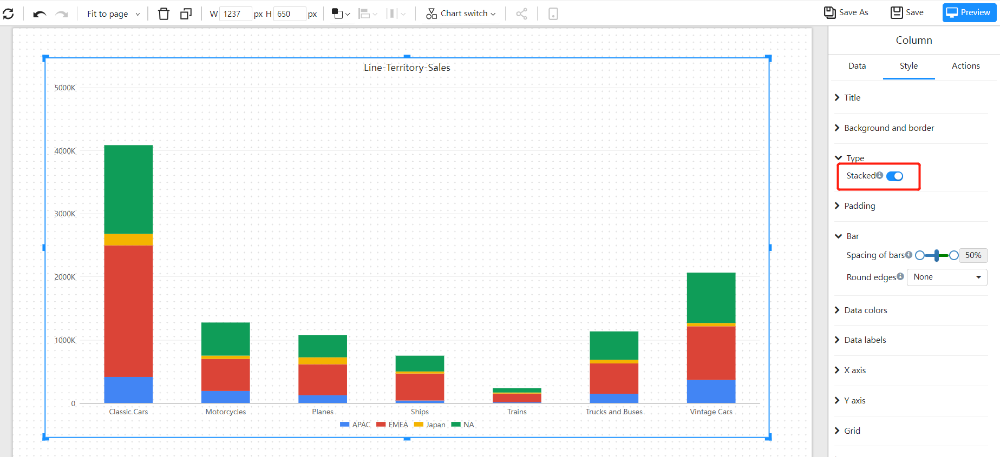

# Column

A bar chart is a common data visualization chart used to represent the relationship of the size of each item in a set of data. It presents the data items in the form of bars, with the length proportional to the value, making it easy to compare the size of each data item. The bar chart typically represents categories on the horizontal axis and values on the vertical axis.

Bar charts can be used to represent multidimensional data, for example: displaying data for multiple categories in the same chart using different colors to distinguish each category; or showing multiple data sets in the same chart, such as using stacked bar charts to display data for different parts.

The advantage of bar charts is that they are simple and easy to understand, and easy to compare the size of each data item. The disadvantage is that when the number of data items is large, the chart may appear crowded and difficult to read.

## Applicable scenarios

- Representing frequency distribution: Bar charts can be used to represent the frequency distribution of values in a set of data, such as showing the number of people in each age group.

- Representing grouped data: Bar charts can be used to represent grouped data, such as showing the Gross Domestic Product (GDP) of each country.

- Representing trends: Bar charts can be used to represent data trends, such as showing a company's annual sales revenue.

- Comparing data across different categories: Bar charts can be used to compare data across different categories, such as showing the population size of different cities.

## Example

### Basic Column chart

A basic histogram, using columns to show numerical comparisons between categories.

### Cluster column chart

Cluster bar chart are suitable for analyzing and comparing various data in groups, and can also compare the values of various categories.

### Stacked column chart

A stacked bar chart divides each column to show the size of each data of the same type. It can vividly display the data of each sub-category contained in a large category, as well as the proportion of each sub-category, showing the relationship between a single item and the whole.

## Settings