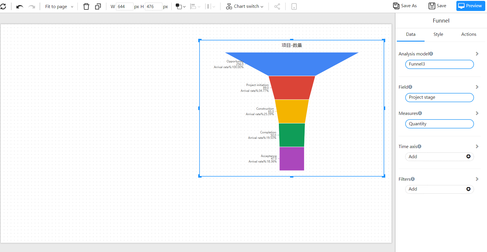
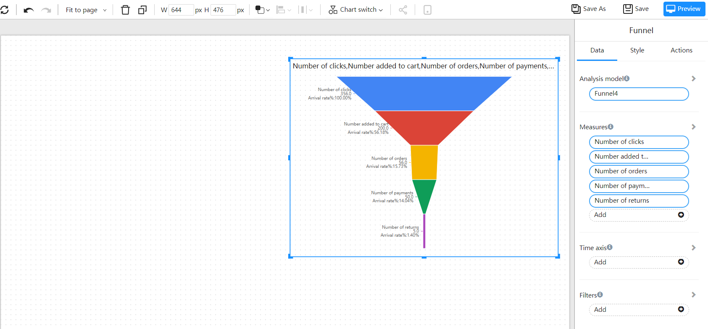

# Funnel

A funnel chart is a graphical representation of a process that is divided into multiple stages, showing the number of potential customers or elements at each stage and how that number decreases as they progress through the process. Funnel charts are often used to visualize and analyze sales or marketing processes, such as the steps involved in a customer journey from initial awareness to final purchase. 

## Application scenario

- Sales Process: Track the number of potential customers in each stage of the sales process, such as lead generation, qualification, proposal, negotiation, and closure.
- Customer Journey: Visualize and understand the steps a customer takes from initial awareness to final purchase.
- Marketing Campaigns: Track the effectiveness of marketing campaigns by displaying the number of sales leads generated, the number of sales leads that become customers, and the conversion rate between the two.
- Project Management: Represent stages in a project and track progress in each stage.
- Workflow Management: Represent stages in a workflow and track progress in each stage.
- Network Analysis: Track user behavior and understand the steps in a user's journey on a website or mobile application.

## Composition

1. A dimension and a measure, displaying the conversion rate between dimensions
2. Multiple measures, displaying the arrival rate between measures

## Example 1:

Displaying the conversion rate of different stages of a project

| Project stage | Quantity |
| -------- | ---- |
| Opportunity     | 256  |
| Project initiation     | 89   |
| Construction     | 65   |
| Completion     | 50   |
| Acceptance     | 47   |

"Project stage" as dimension, project quantity as measure.

## Example 2

Arrival rate between indicators

| Time | Number of clicks | Number added to cart | Number of orders | Number of payments | Number of returns |
| ---- | ------ | ---------- | ------ | ------ | ------ |
| 2005 | 356    | 200        | 56     | 50     | 5      |

Add different indicators in sequence to the measurement data to display the arrival rate between different indicators.

