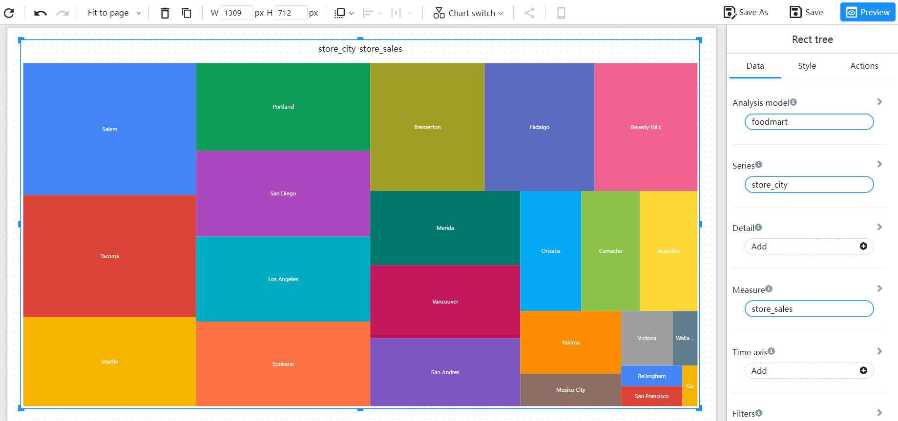

# Treemap

Treemap visualize the relationship of hierarchical or categorized data. It consists of rectangles and nodes, where the size of the rectangle represents the quantity of data and the nodes represent the categorization or hierarchical structure.

## Application scenario

- Visualizing hierarchical or categorized data: Rectangular treemaps can display the relationship of hierarchical or categorized data, presenting the hierarchical structure of the data in an intuitive way.
- Comparing data from different dimensions: Rectangular treemaps can show multiple dimensions of data at the same time, representing different nodes through color, border, label, etc., in order to compare data from different dimensions.
- Analyzing the relationship between data: Rectangular treemaps can intuitively display the relationship between data, such as parent-child relationship, composition relationship, proportion relationship, etc.

## Composition

1. Dimensions: Rectangular treemaps represent the categorization or hierarchical structure of data through nodes, where each node is a dimension, such as product categories, regions, etc.
2. Indicators: Indicators are used to represent the quantity of data in rectangular treemaps, typically representing the quantity or ratio of data in each node. The size of the rectangle represents the indicator, where larger rectangles represent larger quantities of data.
3. Hierarchical structure: There is usually a hierarchical structure between nodes in rectangular treemaps, where each node represents a layer. The hierarchical structure consists of parent nodes and child nodes, where parent nodes represent the total quantity of data for the layer and child nodes represent the breakdown of the data for the layer.
4. Color: Color is usually used to distinguish different nodes and layers in rectangular treemaps, where different colors represent different categories or quantities of data.

## Examples

### Categorized data

### Hierarchical data

