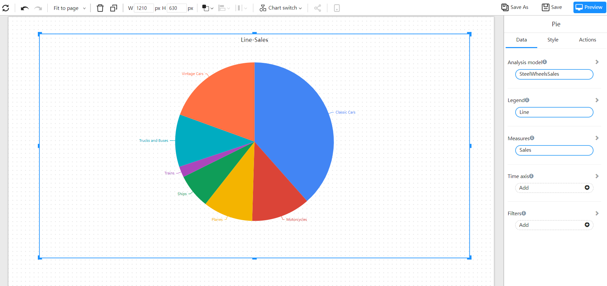
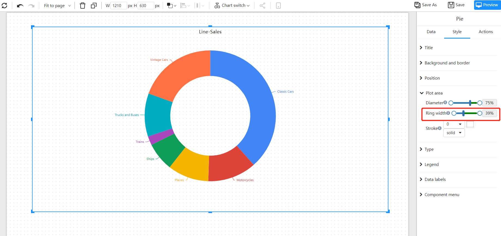
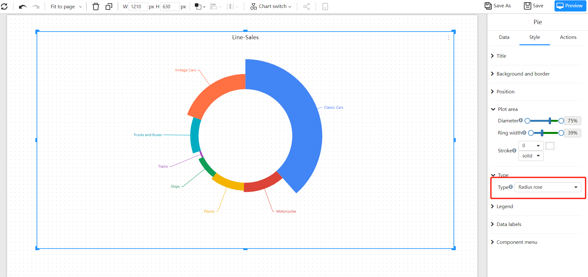
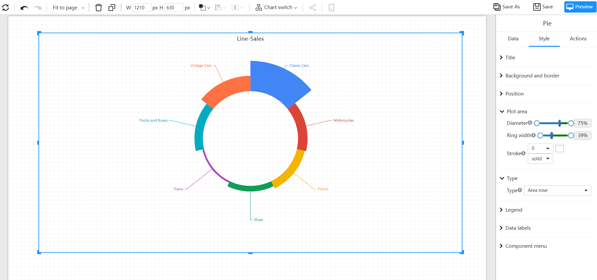

# Pie

The pie chart shows the proportion of different categories, and compares various categories through the size of the arc. The pie chart divides a circular pie into multiple blocks according to the proportion of the category. The entire circular pie represents the total amount of data, and each block (arc) represents the proportion of the category to the whole. All blocks (arcs) ) is equal to 100%.

## Applicable scene

- Display the proportion of categories
- Display the proportion of multiple indicators

## Composition

1. A pie chart consists of several **segments**, each sector represents a **component** of the data
2. The **arc length** (and central angle and **area**) of each sector is proportional to the **quantity** it represents.
3. These sectors together just form a complete circle.

## Example

### Pie

### Circle

Compared with the pie chart, the ring chart has a higher utilization rate of space. For example, we can use its hollow area to display text information.

### Radius rose

Compare the data by the size of the radius.

### Area rose

Compare the data by the size of the area.

## 其它设置

|      |      |
| ---- | ---- |
|      |      |
|      |      |
|      |      |

