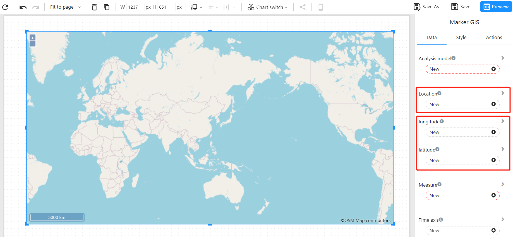
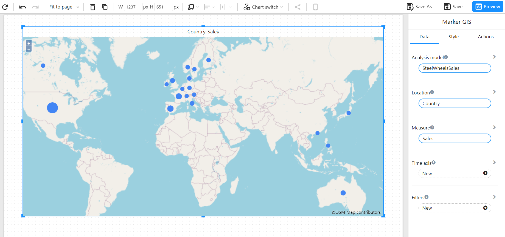
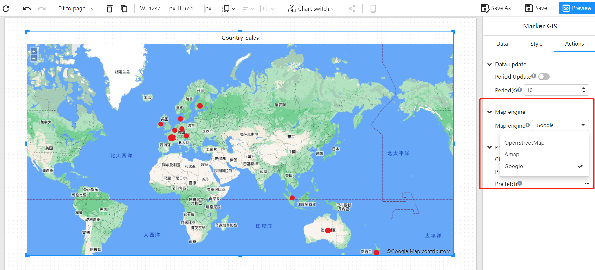

# GIS Marked Map

GIS (Geographic Information System) marked map is used to visualize data on a map, so that users can have a more intuitive understanding of data distribution and spatial relationships, while providing more precise analysis and decision support. GIS marked maps can help users better understand geographic data, including location, region, and geographic features, as well as their relationships with other data.

By combining data and maps, users can quickly discover the geographic location and spatial trends of data, and better understand the interactions and relationships between data. In addition, GIS marked maps can help users discover trends and patterns in data, as well as changes in specific locations.

In the business and government sectors, GIS marked maps are widely used in visualizing market and customer distribution, resource management, urban planning, environmental monitoring, and natural disaster response, among other areas.

## When to Use GIS Maps

- Compare indicators across geographic areas.
- Obtain an overview of the distribution of geographic locations.

## Creating a GIS Marked Map

Bind the "geographic field", such as city names, or any geographic name, or longitude and latitude information to the "longitude" and "latitude" data blocks. If the dataset used contains longitude and latitude fields, use them instead. Longitude and latitude information provides more precise location information and eliminates the need for back-end geocoding processes.

For example, bind the "country" field to the "Location", and select the "sales" measurement field.

## Changing the Map Engine

The default map engine is Open Street Map. The GIS systems supported by Datafor include: Amap, Baidu Map, Open Street Map, Google Map, etc. You can configure and modify the map engine in the map configuration file.

