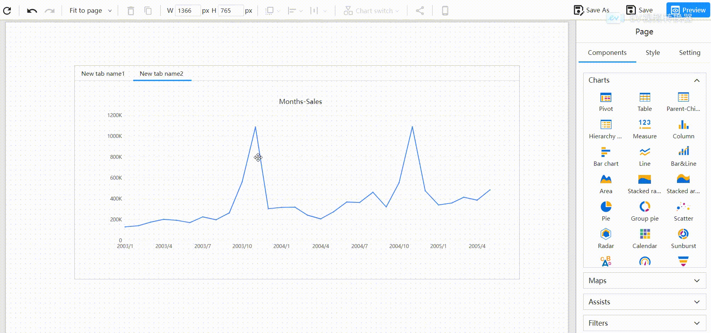
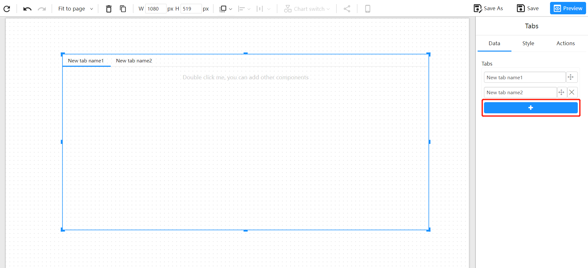
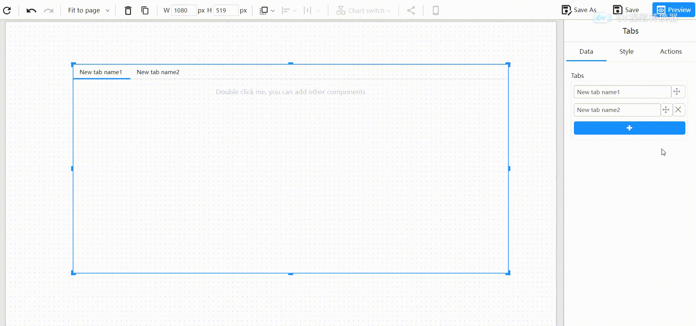
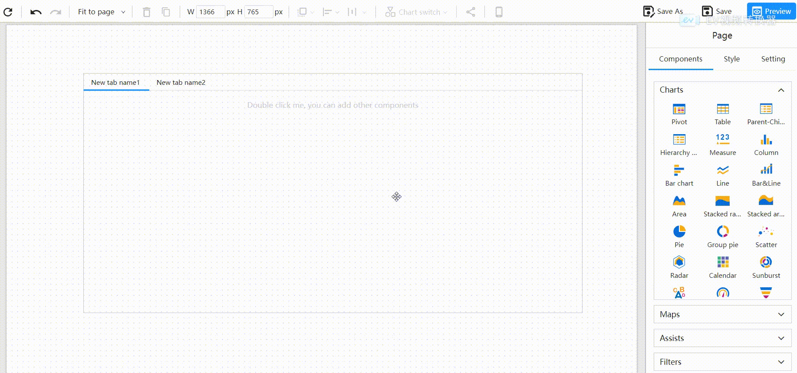

# Tabs

Using tabs allows for browsing and comparing multiple related data views or charts within the same interface. Tab components typically consist of a tab bar and multiple tabs, with each tab containing a different visual element or chart.

The main advantage of tab components is that they can save screen space and improve user efficiency in comparing and analyzing data. Through tab components, users can easily switch between different data views or charts without having to switch to different interfaces or open multiple windows.

## Creating Tabs

1. Select the "Tabs" component in assists.

   

2. Adding a New Tab

   To add a new tab to the tabs component, you can add or delete tabs on the data panel of the tabs component.

   Note: Deleting a tab will also delete all the visual elements and charts associated with that tab. Be sure to back up any important data before deleting a tab.

   

3. Adjust the order of tabs

   

4. Add components to the tab

   Double-click on the content area of the tab to enter component editing mode.

   

   At this point, you can add and edit other components on the tab just like adding components on a page.

   

5. Exit component editing mode
   Exit component editing mode by clicking anywhere outside of the tab.