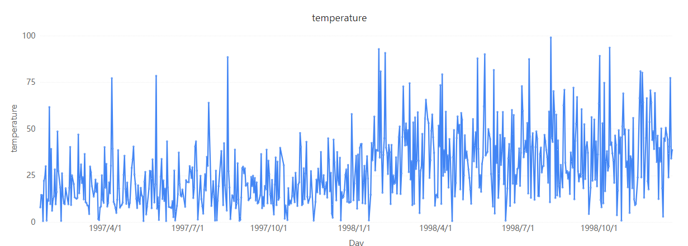
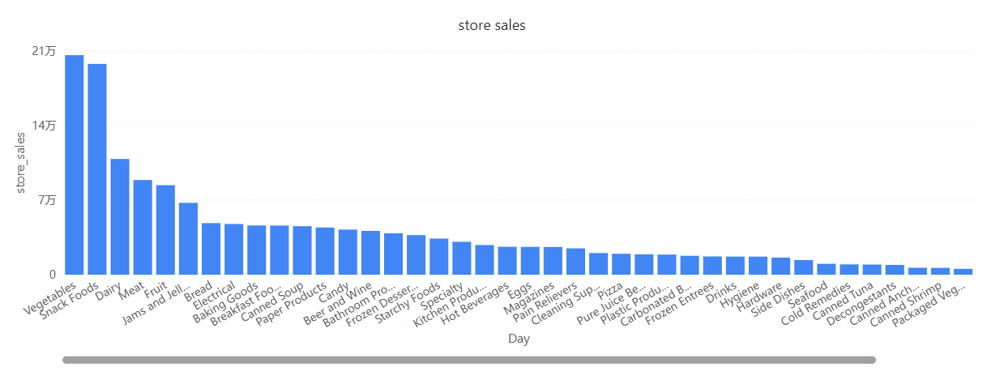
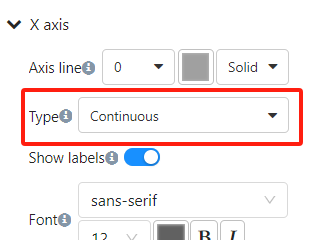

# X Axis Type Settings: Continuous and Categorical

In Datafor, when using charts such as line charts, bar charts, area charts, etc., the X axis can be set to either "Continuous" or "Categorical." The choice between these two types significantly impacts how the data is displayed. Below is a detailed explanation of these two types.

## 1. Continuous

### Definition
The "Continuous" type is suitable for numerical or time series data. When selecting the "Continuous" type, the X axis will display data points in a continuous manner.

### Features
- **Evenly Distributed Data Points**: Data points are evenly distributed along the X axis, even if there are missing values in between.
- **Suitable for Time Series Data**: Particularly suitable for displaying time series data, such as daily sales, temperature changes, etc.
- **Supports Smooth Curves**: In line charts, it can display smooth curves, reflecting the trend of data changes.

### Advantages
- Better illustrates data trends and changes.
- Can handle a large number of data points and display them on a continuous time axis.

### Example
If we have a set of daily temperature data, using the "Continuous" type can make the trend of temperature changes more apparent.

## 2. Categorical

### Definition
The "Categorical" type is suitable for discrete categorical data. When selecting the "Categorical" type, the X axis will display data points by category.

### Features
- **Discretely Distributed Data Points**: Data points are displayed according to categories, with no continuity between them.
- **Suitable for Categorical Data**: Particularly suitable for displaying categorical data, such as product categories, regional distributions, etc.
- **Fixed Interval Between Categories**: The interval between categories is fixed and not affected by the size of category values.

### Advantages
- Clearly displays the comparison of data across categories.
- More suitable for displaying discrete, non-continuous data points.

### Example
If we have a set of sales data for different products, using the "Categorical" type can more clearly compare the sales of each product.
   

## How to Set X Axis Type in Datafor

1. **Select the Chart**: In Datafor, select the chart you need to modify, such as a line chart, bar chart, area chart, etc.

2. **Open the "Format" Pane**: After clicking the chart, find the "X Axis" option in the "Style" panel on the right side.

3. **Select Axis Type**: In the "Type" dropdown menu, select "Continuous" or "Categorical."
   

4. **Apply Changes**: After selecting, the chart will automatically update to display the corresponding X axis type.

## Default X Axis Type

In Datafor, when you create a chart, the system automatically selects the default type for the X axis ("Continuous" or "Categorical") based on the field type (numerical or textual). This automatic switching helps users quickly generate suitable charts, but in some cases, manually adjusting the X axis type may better meet your data analysis needs.

### Numerical Fields

When using numerical fields (such as years, values, etc.) as the X axis, Datafor usually defaults to the "Continuous" type. This is because numerical fields are more suitable for displaying data points in a continuous manner, better reflecting the trend and changes in data.

### Textual Fields

When using textual fields (such as categories, product names, etc.) as the X axis, Datafor usually defaults to the "Categorical" type. This is because textual fields represent discrete categorical data, more suitable for displaying each category's data points one by one.

## Summary

In Datafor, selecting the appropriate X axis type ("Continuous" or "Categorical") can significantly impact the effectiveness of data visualization. Understanding the differences and applicable scenarios of these two types can help us present and analyze data more accurately.

By following the steps above, we can easily set and switch the X axis type in Datafor, thereby optimizing the data visualization effect.