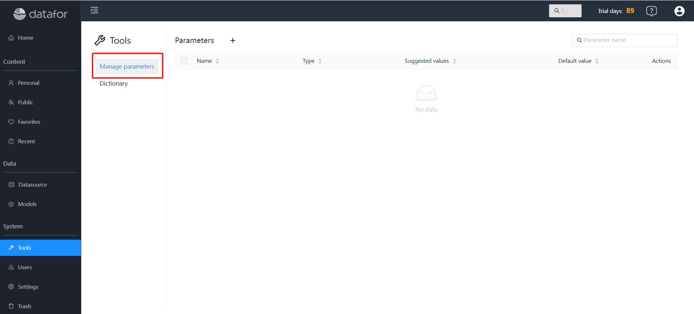
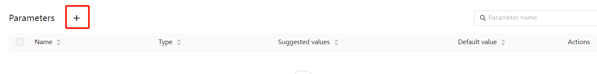
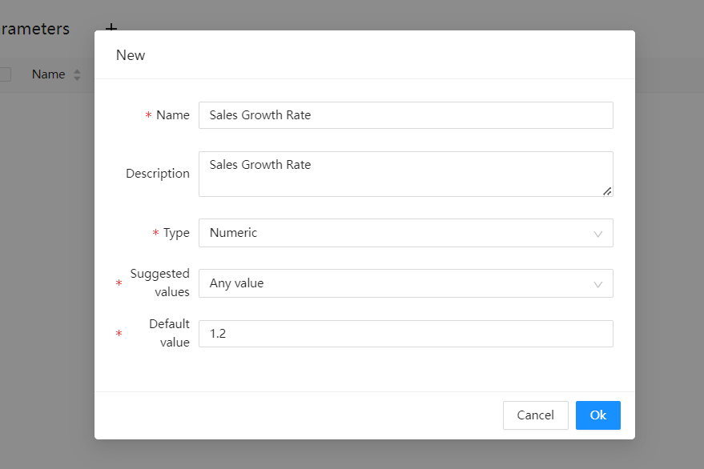
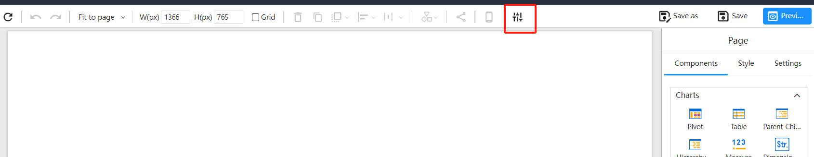
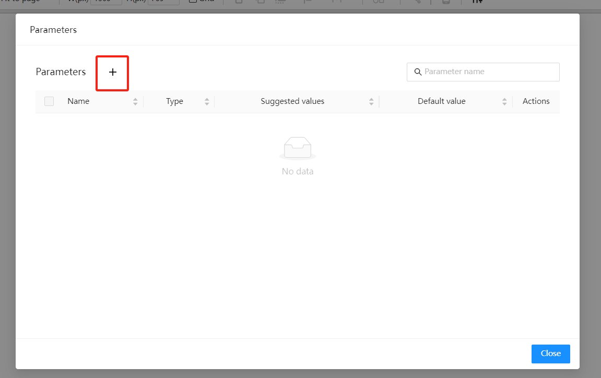
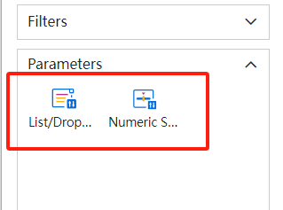
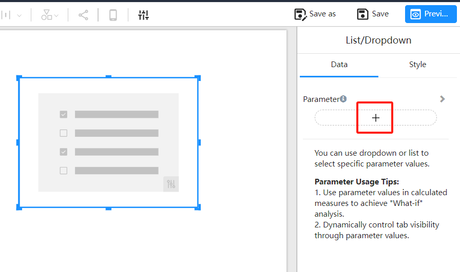
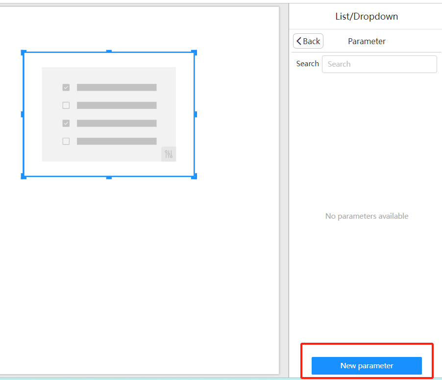
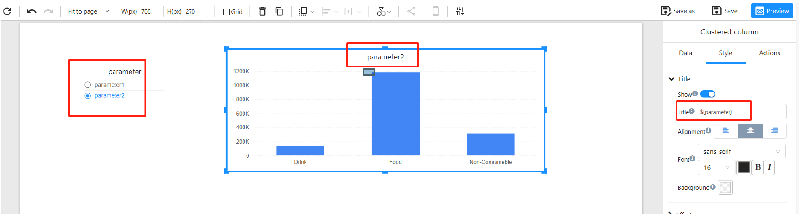

# Parameters

## Overview

Datafor provides a powerful dynamic parameters feature that allows users to achieve flexible and interactive data analysis in reports and data models. Users can define parameters' names, data types, and value sources (such as manual input, list values, or query values), and use these parameters in the analysis model to filter data or create calculated fields. In reports, parameters can be used with parameter controllers, enabling users to dynamically change the display of data by adjusting parameter values in real-time, thus enhancing interactivity and personalization of the reports.

Datafor includes two types of parameters: **Global Parameters** and **Report Parameters**.

**Global Parameters**: Global parameters are defined within the analysis model or project and can be reused across multiple reports and analyses. Key features include:

- **Unified Management**: Global parameters can be centrally managed, and modifying a global parameter's value will update all instances where it is referenced.
- **Consistency**: Ensures that the same parameter settings are used across different reports and analysis models, maintaining consistency.

**Report Parameters**: Report parameters are used exclusively within a specific report, with their scope limited to the report in which they are created. Key features include:

- **Local Control**: Report parameters are only effective within the specific report, and modifying a report parameter will only affect that report.

## Creating Global Parameters

1. Open the Global Parameters Management


   <div align="left"></div>

2. Click the `New` button

   <div align="left"></div>

3. In the **"Manage Parameters"** window that appears, fill in the following information:

   - **Name**: Provide a name for the parameter.
   - **Description**: Provide a description for the parameter.
   - **Type**: Select the data type for the parameter (e.g., Text, Number).
   - **Suggested Values**: Choose the source of the parameter values:

     - **Any Value**: Manually input parameter values.
     - **List Values**: Define a set of predefined values for users to choose from.
     - **Query Values**: Use the first column of a query result as the parameter values.

   <div align="left"></div>

4. Save the Parameter

   After completing the settings, click **"OK"** to save the parameter.

## Creating Report Parameters

**Method 1**:

1. Enter the Report Designer and select the “Parameter Management” button on the toolbar.

   <div align="left"></div>

2. In the "Parameter Management" window that appears, select the "New" button.

   <div align="left"></div>

3. Follow steps 3 and 5 of creating a "Global Parameter" to create and save the parameter.

**Method 2**:

1. Select the “Parameter Controller” component.

   <div align="left"></div>

2. Add the parameter controller to the canvas and click the "Select Parameter" button on the data panel.


   <div align="left"></div>


3. Select the "New Parameter" button.


   <div align="left"></div>

4. Follow steps 3 and 5 of creating a "Global Parameter" to create and save the parameter.

## Using Parameters

### Using Parameters in Calculated Measures

In calculated measures, you can reference parameter values using the ParamRef function: `ParamRef("ParameterName")`.

**For example:**

Calculated Measure: Forecast Sales

**Formula**:

```DAX
[Measures].[Last Year Sales] * ParamRef("Sales Growth Rate")
```

### Using Parameters in Component Titles

In component titles, reference parameters using: ${"ParameterName"}.

   <div align="left"></div>

### Switching Tabs with Parameters

Refer to: [Parameter-driven Tab Switching](https://datafor123.github.io/docs/60%20visualizer/visualization-parameter-driven)