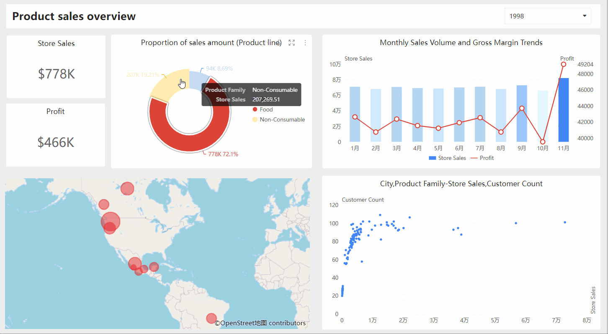
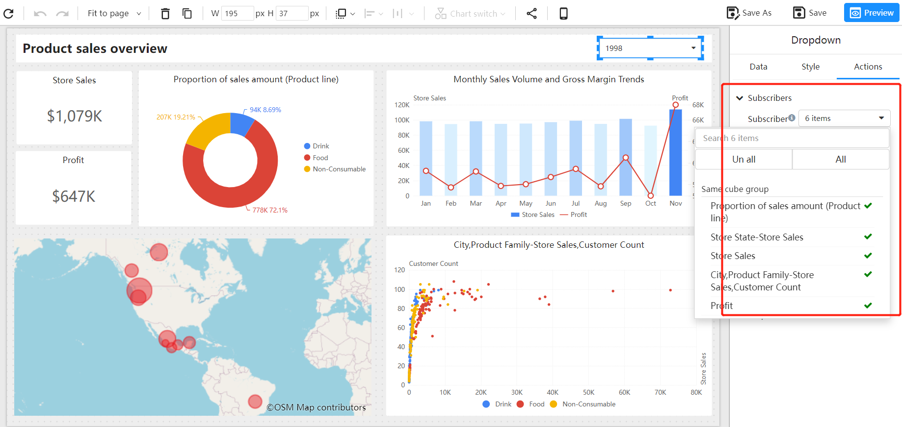

# Component Data Linkage

Component data linkage refers to the phenomenon where data in one component changes, and corresponding data in other components also change accordingly. This linkage allows users to view and analyze data more conveniently and efficiently in an analysis report.

## How to Set up Linkage

### Linkage between Data Charts

The linkage between charts in Datafor is implemented based on the automatic association of analytical models. If there are common dimensions in different analytical models, they will be automatically associated, thus realizing the linkage between charts.

### Linkage between Filter Components and Data Charts

In data analysis, it is usually necessary to filter data through filter components (such as drop-down boxes, sliders, etc.), and these filtering conditions need to be applied to data charts at the same time. By default, there is no linkage between filter components and data charts. To achieve linkage between them, a "subscription" needs to be established, allowing filter components and data charts to be mutually associated.

## Frequently Asked Questions

   1. Can components from different analytical models be linked?
   
      If the selected dimension of a component exists in different analytical models, the selected dimension value will be passed to different analytical models. All components from different analytical models can be linked, but this requires the premise that the models have common dimensions.
   
   2. Will chart components be linked to filter components?
   
      Chart components do not have linkage function with filter components. Chart components can only subscribe to filter components.
   
   3. Do filter components have linkage function with each other?
   
      The linkage between filter components is achieved through "[Subscription of filter components and chart components](https://datafor123.github.io/docs/visualizer/visualization-sxzjhtbzjddy)" to achieve linkage function.