# What-if Analysis

What-if analysis is a predictive analysis method used to evaluate the impact of changes in specific variables under different assumptions or scenarios.

   <div align="left">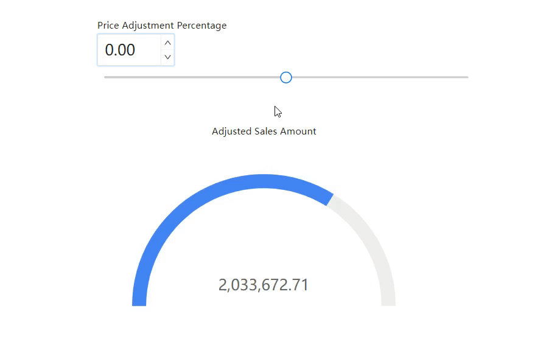</div>

Below is a detailed example demonstrating how to use What-If parameters in Datafor for sales forecast analysis:

### Scenario: Sales Forecast Analysis

#### Background

A retail company wants to forecast the impact of different pricing strategies on future sales revenue. They aim to understand how adjusting product prices will affect sales quantities and total revenue.

#### Objective

Use Datafor's What-If parameter feature to simulate the impact of different price adjustment scenarios on sales revenue.

### Steps

1. **Create a Parameter Controller**

   <div align="left">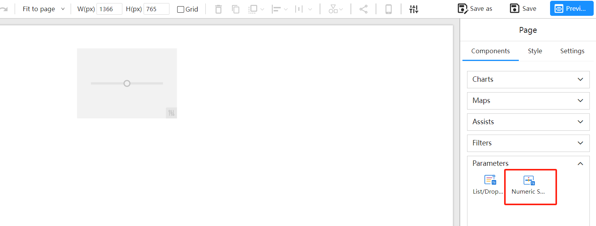</div>


2. **Create What-If Parameter**

   - Select the parameter controller, click the "Add Data" button in the data panel, and choose "New Parameter".

   <div align="left">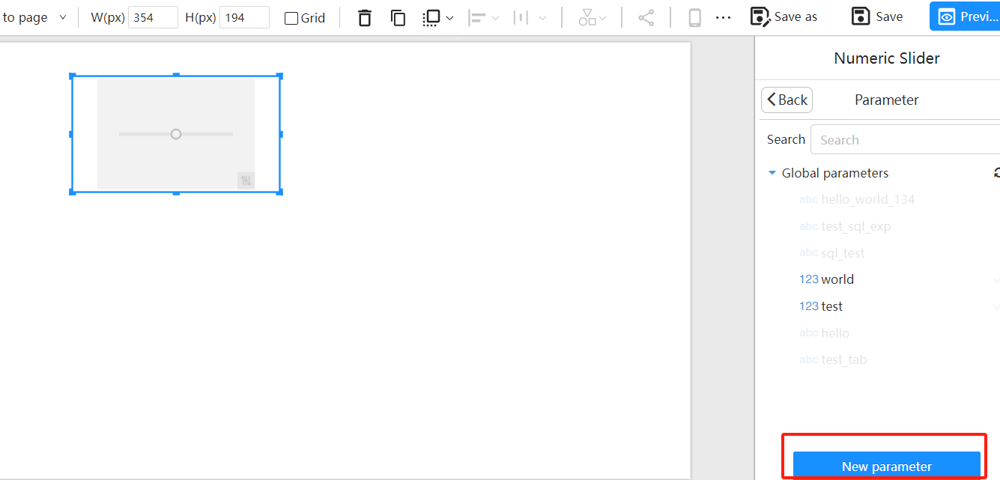</div>

   - Name the parameter "Price Adjustment Percentage" with a default value of "0".

   <div align="left">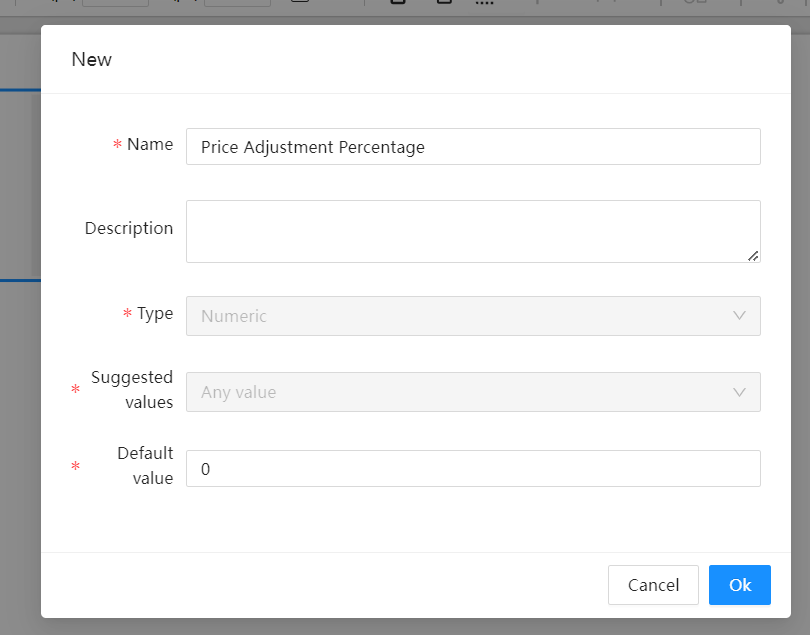</div>

   - Select the created "Price Adjustment Percentage" parameter.

   <div align="left">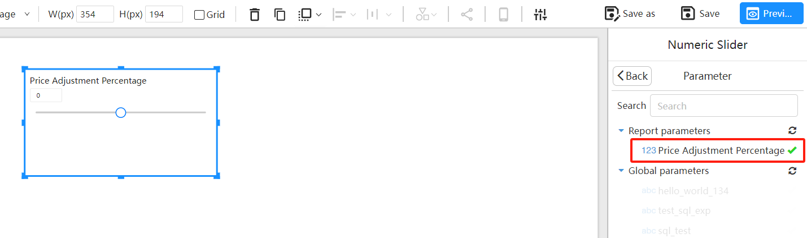</div>

   - Define the slider's value range in the style panel, with a minimum of -0.2, maximum of 0.2, and a step size of 0.01.

   <div align="left">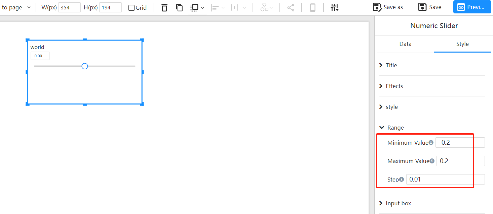</div>

3. **Create a Gauge Component**

   Select the analysis model "**workshop-model**".

   <div align="left">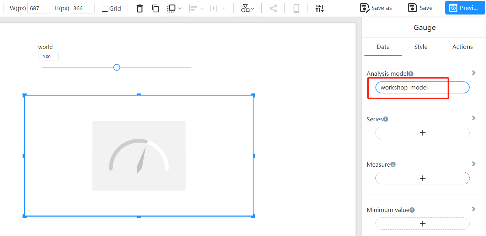</div>

4. **Add Measures**

   In the data panel, click the "Add Data" button.

   <div align="left">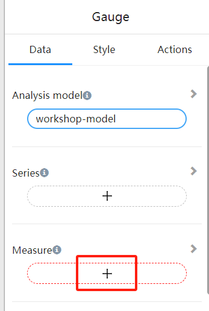</div>

5. **Create Calculated Measures**

   <div align="left">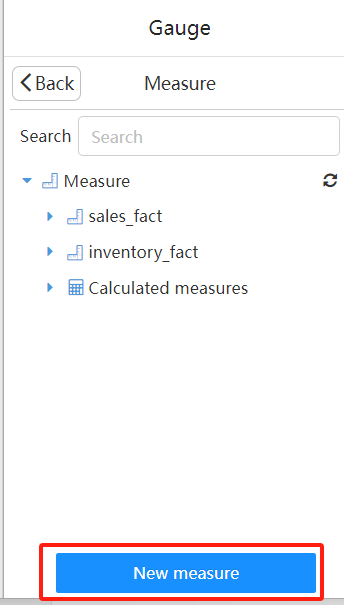</div>

   - Measure Name: **Adjusted Price**

     Formula:

     ```
     [Measures].[sales_fact.UNIT_PRICE] * (1 + ParamRef("Price Adjustment Percentage"))
     ```

   - Measure Name: **Adjusted Sales Amount**  

     Formula:

     ```
     [Measures].[sales_fact.QUANTITY] * [Measures].[Adjusted Price]
     ```

6. **Select "Adjusted Sales Revenue" as the Measure for the Gauge Component**

   <div align="left">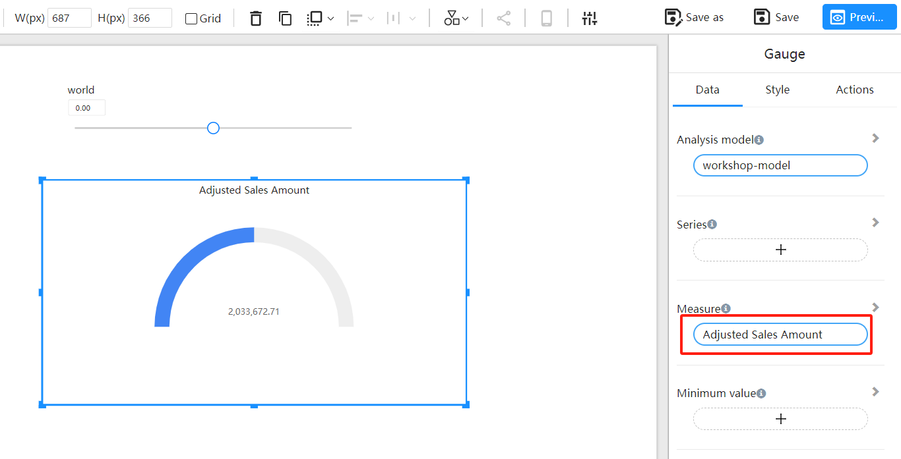</div>

   - Adjust the dashboard component's style by setting the **Minimum Value (0)** and **Maximum Value (3000000)**.

   <div align="left">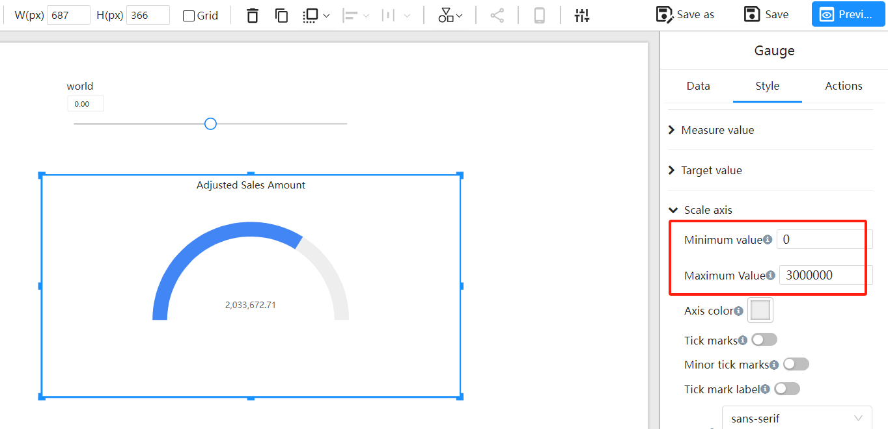</div>

7. **Interactive Analysis**

   Adjust the "**Price Adjustment Percentage**" parameter to dynamically view changes in **Adjusted Sales Revenue** under different price adjustment scenarios.

   <div align="left"></div>