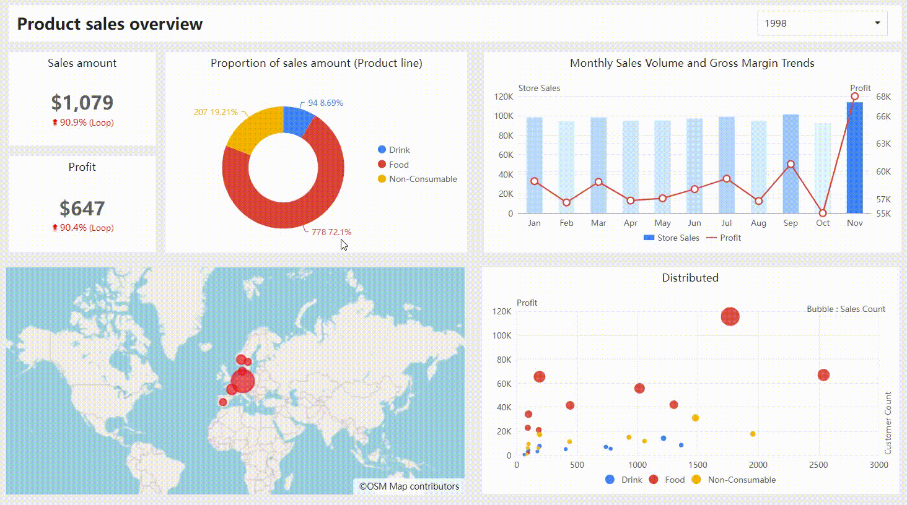

# Cross-Filtering

## Overview

Datafor's cross-filtering feature enable users to interact with multiple chart components within reports. These features allow users to dynamically filter and highlight data, aiding in deeper understanding of relationships within the data and more effective data exploration.

## What is Cross-Filtering?

Cross-filtering allows users to filter data in other related chart components by selecting a data point in one chart. When a data point is selected, other related chart components automatically update to display only the relevant data. This helps users focus on specific data subsets and understand the relationships between different data segments.

## Benefits of Cross-Filtering

- **Focused Analysis**: Concentrate on specific points of interest for better analysis and understanding.
- **Discover Data Relationships**: Explore how changes in one data point affect other related data points.
- **Interactive Data Exploration**: Engage with data in a dynamic and intuitive manner.

## How to Use Cross-Filtering

1. **Open Your Datafor Report**: Ensure your report page contains multiple chart components.
2. **Select a Data Point**: Click on a data point in one of the chart components (e.g., a bar in a bar chart).
3. **Observe the Effect**: Watch how other chart components update to reflect the selected related data.

## Example

Consider a sales report with a pie chart showing sales by product line and other charts. By selecting a specific product line in the pie, other charts update to display data only for that product line.

This interactive exploration allows users to analyze sales for a specific product line and compare it with overall sales.

## Conclusion

Datafor's cross-filtering  features are powerful interactive data exploration tools. They help users focus on specific data points and understand the relationships between different data segments, enabling more effective and insightful data analysis.