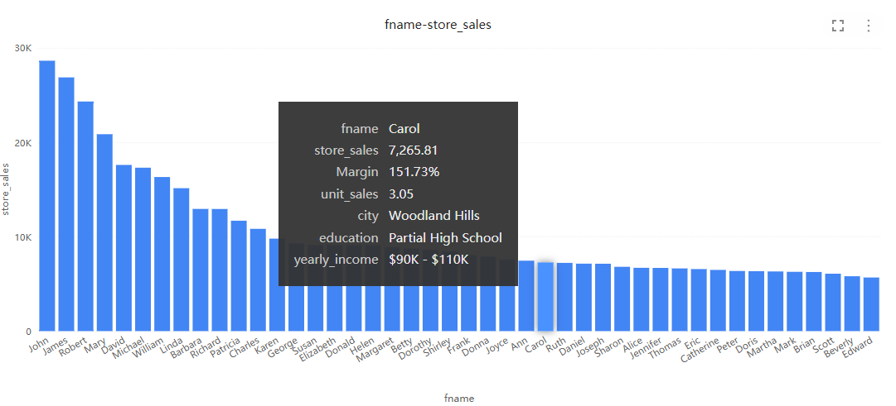
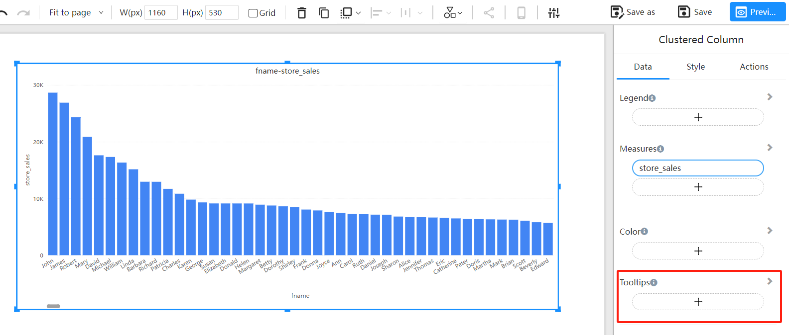

# Tooltips for Chart Components

## Overview

The Tooltips feature in Datafor provides additional information when users hover over chart or visualization data points. This feature enhances data comprehension by providing more details without taking up visual space. Tooltips can be customized to display various information, such as summary statistics, text descriptions, and even additional visual content.

## Understanding Tooltips

### What are Tooltips?

Tooltips are small interactive boxes that appear when users hover over data points in Datafor chart components. They provide contextual information about specific data points, such as data values and categories, helping users better understand and analyze the data.

### Benefits of Tooltips

- **Enhanced Data Understanding**: Tooltips provide additional information, helping users gain a more comprehensive understanding of the data.
- **Maintains Visualization Clarity**: By not displaying all details on the chart, tooltips keep the interface clean and clear.
- **Dynamic Interaction**: Users can interact with data points in real-time by hovering, improving data exploration and interaction.

## How to Use Tooltips

### Default Tooltips

Every chart component in Datafor has tooltips enabled by default. By default, tooltips display basic data information, such as data values and categories.

1. **Open your Datafor Report**: Ensure your report page has multiple chart components.
2. **Hover over a Data Point**: Hover your mouse over a data point in the chart component to see the default tooltip.
3. **View Information**: Observe the tooltip displaying the relevant data point information.

### Custom Tooltips

Users can customize tooltips to display more detailed information or custom content.

1. **Select the Chart Component**: Click on the chart where you want to customize the tooltip.

2. **Find "Tooltips" in the Data Panel**

   

3. **Add Dimension and Measure Fields to the "Tooltips" Area**

   

   
## Conclusion

Datafor's Tooltips feature is a powerful tool that enhances data understanding and interaction by providing additional information for data points. Default tooltips offer basic information, while custom tooltips allow users to display more detailed content based on specific needs.