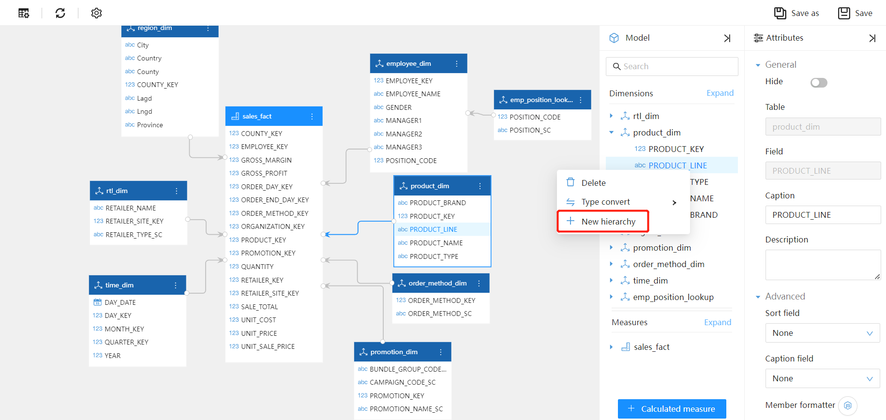
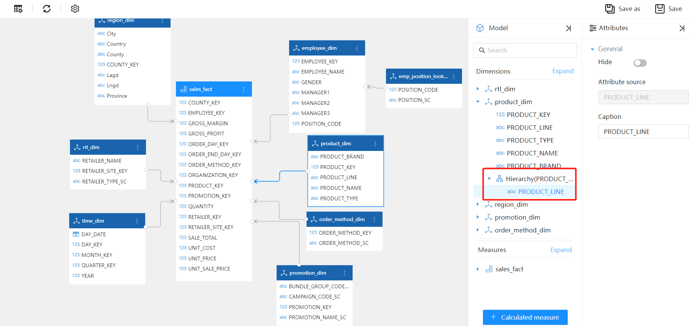
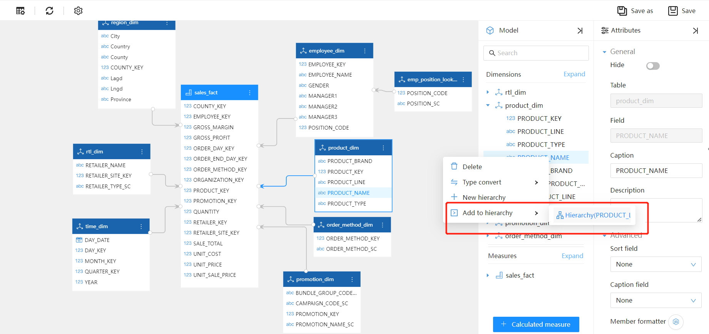
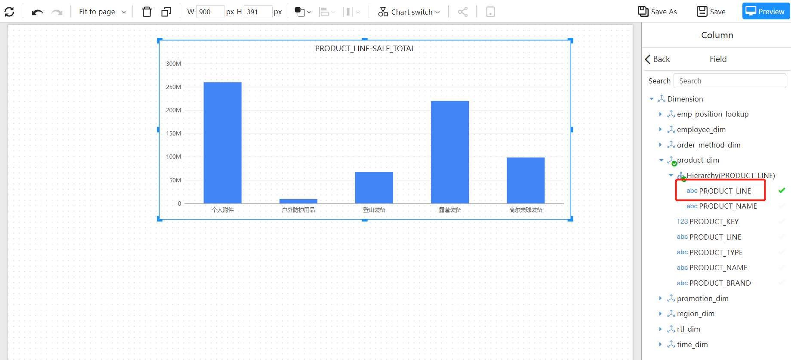
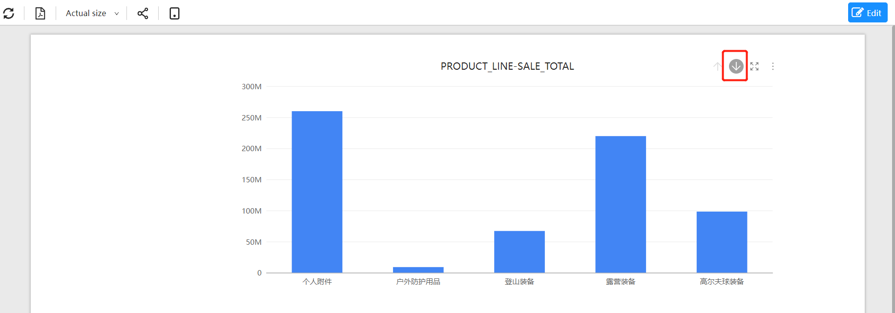
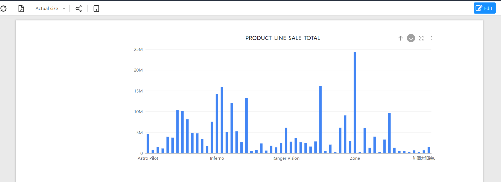
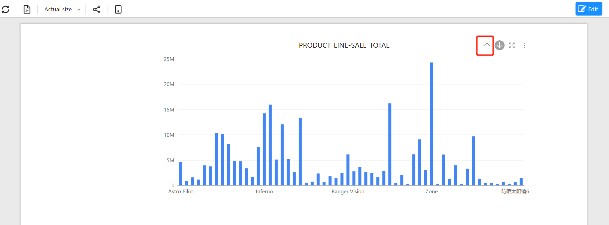

---
id: kzt-jmgnjs
title: Drill down
sidebar_position: 50
---
# Drill down

Data drilling can be understood as adding levels of dimensionality, so that data can be observed from coarse to fine granularity. For example, when analyzing product sales, data can be drilled down from product categories to specific products along the product dimension.

## Creating Hierarchies in Analytical Models

Open the model editing interface.

In the "Analytical Model" panel, right-click on a dimension field and select the "New Hierarchy" button from the pop-up menu.

A "hierarchy" is created in the dimension, and the attribute field selected by right-clicking is automatically added to this "hierarchy."

Through the "Properties" panel on the right, you can modify the name of the "hierarchy" or hide the "hierarchy".

Drag other fields into this hierarchy and adjust their positions by dragging and dropping.

Hierarchies are arranged from top to bottom, from higher level to lower level, with the lowest level being the most detailed.

## Component Drill-down Behavior

### Using Fields in Hierarchies

When the component data uses fields in a hierarchy, no settings are required, and the component can drill down.

Take the column chart as an example and set the component's drill-down behavior.

For the "axis" field of a column chart, a higher-level field in the hierarchy is usually selected.

In the example, the "Product Line" hierarchy has two levels, "Product Line" and "Product."

### Preview Page

Click the "Drill-Down Mode" button on the component toolbar.

Click on a column to drill down.

Click the "Reset Drilling" button in the upper-right corner of the component menu to return the component to the data before drilling down.

