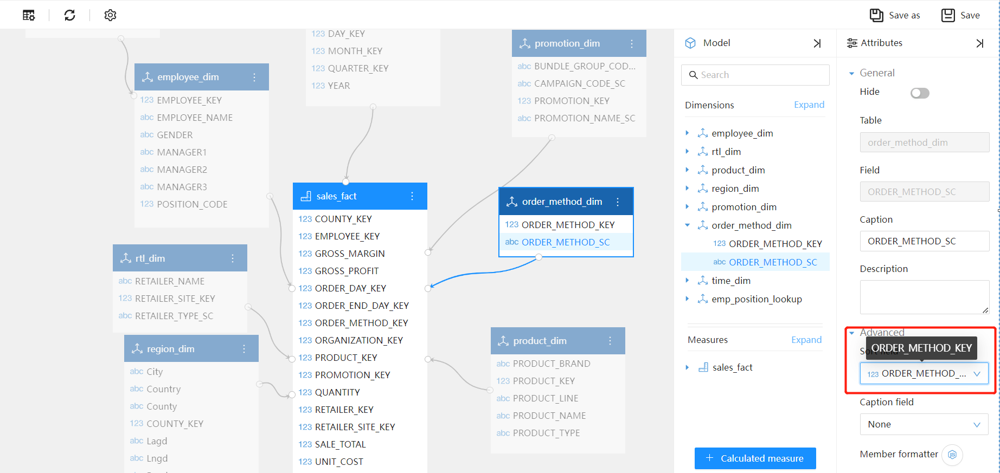
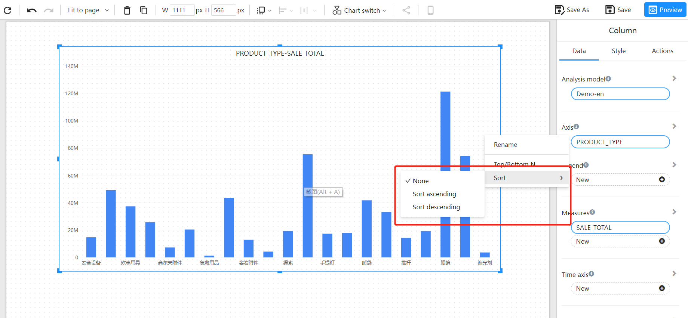
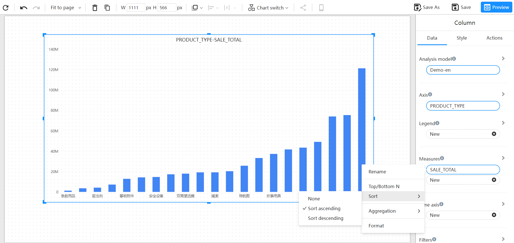

# Sorting

Datafor provides the ability to set sorting fields on the analysis model and to set ascending or descending sorting on the fields in the report design components.

## Setting Sorting on the Analysis Model

If a dimension field needs to be sorted based on the order of another field, you need to set the sorting field in the "advanced properties" of the dimension field when designing the model.

For example: If you have an "ORDER_METHOD_SC" column, when it is added to a component, it will be sorted in alphabetical order. This is not what you need, you want it to be sorted in the order of "ORDER_METHOD_KEY".

## Sorting during Design of Analytical Reports

### Sorting Dimension Fields

The "axis" of a component can usually be sorted. Whether it's text, numbers, or dates, it can be sorted in the desired way.

For some types of components, sorting is not available: tree maps, gauges, maps, etc.

To sort a dimension field, select the "Sort" menu from the field's menu and then choose either "Sort ascending" or "Sort descending" from the submenu.

### Sorting Measures

Measure values are usually of numeric type. To sort a measure, select "Sort" in the measure menu and choose either "Sort ascending" or "Sort descending" from the submenu.

