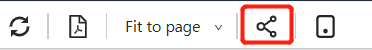
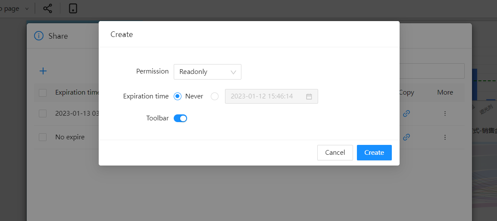
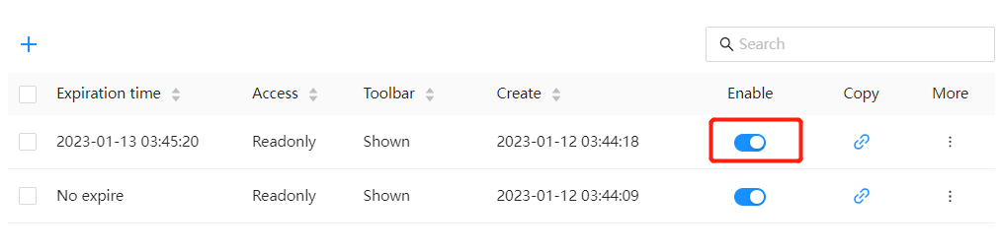
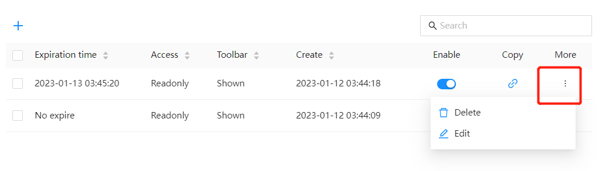

# Share link

By generating a "share link", the analysis report can be shared with others. The shared person can view the data or modify the report if they have a DATAFOR account or do not have a DATAFOR account. The data permissions viewed through the sharing link are the same as those of the sharer.

## Configure the application domain name address

share link use

## Create share link

1. Use the "Share" button on the toolbar to manage the created share links

   

2. In the share link management interface, click the Create share link button to create a share link

   

Click the "Copy Link" button to copy the share link url.

3. Set share link

     

DATAFOR provides two sharing links:

- read only

   Anyone can access this link to view this report without a DATAFOR account. The data permissions are consistent with those of the sharer.

- edit

   Anyone can access this link to edit and view this report without a DATAFOR account. The data permissions are consistent with those of the sharer.

***Note: Users who do not have permission to edit files do not have permission to generate "edit" sharing links. **

## Pause sharing

In the share link list, turn off the "Turn on sharing" button. When the "Enable Sharing" switch is turned off, the sharing link becomes invalid.

## Edit and delete share link

Click the More button in the share link list to edit and delete.

