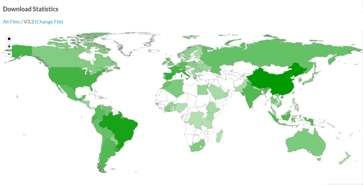

---
sidebar_position: 1
description: 这是一个帮助文档。
keywords:
  [
    datafor,
    文档
  ]
slug: /
id: intro
title: 欢迎
---

# Datafor 数据可视化与分析

Datafor 是一款自助式敏捷商业智能（BI）工具，旨在为用户提供直观易用的数据可视化和探索式分析功能，帮助用户快速进行数据探索、分析和决策。

**全球覆盖：超过56个国家和地区下载使用**

## **主要功能**

- **数据连接**：支持连接多种数据源，包括关系型数据库、NoSQL 数据库、数据仓库、云数据源和文件数据源。
- **数据可视化**：提供丰富的可视化图表和元素，支持个性化设置，帮助用户轻松创建精美的数据分析报告和数据可视化页面。
- **多维分析**：提供强大的多维分析能力，帮助用户深入挖掘数据背后的规律和关系，发现潜在的业务机会和问题。
- **嵌入式分析**：支持将数据可视化和分析功能嵌入到其他应用程序中，实现数据的实时可视化和分析。
- **权限控制**：提供精细的权限控制功能，满足企业在数据管理和安全方面的多种需求。

## **应用场景**

- **数据分析和报告**：帮助用户轻松连接、组织和可视化数据，快速生成各种类型的数据报告和分析结果。
- **业务智能和决策支持**：协助企业和组织建立强大的数据分析和决策支持系统，做出更准确和明智的决策。
- **数据挖掘和预测**：帮助用户进行数据挖掘和预测分析，发现隐藏在数据背后的规律和趋势。
- **行业研究和市场分析**：帮助行业研究人员和市场分析师获取、处理和分析市场数据，更好地理解市场趋势和竞争情况。

## **优势**

- **先进的架构**：具有完整性、高伸缩性、模块化、微服务和扩展性特点，满足不同企业需求，并支持灵活定制和扩展系统功能。
- **丰富的数据可视化元素**：提供多样化的可视化图表和元素，支持个性化设置，让用户自由设计报表、仪表盘和大屏展示等数据可视化页面。
- **强大的多维分析能力**：深入挖掘数据背后的规律和关系，发现潜在的业务机会和问题。
- **无缝的嵌入式分析**：可无缝集成到其他应用程序中，成为应用程序的一部分，实现数据的实时可视化和分析功能。
- **精细化的权限控制**：满足企业在数据管理和安全方面的多种需求。

## **Datafor 的效益**

- **提高数据分析效率**：快速连接、组织和分析数据，提高数据分析效率。
- **做出更明智的决策**：深入挖掘数据背后的规律和关系，发现潜在的业务机会和问题，做出更明智的决策。
- **提高运营效率**：优化业务流程，提高运营效率。
- **降低成本**：降低数据分析和决策成本。

> 🚀**立即开始使用 Datafor，释放您的数据价值！**

