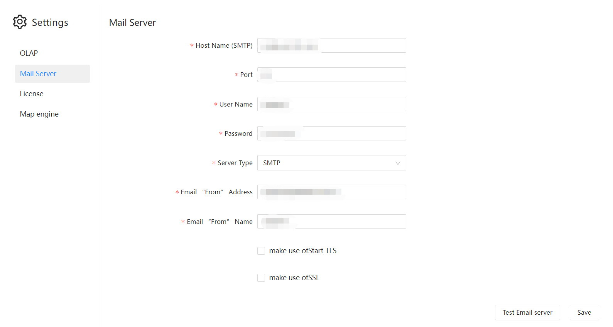

# Configure mail server

Datafor supports sending emails. Therefore, the mail server needs to be configured in the system settings.

| Setting Items | Description |
| :-----------: | :---------------------------------- --------------------: |
| Mail Server | Enter the mail server in the format of SMTP.mailbox suffix. For example smtp.ym.163.com |
| Port | Set the port and encryption method of the mail service. By default, port 25 is used |
| Server Type | Select smtp or smtps |
| Sender's address | Fill in the sender's email address |
| Password | Sender Email Password |
| Sender Name | Email Sender's Name |
| Use Start TLS | Use TLS protocol |
| Use SSL | The SMTP server supports SSL encryption |
