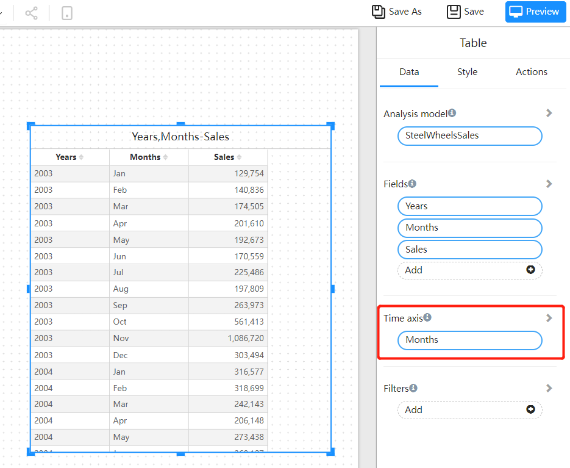
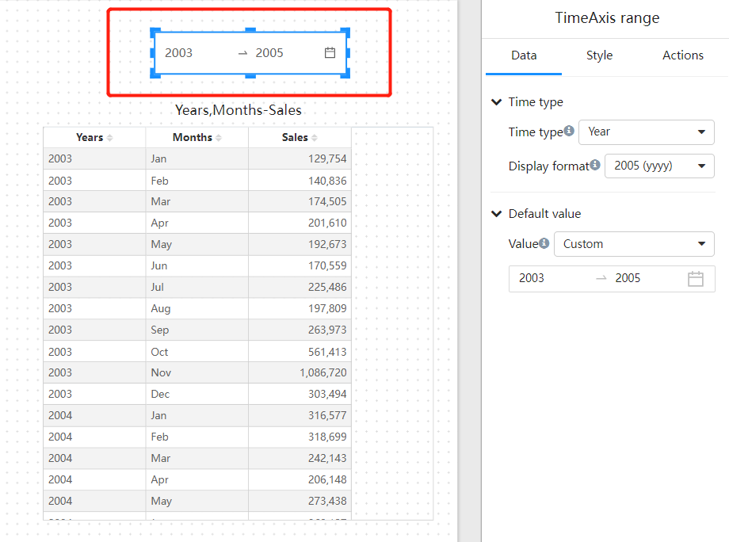
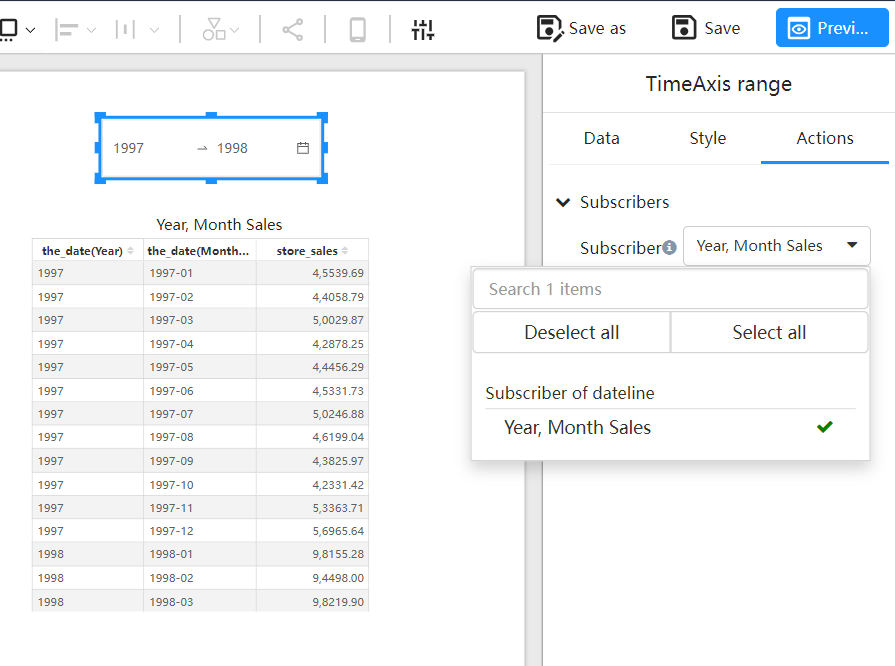

# Time Axis

## What is the Purpose of the “Time Axis” in Chart Component Data Panels?

The “Time Axis” feature allows you to filter multiple “time fields” in the model using a single “Time Axis Filter” component.

For example, if your model includes fields like “Sales Date,” “Purchase Date,” and “Inventory Date,” or if you have metrics with different time granularities—such as “Sales Budget Amount” displayed by “Year” and “Sales Amount” displayed by “Day”—you can use the “Time Axis” to apply a unified time filter across these various components.

By using the “Time Axis,” you ensure consistent time filtering across all relevant components in your report.

## How Does the Time Axis Work?

The Time Axis Filter applies the selected time range to the time axis fields of chart components, thereby filtering the data.

For example:

- **Chart A** has a time axis field of “Sales Month.”
- **Chart B** has a time axis field of “Purchase Year.”

When the Time Axis Filter selects the time range of “1998”:

- **Chart A** will filter for “Sales Month” between January 1998 and December 1998.
- **Chart B** will filter for “Purchase Year” equal to “1998.”

**Note:** The Time Axis Filter can be used to filter time fields with the same or finer granularity. For example, a year filter can be used for fields with yearly, monthly, or daily granularity, while a month filter can be used for fields with monthly or daily granularity.

## How to Use the “Time Axis”?

1. **Set the “Time Axis” Field in Chart Components**

   

2. Add the “Time Axis” or “Range Time Axis” Filter Component to the Report Page

   

3. Establish Subscription Relationships Between the Filter Component and Chart Components.

   

   

## FAQ

1. **Does the Time Axis Filter need to be bound to specific time fields?**

   No. The Time Axis Filter can be set up and used independently of specific time fields.

2. **When should you use the Time Axis Filter?**

   Use the Time Axis Filter when your report contains multiple time fields that need to be filtered by the same time filter, or when you need to apply a unified time filter to time fields with different granularities.

3. **Can a Time Axis Filter set to “Year” be applied to charts with time axis fields of “Day”?**

   Yes. A coarser time granularity filter, such as a year filter, can be used to filter finer granularity fields, such as days. However, for better performance, using filters with the same granularity as the time fields is recommended.
